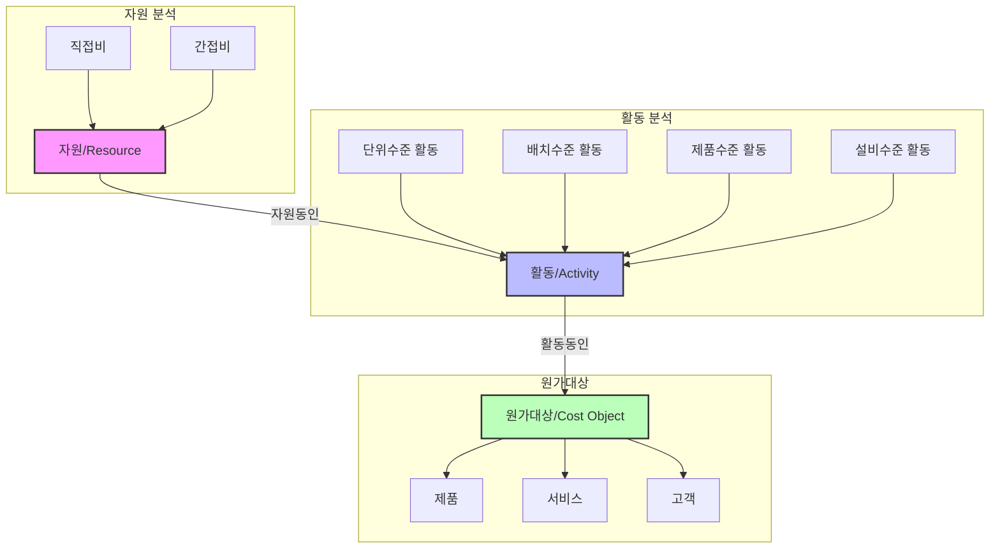

# ABC(Activity Based Costing): 활동 기반 원가 계산의 핵심

<!-- mtoc-start -->

- [ABC의 개요](#abc의-개요)
  - [정의](#정의)
  - [필요성](#필요성)
- [ABC의 주요 구성 요소](#abc의-주요-구성-요소)
  - [1. 활동(Activity)](#1-활동activity)
  - [2. 활동 동인(Activity Driver)](#2-활동-동인activity-driver)
  - [3. 원가 대상(Cost Object)](#3-원가-대상cost-object)
- [ABC 프로세스](#abc-프로세스)
- [ABC의 기대 효과](#abc의-기대-효과)
- [ABC의 활용 사례](#abc의-활용-사례)
- [마무리](#마무리)
- [Keywords](#keywords)

<!-- mtoc-end -->

ABC(Activity Based Costing)는 활동 기반으로 원가를 측정하고, 프로세스와 관련된 활동 및 원가 대상(고객, 제품 등)의 성과를 평가하는 원가 계산 기법입니다. ABC는 자원 사용과 활동을 연계하여 원가를 배분하며, 활동과 원가 간의 인과관계를 명확히 파악할 수 있는 도구를 제공합니다. ABC의 정의, 주요 개념, 구성 요소, 그리고 기대 효과를 살펴보겠습니다.

## ABC의 개요

### 정의

ABC는 기업의 자원이 어떤 활동에서 소비되고, 이러한 활동이 원가 대상에 어떻게 기여하는지를 분석하는 원가 계산 기법. 이를 통해 원가 발생의 원인을 명확히 파악하고, 비효율적인 비용 구조를 개선할 수 있습니다.

### 필요성

1. **원가 관리의 정밀화**

   - 전통적인 원가 계산 방식에서 간접비 배분의 한계를 극복

2. **비효율 제거 및 최적화**

   - 자원 사용과 관련된 비효율적인 활동을 식별

3. **경쟁력 강화**
   - 제품 및 고객별 수익성을 정확히 평가하여 전략적 의사결정 지원

## ABC의 주요 구성 요소

### 1. 활동(Activity)

- **정의**: 기업의 업무를 프로세스 관점에서 세분화한 작업 단위
- **역할**: 간접 원가를 집계하여 다른 원가 대상으로 배부하는 단위로 사용

### 2. 활동 동인(Activity Driver)

- **정의**: 활동에서 소비되는 자원의 크기에 영향을 미치는 요인 또는 활동량의 지표
- **역할**: 간접 원가를 배부하는 기준으로 사용하며, 전통적 원가 계산에서의 조업도 지표를 대체

### 3. 원가 대상(Cost Object)

- **정의**: 활동에 의해 발생한 원가가 배분되는 대상(예: 제품, 서비스, 고객)
- **역할**: 원가 데이터를 최종적으로 할당받는 단위

## ABC 프로세스

4. 자원(Resource) 단계:
   - 직접비와 간접비를 포함한 모든 비용 자원을 식별
   - 자원동인을 통해 활동으로 할당
5. 활동(Activity) 단계:
   - 단위수준: 생산량에 비례하는 활동
   - 배치수준: 생산 로트 단위의 활동
   - 제품수준: 제품 지원을 위한 활동
   - 설비수준: 전반적인 생산 지원 활동
   - 활동동인을 통해 원가대상으로 할당
6. 원가대상(Cost Object) 단계:
   - 제품, 서비스, 고객 등 최종적인 원가계산 대상
   - 정확한 원가 정보 제공으로 의사결정 지원

이 시스템을 통해 기업은 더 정확한 원가 계산과 효율적인 자원 관리가 가능.

## ABC의 기대 효과

7. **정확한 원가 정보 제공**

   - 자원의 사용과 활동 간의 관계를 명확히 파악하여 원가 배분의 신뢰성 강화

8. **비효율적 비용 구조 개선**

   - 비효율적인 활동과 자원 낭비를 식별하여 제거

9. **전략적 의사결정 지원**

   - 제품, 서비스, 고객별 수익성을 분석하여 전략적 투자 및 개선 방향 제시

10. **성과 평가의 정밀성 향상**
   - 활동과 원가 간의 인과관계를 기반으로 성과를 정확히 평가

## ABC의 활용 사례

11. **제조업**

   - 생산 공정에서 간접비를 정확히 배분하여 생산성 향상

12. **서비스업**

   - 서비스 제공 과정에서 활동 기반으로 비용을 분석하여 비용 효율화

13. **유통업**
   - 물류와 배송 과정에서 발생하는 간접비를 추적하여 운영 효율성 증대

## 마무리

ABC는 활동과 원가 간의 명확한 인과관계를 파악하여 기업의 비용 구조를 개선하고, 경쟁력을 강화할 수 있는 강력한 원가 계산 기법입니다. 이를 통해 조직은 효율성을 높이고 전략적 의사결정을 강화할 수 있습니다. ABC를 활용하여 정밀한 원가 관리와 지속 가능한 성장을 도모하세요.

## Keywords

ABC, Activity Based Costing, 활동 기반 원가, 원가 계산, 원가 동인, 간접 원가 배분, 활동 분석, 전략적 의사결정, 비용 효율화, 성과 평가