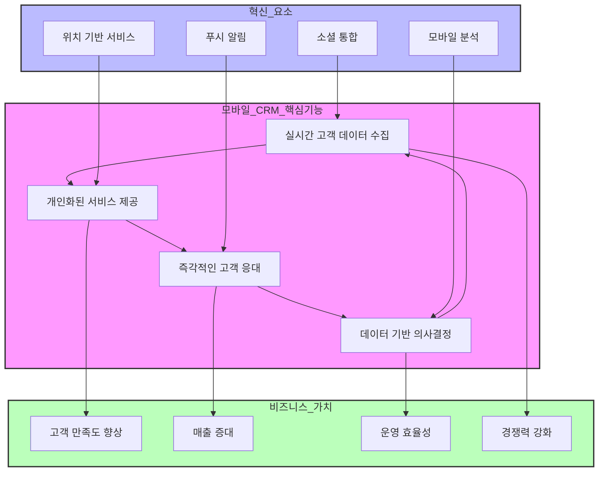

# mCRM: 모바일 고객 관계 관리의 혁신

<!-- mtoc-start -->

- [mCRM의 정의 및 개념](#mcrm의-정의-및-개념)
- [mCRM의 주요 특징](#mcrm의-주요-특징)
  - [1. 실시간 고객 데이터 접근](#1-실시간-고객-데이터-접근)
  - [2. 장소와 시간의 제약 해소](#2-장소와-시간의-제약-해소)
  - [3. 직원 생산성 향상](#3-직원-생산성-향상)
- [mCRM 혁신 프로세스](#mcrm-혁신-프로세스)
- [mCRM의 활용 사례](#mcrm의-활용-사례)
  - [1. 이동 영업팀 지원](#1-이동-영업팀-지원)
  - [2. 고객 서비스 개선](#2-고객-서비스-개선)
- [mCRM 도입의 기대 효과](#mcrm-도입의-기대-효과)
  - [1. 고객 만족도 증대](#1-고객-만족도-증대)
  - [2. 비즈니스 경쟁력 향상](#2-비즈니스-경쟁력-향상)
- [마무리](#마무리)
- [키워드](#키워드)

<!-- mtoc-end -->

mCRM(Mobile Customer Relationship Management)은 무선 인터넷, 휴대폰, PDA 등 모바일 기기를 활용하여 고객 관계를 관리하고 강화하는 기술입니다. 이러한 솔루션은 고객과의 접점을 확대하며, 언제 어디서나 효율적인 고객 서비스를 제공함으로써 고객 만족도와 직원 생산성을 동시에 높이는 데 기여합니다.

## mCRM의 정의 및 개념

mCRM은 모바일 기기를 통해 고객 데이터를 실시간으로 관리하고, 고객과의 상호작용을 최적화하는 확장된 CRM(Customer Relationship Management).

- **모바일 CRM**: 무선 인터넷과 모바일 기기를 통해 고객 데이터를 처리 및 활용하는 솔루션
- **주요 기기**: 휴대폰, 태블릿, PDA 등 다양한 무선 인터넷 단말기

이를 통해 비즈니스는 시간과 장소의 제약 없이 고객 관계를 유지하고, 강화할 수 있습니다.

## mCRM의 주요 특징

### 1. 실시간 고객 데이터 접근

- 고객의 구매 이력, 선호도 등을 즉시 확인 가능
- 모바일 환경에서 실시간으로 데이터 업데이트 및 활용

### 2. 장소와 시간의 제약 해소

- 언제 어디서나 고객과의 접점 유지
- 이동 중에도 고객 서비스 제공 가능

### 3. 직원 생산성 향상

- 현장에서 고객 요청에 즉각 대응 가능
- 실시간 정보 접근을 통해 효율적인 의사결정 지원

## mCRM 혁신 프로세스

1. 핵심기능: 실시간 데이터 수집부터 의사결정까지의 순환 구조.
2. 혁신 요소: 모바일 환경에서만 가능한 차별화된 서비스 요소들.
3. 비즈니스 가치: mCRM 도입을 통해 얻을 수 있는 실질적인 성과.

## mCRM의 활용 사례

### 1. 이동 영업팀 지원

- 현장에서 고객 정보에 접근하여 맞춤형 서비스를 제공
- 판매 데이터를 즉시 업데이트하고 분석 가능

### 2. 고객 서비스 개선

- 고객 문의를 실시간으로 처리하여 만족도 향상
- 모바일 디바이스를 통해 문제 해결 시간을 단축

## mCRM 도입의 기대 효과

### 1. 고객 만족도 증대

- 빠르고 맞춤화된 서비스 제공으로 고객 신뢰도 강화
- 고객 경험 향상을 통한 장기적 관계 구축

### 2. 비즈니스 경쟁력 향상

- 실시간 데이터 활용으로 시장 변화에 유연하게 대응
- 운영 효율성을 증대시켜 비용 절감 효과

## 마무리

mCRM은 모바일 기기를 통해 고객 관계를 강화하고, 기업의 생산성과 경쟁력을 높이는 혁신적인 솔루션입니다. 시간과 장소의 제약을 극복하고 고객과의 상호작용을 최적화할 수 있는 mCRM은 현대 비즈니스 환경에서 필수적인 도구로 자리 잡고 있습니다. 이를 적극 활용하여 고객 중심의 비즈니스 전략을 구현해 보세요.

## 키워드

mCRM, 모바일 CRM, 고객 관계 관리, 무선 인터넷, PDA, 휴대폰 CRM, 고객 서비스, 생산성 향상, 실시간 데이터, 고객 만족도