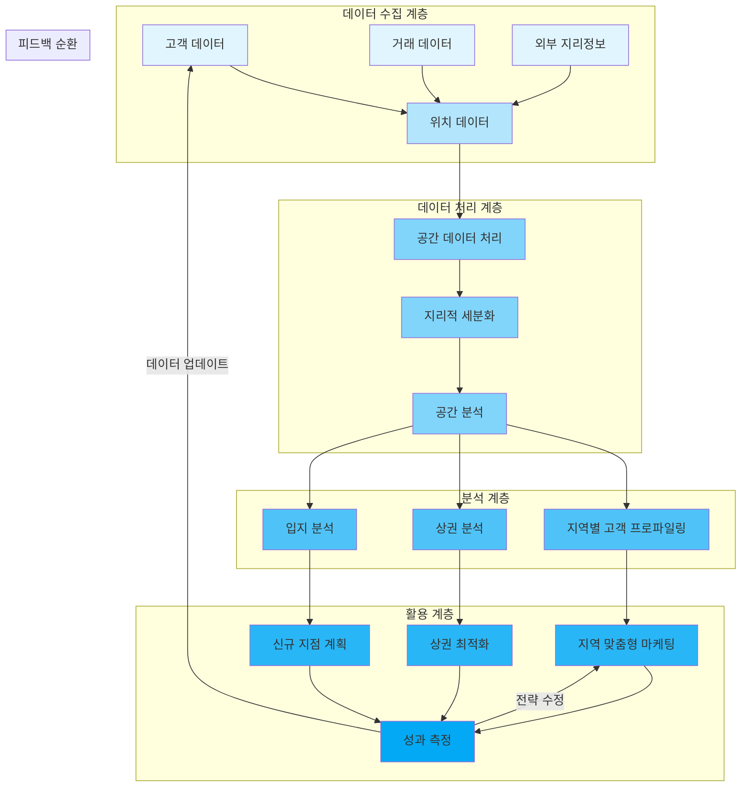

# g-CRM: 지리적 고객 관계 관리의 새로운 접근

<!-- mtoc-start -->

- [g-CRM의 정의 및 개념](#g-crm의-정의-및-개념)
- [g-CRM의 주요 특징](#g-crm의-주요-특징)
  - [1. 고객 맞춤형 마케팅 전략](#1-고객-맞춤형-마케팅-전략)
  - [2. 시장 환경 분석](#2-시장-환경-분석)
  - [3. 효율적 자원 배분](#3-효율적-자원-배분)
- [g-CRM 구조 및 프로세스](#g-crm-구조-및-프로세스)
- [g-CRM의 활용 사례](#g-crm의-활용-사례)
  - [1. 지역 기반 마케팅 캠페인](#1-지역-기반-마케팅-캠페인)
  - [2. 신규 점포 입지 선정](#2-신규-점포-입지-선정)
- [g-CRM 도입의 기대 효과](#g-crm-도입의-기대-효과)
  - [1. 고객 만족도 및 충성도 향상](#1-고객-만족도-및-충성도-향상)
  - [2. 비즈니스 성장 촉진](#2-비즈니스-성장-촉진)
- [마무리](#마무리)
- [키워드](#키워드)

<!-- mtoc-end -->

g-CRM(Geographic Customer Relationship Management)은 GIS(Geographic Information System) 기술을 CRM(Customer Relationship Management)에 접목시킨 혁신적인 고객 관리 솔루션입니다. 고객의 주거 형태, 주변 상권 등 지리적 요소를 활용하여 고객의 특성과 요구를 보다 정확히 이해하고, 맞춤형 서비스를 제공하는 데 중점을 둡니다.

## g-CRM의 정의 및 개념

g-CRM은 지리적 정보를 고객 관리에 통합하여 고객의 행동 패턴과 시장 환경을 분석하는 기술. 이를 통해 고객의 지리적 특성과 비즈니스의 연관성을 파악하고 전략적 의사결정을 지원합니다.

- **지리적 정보 통합**: 고객의 위치 데이터, 주변 상권, 교통 정보 등을 활용
- **고객 행동 분석**: 지리적 패턴을 기반으로 한 구매 경향 및 선호도 파악

## g-CRM의 주요 특징

### 1. 고객 맞춤형 마케팅 전략

- 고객의 위치와 주변 환경에 따라 타겟 마케팅 실행
- 지역별 특성에 최적화된 프로모션 제공

### 2. 시장 환경 분석

- 주변 상권 및 경쟁사 위치를 고려한 데이터 분석
- 신규 시장 진출 및 점포 선정에 활용

### 3. 효율적 자원 배분

- 지역별 매출 데이터를 기반으로 마케팅 예산 최적화
- 특정 지역의 고객 요구에 맞춘 서비스 제공

## g-CRM 구조 및 프로세스

1. 데이터 수집 계층

- 고객 데이터, 거래 데이터, 외부 지리정보 등 다양한 소스에서 데이터를 수집
- 모든 데이터는 위치 데이터와 통합됨

2. 데이터 처리 계층

- 수집된 데이터를 공간 데이터로 처리
- 지리적 기준으로 고객을 세분화
- 공간 분석 수행

1. 분석 계층

- 지역별 고객 프로파일링
- 상권 분석
- 입지 분석

2. 활용 계층

- 지역 맞춤형 마케팅 실행
- 상권 최적화
- 신규 지점 계획 수립
- 각 활동의 성과 측정

3. 피드백 순환

- 성과 측정 결과를 바탕으로 데이터 업데이트
- 전략 수정 및 개선

각 계층은 서로 유기적으로 연결되어 있어 지속적인 개선이 가능한 순환 구조.

## g-CRM의 활용 사례

### 1. 지역 기반 마케팅 캠페인

- 특정 지역 고객을 대상으로 한 할인 행사 및 프로모션 실행
- 지역 특성에 맞춘 신상품 출시 전략 개발

### 2. 신규 점포 입지 선정

- 고객 밀집 지역과 경쟁 상권 분석을 통해 최적의 점포 위치 선정
- 교통 접근성과 인구 분포를 고려한 전략적 의사결정

## g-CRM 도입의 기대 효과

### 1. 고객 만족도 및 충성도 향상

- 고객의 위치 및 환경을 고려한 맞춤형 서비스 제공
- 지역별 요구 사항을 반영한 차별화된 경험 제공

### 2. 비즈니스 성장 촉진

- 효율적인 자원 활용으로 마케팅 ROI 향상
- 지리적 통찰력을 통한 신규 고객 확보 및 시장 확대

## 마무리

g-CRM은 지리적 데이터를 기반으로 고객 이해도를 높이고, 비즈니스 전략을 더욱 정교하게 설계할 수 있는 강력한 도구입니다. GIS 기술과 CRM의 결합은 현대 고객 관리의 새로운 패러다임을 제시하며, 지역 중심의 맞춤형 서비스를 통해 고객 만족도와 비즈니스 성과를 동시에 향상시킬 수 있습니다. g-CRM을 도입하여 고객 중심의 차별화된 비즈니스 전략을 실행해 보세요.

## 키워드

g-CRM, Geographic CRM, 지리적 CRM, 고객 관계 관리, GIS, 위치 데이터, 상권 분석, 고객 맞춤형 서비스, 마케팅 전략, 점포 입지 선정