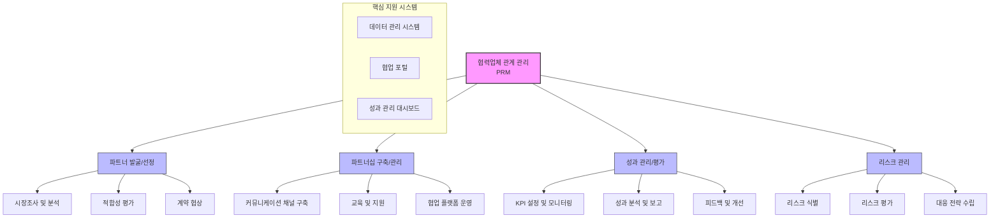

# PRM: 협력업체 관계 관리의 핵심 솔루션

<!-- mtoc-start -->

- [PRM의 정의 및 개념](#prm의-정의-및-개념)
- [PRM의 주요 특징](#prm의-주요-특징)
  - [1. 협력업체 통합 관리](#1-협력업체-통합-관리)
  - [2. 영업 및 마케팅 협업 강화](#2-영업-및-마케팅-협업-강화)
  - [3. 맞춤형 지원 제공](#3-맞춤형-지원-제공)
- [PRM의 절차 및 프로세스](#prm의-절차-및-프로세스)
  - [1. 파트너 온보딩](#1-파트너-온보딩)
  - [2. 성과 모니터링](#2-성과-모니터링)
  - [3. 협력 강화](#3-협력-강화)
  - [4. 피드백 및 개선](#4-피드백-및-개선)
- [PRM 시스템 구조](#prm-시스템-구조)
- [PRM의 활용 사례](#prm의-활용-사례)
  - [1. 글로벌 공급망 관리](#1-글로벌-공급망-관리)
  - [2. 공동 마케팅 캠페인](#2-공동-마케팅-캠페인)
- [PRM의 메커니즘 및 구조](#prm의-메커니즘-및-구조)
  - [1. 데이터 기반 의사결정](#1-데이터-기반-의사결정)
  - [2. 중앙 집중형 플랫폼](#2-중앙-집중형-플랫폼)
  - [3. 다채널 커뮤니케이션 지원](#3-다채널-커뮤니케이션-지원)
- [PRM 도입의 기대 효과](#prm-도입의-기대-효과)
  - [1. 수익성 증대](#1-수익성-증대)
  - [2. 관계 강화 및 신뢰 구축](#2-관계-강화-및-신뢰-구축)
- [마무리](#마무리)
- [키워드](#키워드)

<!-- mtoc-end -->

PRM(Partner Relationship Management)은 기업이 공급업체 및 협력업체와의 관계를 체계적으로 관리하고, 이를 통해 영업, 마케팅, 서비스 전반에서 협업을 강화하는 솔루션입니다. 이러한 시스템은 파트너와의 효율적인 협력을 통해 수익성을 극대화하고, 비즈니스 경쟁력을 강화하는 데 중점을 둡니다.

## PRM의 정의 및 개념

PRM은 협력업체 및 파트너 관계를 효율적으로 관리하기 위한 통합된 플랫폼. 이를 통해 기업은 파트너와의 협업을 강화하고, 상호 이익을 도모할 수 있습니다.

- **파트너 관계 관리**: 공급망 내 협력업체와의 관계를 조율하여 비즈니스 성과를 개선
- **주요 기능**: 영업 지원, 마케팅 협업, 서비스 품질 개선 등

## PRM의 주요 특징

### 1. 협력업체 통합 관리

- 파트너의 성과와 계약 상태를 실시간으로 모니터링
- 협력업체 데이터 및 활동을 체계적으로 관리

### 2. 영업 및 마케팅 협업 강화

- 협력업체와의 공동 캠페인 및 프로모션 실행
- 공동 영업 기회 관리 및 성과 분석

### 3. 맞춤형 지원 제공

- 파트너 요구에 맞는 교육 및 리소스 제공
- 다양한 채널을 통한 실시간 지원 서비스

## PRM의 절차 및 프로세스

### 1. 파트너 온보딩

- 새로운 협력업체 등록 및 정보 수집
- 파트너 교육 및 초기 지원 제공

### 2. 성과 모니터링

- 실시간 데이터 분석으로 파트너의 활동 및 성과 점검
- KPI(Key Performance Indicator)를 기준으로 평가

### 3. 협력 강화

- 협력 목표 설정 및 달성을 위한 정기적인 커뮤니케이션
- 공동 프로젝트 및 캠페인 관리

### 4. 피드백 및 개선

- 파트너의 피드백을 바탕으로 시스템 개선
- 정기적인 성과 리뷰 및 관계 강화 방안 수립

## PRM 시스템 구조

1. 파트너 발굴/선정

- 시장조사를 통한 잠재 파트너 발굴
- 적합성 평가를 통한 선정
- 계약 협상 및 체결

2. 파트너십 구축/관리

- 효과적인 커뮤니케이션 채널 구축
- 파트너 교육 및 지원 프로그램
- 협업 플랫폼을 통한 효율적인 운영

1. 성과 관리/평가

- 명확한 KPI 설정과 모니터링
- 정기적인 성과 분석 및 보고
- 지속적인 피드백과 개선활동

2. 리스크 관리

- 잠재적 리스크 식별
- 체계적인 리스크 평가
- 효과적인 대응 전략 수립

핵심 영역들은 데이터 관리 시스템, 협업 포털, 성과 관리 대시보드와 같은 지원 시스템을 통해 통합적으로 운영.

## PRM의 활용 사례

### 1. 글로벌 공급망 관리

- 다수의 협력업체를 체계적으로 관리하여 공급망의 효율성을 증대
- 지역별 파트너와의 협업을 통해 시장 확장

### 2. 공동 마케팅 캠페인

- 파트너와의 협력을 통해 공동 프로모션 기획 및 실행
- 캠페인 성과를 공유하고 향후 전략 수립에 반영

## PRM의 메커니즘 및 구조

### 1. 데이터 기반 의사결정

- 실시간 데이터와 분석 도구를 활용하여 협력 관계를 최적화
- 파트너와의 상호작용을 기록하고 개선 방안 도출

### 2. 중앙 집중형 플랫폼

- 모든 협력업체 데이터를 한 곳에서 관리
- 사용자 친화적인 대시보드를 통해 손쉬운 정보 접근

### 3. 다채널 커뮤니케이션 지원

- 이메일, 채팅, 비디오 콜 등 다양한 채널을 통해 협업 강화
- 효율적인 커뮤니케이션으로 문제 해결 시간 단축

## PRM 도입의 기대 효과

### 1. 수익성 증대

- 파트너와의 협업을 최적화하여 매출 증대
- 효율적인 자원 배분과 비용 절감

### 2. 관계 강화 및 신뢰 구축

- 체계적인 관리로 파트너와의 신뢰 관계 강화
- 상호 이익을 도모하는 협력 환경 조성

## 마무리

PRM은 협력업체와의 관계를 전략적으로 관리하여 비즈니스 성과를 극대화하는 필수 솔루션입니다. 영업, 마케팅, 서비스 전반에서의 협업을 통해 기업과 파트너 모두에게 장기적인 이익을 제공합니다. PRM을 활용하여 파트너 관계를 체계적으로 관리하고, 성공적인 협력 네트워크를 구축해 보세요.

## 키워드

PRM, Partner Relationship Management, 협력업체 관리, 파트너 관계, 공급망 관리, 영업 협업, 마케팅 캠페인, 수익성 강화, 서비스 품질, 협업 솔루션