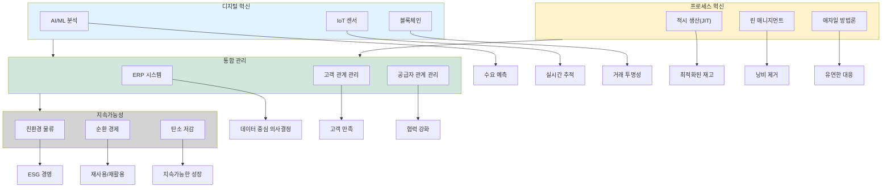
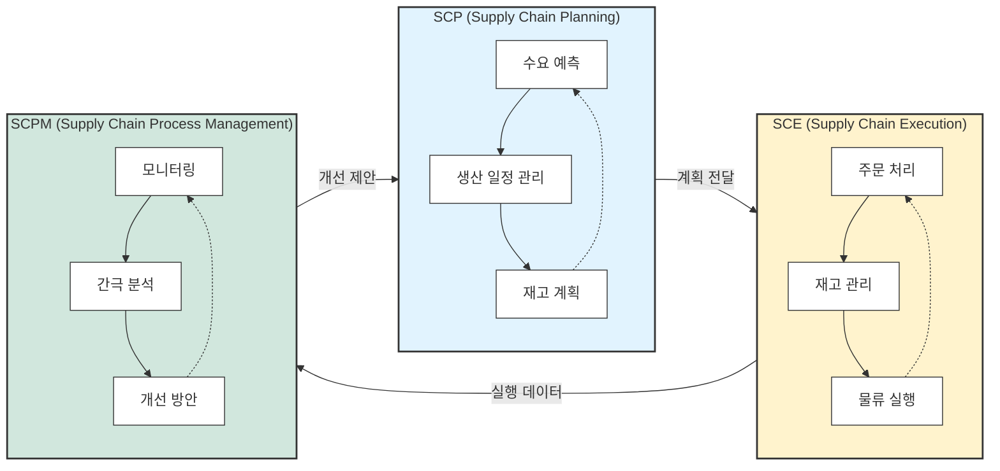

# SCM: 공급망 관리의 혁신적 접근

<!-- mtoc-start -->

- [SCM의 정의 및 개념](#scm의-정의-및-개념)
- [SCM의 구성 요소](#scm의-구성-요소)
  - [1. SCP(Supply Chain Planning)](#1-scpsupply-chain-planning)
  - [2. SCE(Supply Chain Execution)](#2-scesupply-chain-execution)
  - [3. SCPM(Supply Chain Process Management)](#3-scpmsupply-chain-process-management)
- [SCM의 절차 및 프로세스](#scm의-절차-및-프로세스)
  - [1. 수요 예측](#1-수요-예측)
  - [2. 공급망 계획](#2-공급망-계획)
  - [3. 실행 및 모니터링](#3-실행-및-모니터링)
- [SCM의 메커니즘 및 구조](#scm의-메커니즘-및-구조)
  - [1. 통합 플랫폼](#1-통합-플랫폼)
  - [2. 데이터 기반 의사결정](#2-데이터-기반-의사결정)
  - [3. Bullwhip Effect 제거](#3-bullwhip-effect-제거)
- [SCM 프레임워크](#scm-프레임워크)
- [SCM 핵심구성요소 시스템](#scm-핵심구성요소-시스템)
- [SCM의 활용 사례](#scm의-활용-사례)
  - [1. 제조업의 생산 관리](#1-제조업의-생산-관리)
  - [2. 유통업의 물류 최적화](#2-유통업의-물류-최적화)
- [SCM 도입의 기대 효과](#scm-도입의-기대-효과)
  - [1. 비용 절감](#1-비용-절감)
  - [2. 시장 적시성 확보](#2-시장-적시성-확보)
- [마무리](#마무리)
- [키워드](#키워드)

<!-- mtoc-end -->

SCM(Supply Chain Management)은 상품 및 서비스의 자재 조달, 생산, 판매에 이르는 모든 물류 흐름을 효과적으로 관리하는 경영 혁신 기법입니다. 이를 통해 기업은 비용 절감, 시장 적시성 확보, Bullwhip Effect 제거 등 공급망 효율성을 극대화할 수 있습니다.

## SCM의 정의 및 개념

SCM은 공급망 내 모든 단계에서 자원의 흐름을 통합적으로 관리하여 생산성과 경쟁력을 강화하는 시스템.

- **수요 예측 및 계획**: 시장 데이터를 기반으로 미래 수요를 예측하고 자원 활용 계획 수립
- **통합 물류 관리**: 조달, 생산, 물류, 판매를 하나의 흐름으로 연결

## SCM의 구성 요소

### 1. SCP(Supply Chain Planning)

- 공급망 계획 수립 및 최적화
- 수요 예측, 생산 일정 관리, 재고 계획 포함

### 2. SCE(Supply Chain Execution)

- 공급망 운영 관리 및 실행
- 주문 처리, 재고 관리, 물류 실행 포함

### 3. SCPM(Supply Chain Process Management)

- 공급망 프로세스의 모니터링 및 관리
- Planning과 Execution 간의 간극을 도출하여 개선 방안 마련

## SCM의 절차 및 프로세스

### 1. 수요 예측

- 시장 데이터 분석을 통한 정확한 수요 예측
- 과잉 생산 및 재고 부족 방지

### 2. 공급망 계획

- 조달 및 생산 일정 수립
- 자원 최적 배치를 통한 효율성 증대

### 3. 실행 및 모니터링

- 물류 및 재고 상태 실시간 추적
- KPI 기반 성과 분석 및 프로세스 개선

## SCM의 메커니즘 및 구조

### 1. 통합 플랫폼

- 모든 공급망 데이터를 단일 플랫폼에서 관리
- 실시간 데이터 공유로 협업 강화

### 2. 데이터 기반 의사결정

- AI와 빅데이터 분석을 활용한 공급망 최적화
- 예측 가능한 문제를 사전에 해결

### 3. Bullwhip Effect 제거

- 정보 불균형 및 과잉 반응 문제 해소
- 공급망 전체의 데이터 동기화로 효율성 극대화

## SCM 프레임워크

1. 디지털 혁신: AI/ML, IoT, 블록체인 등 첨단 기술의 도입
2. 프로세스 혁신: JIT, 린 매니지먼트, 애자일 방법론 등 운영 효율화
3. 통합 관리: ERP, CRM, SRM을 통한 전체 공급망의 통합적 관리
4. 지속가능성: 친환경 물류, 순환 경제, 탄소 저감 등 환경 고려

각 영역은 서로 연결되어 있으며, 최종적으로 지속가능한 성장을 목표.\
특히 디지털 기술과 프로세스 혁신이 통합 관리 시스템을 통해 지속가능성으로 이어지는 흐름.

## SCM 핵심구성요소 시스템

1. 각 구성요소(SCP, SCE, SCPM)는 자체적인 순환 구조:

   - SCP: 수요예측 → 생산일정 → 재고계획의 순환
   - SCE: 주문처리 → 재고관리 → 물류실행의 순환
   - SCPM: 모니터링 → 간극분석 → 개선방안의 순환

2. 구성요소 간의 상호작용:
   - SCP → SCE: 계획이 실행으로 이어짐
   - SCE → SCPM: 실행 데이터가 모니터링됨
   - SCPM → SCP: 개선 제안이 다시 계획에 반영됨

## SCM의 활용 사례

### 1. 제조업의 생산 관리

- 원자재 조달에서 완제품 출하까지의 통합 관리
- 비용 절감과 리드 타임 단축

### 2. 유통업의 물류 최적화

- 물류 네트워크 최적화를 통한 배송 시간 단축
- 실시간 재고 관리로 시장 요구에 신속 대응

## SCM 도입의 기대 효과

### 1. 비용 절감

- 자원의 낭비를 줄이고 운영 효율성을 강화
- 재고 관리 최적화를 통한 비용 감소

### 2. 시장 적시성 확보

- 고객 요구에 빠르게 대응하여 경쟁 우위 확보
- 공급망 가시성 강화로 예측 가능한 문제 해결

## 마무리

SCM은 기업의 물류 흐름을 혁신적으로 관리하여 운영 효율성과 시장 경쟁력을 동시에 높일 수 있는 필수 솔루션입니다. 효과적인 공급망 관리는 비용을 절감하고 고객 만족도를 향상시키는 동시에 시장 변화에 신속히 대응할 수 있도록 합니다. SCM을 통해 지속 가능한 비즈니스 성장을 이루어 보세요.

## 키워드

SCM, Supply Chain Management, 공급망 관리, 물류 관리, 수요 예측, 재고 관리, 비용 절감, Bullwhip Effect, 통합 플랫폼, 데이터 기반 의사결정