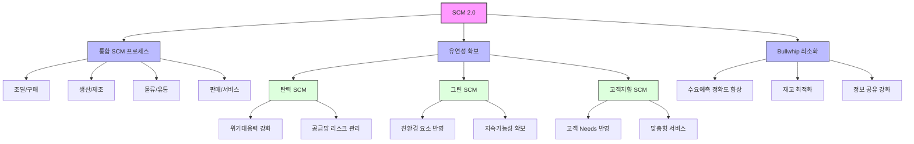

# SCM 2.0: 유연성과 지속 가능성을 겸비한 차세대 공급망 관리

<!-- mtoc-start -->

- [소개 문단](#소개-문단)
- [SCM 2.0의 정의와 필요성](#scm-20의-정의와-필요성)
  - [정의](#정의)
  - [필요성](#필요성)
- [SCM 2.0의 주요 특징](#scm-20의-주요-특징)
  - [1. 탄력 SCM](#1-탄력-scm)
  - [2. 그린 SCM](#2-그린-scm)
  - [3. 고객 지향 SCM](#3-고객-지향-scm)
- [SCM 2.0 관리 체계](#scm-20-관리-체계)
- [SCM 2.0의 기술적 장점](#scm-20의-기술적-장점)
- [SCM 2.0의 기대 효과](#scm-20의-기대-효과)
- [마무리](#마무리)
- [Keywords](#keywords)

<!-- mtoc-end -->

## 소개 문단

SCM 2.0은 기존 공급망 관리(Supply Chain Management, SCM)의 한계를 뛰어넘어, 탄력성, 친환경성, 그리고 고객지향성을 통해 경영 환경 변화에 신속히 대응할 수 있도록 설계된 차세대 공급망 관리 체계. 이 시스템은 공급망 전반의 통합과 효율성을 강조하며, Bullwhip 효과(수요 변동 증폭 현상)를 최소화하는 데 중점을 둡니다. 본 포스트에서는 SCM 2.0의 정의, 주요 특징, 기술적 장점, 그리고 기대 효과를 살펴보겠습니다.

## SCM 2.0의 정의와 필요성

### 정의

SCM 2.0은 기존의 공급망 관리를 개선하여 모든 프로세스를 통합하고, 경영 환경 변화에 대응하기 위해 탄력성, 친환경성, 고객 지향성을 반영한 새로운 관리 체계.

- **탄력 SCM**: 위기 상황에서의 대응력 강화
- **그린 SCM**: 친환경 요소를 공급망에 반영
- **고객 지향 SCM**: 고객의 요구사항(Needs)을 적극적으로 반영

### 필요성

1. **경영 환경의 복잡성 증가**

   - 글로벌화와 디지털화로 인한 공급망 복잡성 증대

2. **지속 가능성 요구**

   - 환경 규제와 소비자 요구에 대응하기 위한 친환경 관리 필요

3. **고객 중심 전략의 중요성**
   - 고객 만족을 극대화하기 위한 맞춤형 공급망 관리 요구

## SCM 2.0의 주요 특징

### 1. 탄력 SCM

- **정의**: 공급망의 위기 대응력과 복구 속도를 높이는 시스템
- **주요 요소**:
  - 예측 분석을 통해 잠재적 리스크 조기 감지
  - 다각화된 공급망 네트워크로 운영 유연성 확보

### 2. 그린 SCM

- **정의**: 친환경 요소를 공급망에 반영하여 지속 가능성을 강조
- **주요 요소**:
  - 탄소 배출량 추적 및 감소
  - 재활용 가능 자재 사용 확대
  - 친환경 물류 최적화

### 3. 고객 지향 SCM

- **정의**: 고객의 요구와 피드백을 반영하여 공급망을 최적화
- **주요 요소**:
  - 맞춤형 서비스 제공
  - 실시간 고객 데이터 활용
  - 신속한 주문 처리와 배송

## SCM 2.0 관리 체계

4. SCM 2.0의 3대 핵심 축인 통합 SCM 프로세스, Bullwhip 최소화, 유연성 확보.
5. 통합 SCM 프로세스는 조달/구매부터 판매/서비스까지의 전체 공급망 포함.
6. 유연성 확보는 세 가지 주요 전략(탄력, 그린, 고객지향 SCM)으로 구현.
7. Bullwhip 효과 최소화.

## SCM 2.0의 기술적 장점

8. **통합 플랫폼**

   - ERP, CRM 등과의 통합으로 공급망 전반의 데이터 흐름 최적화

9. **데이터 기반 의사결정**

   - AI와 빅데이터 분석을 통해 실시간 예측 및 의사결정 지원

10. **IoT 및 블록체인 활용**

   - IoT로 실시간 데이터 수집 및 추적
   - 블록체인을 통한 투명한 거래와 신뢰 강화

11. **클라우드 기반 운영**
   - 공급망 데이터의 접근성과 가용성 향상

## SCM 2.0의 기대 효과

12. **효율성 및 비용 절감**

   - 프로세스 통합과 최적화를 통해 운영 비용 감소

13. **환경 지속 가능성 강화**

   - 친환경 요소를 반영한 공급망 설계로 ESG 목표 달성 지원

14. **고객 만족도 증가**

   - 맞춤형 서비스를 통해 고객 요구를 신속히 충족

15. **리스크 관리 강화**

   - 예측 분석과 탄력 SCM으로 잠재적 위기 대응

16. **경쟁력 확보**
   - 유연성과 지속 가능성을 겸비한 공급망 관리로 시장에서의 우위 확보

## 마무리

SCM 2.0은 공급망 관리의 새로운 표준으로, 탄력성, 친환경성, 고객 지향성을 통해 효율성과 지속 가능성을 동시에 추구합니다. 이를 통해 기업은 복잡한 경영 환경에서도 경쟁력을 유지하고, 고객과 환경에 대한 책임을 다할 수 있습니다. SCM 2.0을 도입하여 미래 지향적인 공급망 관리 체계를 구축하세요.

## Keywords

SCM 2.0, 공급망 관리, 탄력 SCM, 그린 SCM, 고객 지향 SCM, Bullwhip 효과, 지속 가능성, 통합 플랫폼, 빅데이터 분석, IoT, 블록체인, ESG