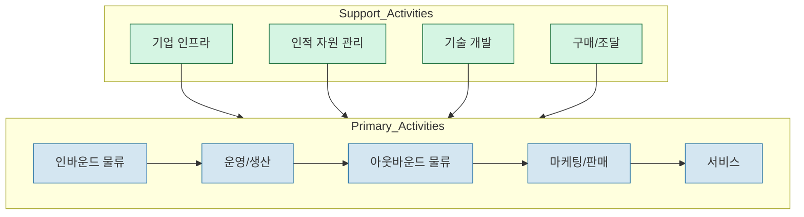

# Value-Chain: 가치 창출의 체계적 접근

<!-- mtoc-start -->

- [소개 문단](#소개-문단)
- [Value-Chain의 정의 및 개념](#value-chain의-정의-및-개념)
- [Value-Chain의 구성 요소](#value-chain의-구성-요소)
  - [1. 주요 활동 (Primary Activities)](#1-주요-활동-primary-activities)
  - [2. 지원 활동 (Support Activities)](#2-지원-활동-support-activities)
- [Value-Chain의 절차 및 프로세스](#value-chain의-절차-및-프로세스)
  - [1. 가치 활동 식별](#1-가치-활동-식별)
  - [2. 경쟁 우위 분석](#2-경쟁-우위-분석)
  - [3. 개선 방안 도출](#3-개선-방안-도출)
- [Value-Chain의 메커니즘 및 구조](#value-chain의-메커니즘-및-구조)
  - [1. 활동 간 연계성](#1-활동-간-연계성)
  - [2. 데이터 기반 접근](#2-데이터-기반-접근)
  - [3. 프로세스 최적화](#3-프로세스-최적화)
- [Value-Chain 구성도](#value-chain-구성도)
- [Value-Chain의 활용 사례](#value-chain의-활용-사례)
  - [1. 제조업의 비용 절감](#1-제조업의-비용-절감)
  - [2. 서비스업의 고객 가치 증대](#2-서비스업의-고객-가치-증대)
- [Value-Chain 도입의 기대 효과](#value-chain-도입의-기대-효과)
  - [1. 경쟁력 강화](#1-경쟁력-강화)
  - [2. 고객 만족도 향상](#2-고객-만족도-향상)
- [마무리](#마무리)
- [키워드](#키워드)

<!-- mtoc-end -->

## 소개 문단

Value-Chain(가치 사슬)은 기업이 가치를 창출할 수 있는 활동을 분석하고, 이를 통해 부가가치를 극대화하는 전략적 도구입니다. 이 모델은 가치 창출과 관련된 일련의 활동, 기능, 프로세스를 체계적으로 연결하여 기업의 경쟁력을 강화하는 데 중점을 둡니다.

## Value-Chain의 정의 및 개념

Value-Chain은 기업이 고객에게 가치를 전달하기 위해 수행하는 모든 활동을 체계적으로 분석하고, 이 과정에서 부가가치를 높일 수 있는 요소를 식별하는 모델.

- **가치 사슬 분석**: 각 활동이 부가가치 창출에 미치는 영향을 평가
- **직접 및 간접 활동**: 부가가치 창출에 기여하는 주요 및 지원 활동 포함

## Value-Chain의 구성 요소

### 1. 주요 활동 (Primary Activities)

- **물류 관리**: 원자재 조달 및 제품 출하
- **운영 활동**: 제품 및 서비스 생산
- **마케팅 및 판매**: 고객에게 제품 및 서비스를 제공하기 위한 활동
- **서비스**: 판매 후 고객 지원 및 유지

### 2. 지원 활동 (Support Activities)

- **조달**: 자원 및 공급업체 관리
- **기술 개발**: 프로세스와 제품 개선
- **인적 자원 관리**: 직원 채용, 교육, 유지
- **기업 기반 시설**: 재무, 법무, 전략 등

## Value-Chain의 절차 및 프로세스

### 1. 가치 활동 식별

- 기업의 주요 및 지원 활동을 분류
- 각 활동의 부가가치 기여도 평가

### 2. 경쟁 우위 분석

- 비용 효율성 및 차별화 가능성을 검토
- 경쟁사 대비 강점 및 약점 파악

### 3. 개선 방안 도출

- 비효율적인 프로세스를 최적화
- 부가가치 창출을 위한 새로운 전략 제안

## Value-Chain의 메커니즘 및 구조

### 1. 활동 간 연계성

- 주요 활동과 지원 활동 간의 상호작용 분석
- 효율적인 연계를 통해 시너지 효과 창출

### 2. 데이터 기반 접근

- KPI 및 데이터 분석을 활용하여 각 활동의 성과 평가
- 실시간 데이터로 신속한 의사결정 지원

### 3. 프로세스 최적화

- 병목 현상을 제거하여 효율성 증대
- 고객 가치를 극대화할 수 있는 프로세스 설계

## Value-Chain 구성도

마이클 포터의 가치 사슬 모형

1. 주요 활동(Primary Activities):
   - 인바운드 물류: 원자재 조달, 보관, 자재 관리 등
   - 운영/생산: 제품 생산 및 제조 과정
   - 아웃바운드 물류: 완제품 보관 및 배송
   - 마케팅/판매: 제품 홍보 및 판매 활동
   - 서비스: 판매 후 고객 지원
2. 지원 활동(Support Activities):
   - 기업 인프라: 경영, 재무, 법무 등 전반적인 지원 체계
   - 인적 자원 관리: 채용, 교육, 보상 등
   - 기술 개발: R&D, 제품/공정 개선
   - 구매/조달: 원자재, 설비 등의 구매 활동

## Value-Chain의 활용 사례

### 1. 제조업의 비용 절감

- 생산 공정의 비효율성을 식별하고 개선
- 원자재 조달부터 제품 출하까지의 최적화

### 2. 서비스업의 고객 가치 증대

- 고객 피드백을 기반으로 서비스 품질 개선
- 판매 후 지원 활동 강화로 고객 만족도 향상

## Value-Chain 도입의 기대 효과

### 1. 경쟁력 강화

- 각 활동의 부가가치를 극대화하여 시장 경쟁 우위 확보
- 프로세스 간 시너지를 통해 비용 절감 및 효율성 증대

### 2. 고객 만족도 향상

- 고객이 체감하는 가치를 극대화하여 브랜드 신뢰도 강화
- 지속 가능한 비즈니스 모델 구축

## 마무리

Value-Chain 모델은 기업이 가치를 창출하고, 이를 통해 부가가치를 극대화하는 데 필수적인 분석 도구입니다. 활동 간 연계를 최적화하고, 효율성을 강화하며, 고객 중심의 가치를 창출함으로써 기업의 장기적인 성공을 지원합니다. Value-Chain을 활용하여 경쟁력을 높이고 지속 가능한 성장을 실현해 보세요.

## 키워드

Value-Chain, 가치 사슬, 부가가치, 프로세스 최적화, 주요 활동, 지원 활동, 경쟁력 강화, 고객 가치, 데이터 기반 분석, 효율성 증대