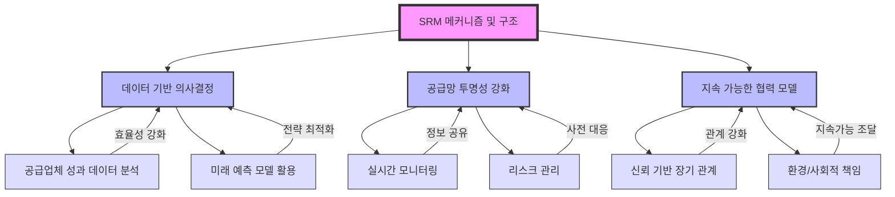

# SRM: 공급자 관계 관리의 전략적 접근

<!-- mtoc-start -->

- [소개 문단](#소개-문단)
- [SRM의 정의 및 개념](#srm의-정의-및-개념)
- [SRM의 주요 특징](#srm의-주요-특징)
  - [1. 공급업체 평가 및 관리](#1-공급업체-평가-및-관리)
  - [2. 협업과 통합 강화](#2-협업과-통합-강화)
  - [3. 전략적 조달 실행](#3-전략적-조달-실행)
- [SRM의 구축 방안](#srm의-구축-방안)
  - [1. 입찰 시스템 도입](#1-입찰-시스템-도입)
  - [2. 평가 시스템 개발](#2-평가-시스템-개발)
  - [3. 통합 플랫폼 운영](#3-통합-플랫폼-운영)
  - [4. 전략적 조달 시행](#4-전략적-조달-시행)
- [SRM의 메커니즘 및 구조](#srm의-메커니즘-및-구조)
  - [1. 데이터 기반 의사결정](#1-데이터-기반-의사결정)
  - [2. 공급망 투명성 강화](#2-공급망-투명성-강화)
  - [3. 지속 가능한 협력 모델](#3-지속-가능한-협력-모델)
- [SRM 구조도](#srm-구조도)
- [SRM의 활용 사례](#srm의-활용-사례)
  - [1. 제조업에서의 조달 최적화](#1-제조업에서의-조달-최적화)
  - [2. 소매업에서의 공급망 효율화](#2-소매업에서의-공급망-효율화)
- [SRM 도입의 기대 효과](#srm-도입의-기대-효과)
  - [1. 비용 절감 및 품질 개선](#1-비용-절감-및-품질-개선)
  - [2. 관계 강화 및 리스크 관리](#2-관계-강화-및-리스크-관리)
- [마무리](#마무리)
- [키워드](#키워드)

<!-- mtoc-end -->

## 소개 문단

SRM(Supplier Relationship Management)은 기업의 외부 파트너인 공급사와의 관계를 개선하고, 수익성과 운영 효율성을 극대화하기 위해 공급업체를 체계적으로 관리하는 솔루션입니다. SRM은 기업과 공급업체 간의 협력을 강화하여 장기적인 경쟁력을 확보하는 데 중점을 둡니다.

## SRM의 정의 및 개념

SRM은 기업과 공급업체 간의 상호 이익을 도모하기 위해 설계된 관리 시스템. 이를 통해 공급망 내 조달 및 관계 관리를 최적화하여 비용 절감과 품질 향상을 동시에 달성할 수 있습니다.

- **공급자 관계 관리**: 공급업체 평가, 계약 관리, 협상 과정 최적화
- **전략적 조달 지원**: 지속 가능한 파트너십 구축 및 성과 극대화

## SRM의 주요 특징

### 1. 공급업체 평가 및 관리

- 성과 데이터와 KPI 기반의 공급업체 평가
- 공급업체 등록, 계약 상태 및 이력 관리

### 2. 협업과 통합 강화

- SCM, CRM, ERP와 연계하여 데이터 흐름 통합
- 공급망 전반의 투명성 및 협업 강화

### 3. 전략적 조달 실행

- 입찰 및 계약 관리 자동화
- 공급업체와의 협상을 통해 비용 절감 및 품질 확보

## SRM의 구축 방안

### 1. 입찰 시스템 도입

- 공급업체 선정 및 입찰 프로세스를 디지털화
- 투명하고 공정한 경쟁 환경 조성

### 2. 평가 시스템 개발

- 공급업체의 성과를 주기적으로 평가하여 개선점 도출
- KPI를 기반으로 한 데이터 중심의 평가 체계 구축

### 3. 통합 플랫폼 운영

- SCM, CRM, ERP와의 연계를 통해 실시간 데이터 통합
- 정보 흐름 최적화를 통해 의사결정 지원

### 4. 전략적 조달 시행

- 데이터 기반의 조달 전략 수립
- 협력적 파트너십을 통한 장기적 비용 절감 및 품질 관리

## SRM의 메커니즘 및 구조

### 1. 데이터 기반 의사결정

- 공급업체 성과 데이터 분석으로 효율성 강화
- 미래 예측 모델을 활용한 조달 전략 최적화

### 2. 공급망 투명성 강화

- 실시간 모니터링과 정보 공유로 투명성 증대
- 공급망 리스크를 사전에 파악하고 해결

### 3. 지속 가능한 협력 모델

- 장기적인 관계 구축을 위한 신뢰 기반 접근
- 환경 및 사회적 책임을 고려한 지속 가능한 조달

## SRM 구조도

## SRM의 활용 사례

### 1. 제조업에서의 조달 최적화

- 주요 원자재 공급업체와의 협상 강화로 비용 절감
- 공급망 리스크 관리와 품질 유지

### 2. 소매업에서의 공급망 효율화

- 다수의 공급업체를 통합 관리하여 운영 효율성 증대
- 판매 데이터를 기반으로 적시 조달 실현

## SRM 도입의 기대 효과

### 1. 비용 절감 및 품질 개선

- 공급업체와의 협력을 통해 비용 절감과 제품 품질 동시 확보
- 중복 프로세스 제거로 운영 효율성 증대

### 2. 관계 강화 및 리스크 관리

- 신뢰 기반의 파트너십 구축으로 장기적 협력 강화
- 공급망 리스크를 사전에 식별하고 대응

## 마무리

SRM은 공급업체와의 관계를 전략적으로 관리하여 기업의 운영 효율성과 수익성을 극대화하는 필수 솔루션입니다. 투명한 입찰 시스템과 평가 체계, SCM/CRM/ERP 통합을 통해 효율적이고 지속 가능한 공급망을 구축할 수 있습니다. SRM을 도입하여 경쟁력을 높이고 성공적인 파트너십을 실현해 보세요.

## 키워드

SRM, Supplier Relationship Management, 공급자 관계 관리, 조달 전략, 공급업체 평가, 비용 절감, 품질 개선, 통합 플랫폼, 공급망 투명성, 지속 가능한 조달