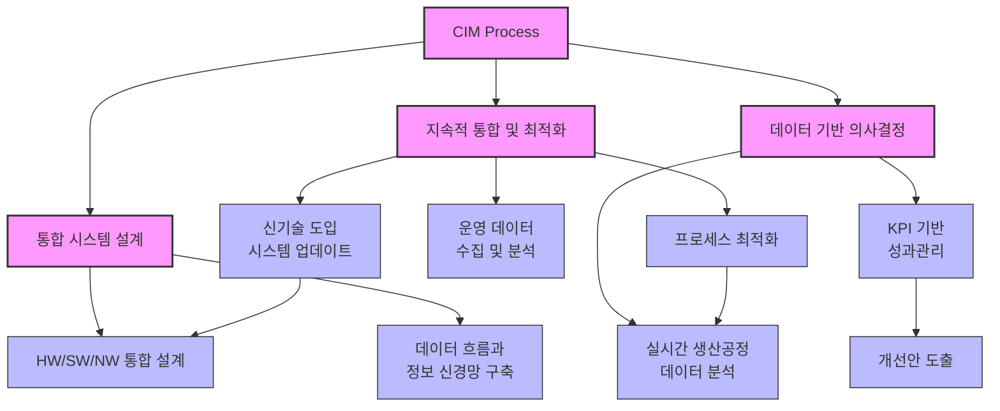

# CIM: 컴퓨터 통합 생산 시스템의 혁신

<!-- mtoc-start -->

- [CIM의 정의 및 개념](#cim의-정의-및-개념)
- [CIM의 구성 요소](#cim의-구성-요소)
  - [1. 제품 개발 관리](#1-제품-개발-관리)
  - [2. 생산 관리 및 공정 제어](#2-생산-관리-및-공정-제어)
  - [3. 판매 및 유통 관리](#3-판매-및-유통-관리)
  - [4. 공장 자동화](#4-공장-자동화)
- [CIM의 절차 및 프로세스](#cim의-절차-및-프로세스)
  - [1. 통합 시스템 설계](#1-통합-시스템-설계)
  - [2. 데이터 기반 의사결정](#2-데이터-기반-의사결정)
  - [3. 지속적 통합 및 최적화](#3-지속적-통합-및-최적화)
- [CIM 프로세스](#cim-프로세스)
- [CIM의 메커니즘 및 구조](#cim의-메커니즘-및-구조)
  - [1. 신경망 체계](#1-신경망-체계)
  - [2. HW/SW/NW 통합](#2-hwswnw-통합)
  - [3. 데이터 통합](#3-데이터-통합)
- [CIM의 활용 사례](#cim의-활용-사례)
  - [1. 자동차 제조업](#1-자동차-제조업)
  - [2. 전자제품 생산업](#2-전자제품-생산업)
- [CIM 도입의 기대 효과](#cim-도입의-기대-효과)
  - [1. 생산 효율성 및 품질 향상](#1-생산-효율성-및-품질-향상)
  - [2. 비용 절감 및 경쟁력 강화](#2-비용-절감-및-경쟁력-강화)
- [마무리](#마무리)
- [키워드](#키워드)

<!-- mtoc-end -->

CIM(Computer Integrated Manufacturing)은 제품 설계부터 생산, 판매, A/S까지 모든 생산 프로세스를 통합 관리하는 시스템입니다. 하드웨어(HW), 소프트웨어(SW), 네트워크(NW)를 결합하여 공장 자동화 설비와 기업 정보 시스템을 통합하며, 생산 라인의 신경망 체계를 구축하여 기업의 생산 전략을 실행하는 데 중점을 둡니다.

## CIM의 정의 및 개념

CIM은 제조업에서 생산 효율성을 극대화하고 경쟁력을 강화하기 위해 설계된 확장된 생산 관리 시스템. 이는 모든 생산 단계에서 데이터와 프로세스를 통합하여 운영합니다.

- **통합 생산 관리**: 설계, 개발, 생산계획, 자재수급 등 전 과정을 지원하는 시스템
- **정보 신경망 구축**: 네트워크를 기반으로 한 실시간 데이터 공유 및 제어
- **HW/SW/NW 통합**: 하드웨어, 소프트웨어, 네트워크를 결합한 자동화 솔루션

## CIM의 구성 요소

### 1. 제품 개발 관리

- 제품 설계 및 개발을 위한 CAD/CAM 시스템 통합
- 시뮬레이션 기반의 제품 최적화

### 2. 생산 관리 및 공정 제어

- 생산 계획 수립 및 자재 수급 관리
- 공정 제어 및 실시간 모니터링을 통한 품질 관리

### 3. 판매 및 유통 관리

- 생산된 제품의 판매 및 물류 관리
- 고객 데이터 기반의 A/S 및 피드백 처리

### 4. 공장 자동화

- 로봇 및 센서 기반의 자동화 설비 운영
- 스마트 팩토리를 통한 생산 효율성 극대화

## CIM의 절차 및 프로세스

### 1. 통합 시스템 설계

- 기업의 생산 전략에 맞춘 HW/SW/NW 통합 설계
- 데이터 흐름과 정보 신경망 구축

### 2. 데이터 기반 의사결정

- 생산 공정 데이터를 실시간 분석하여 최적화
- KPI 기반의 성과 관리 및 개선안 도출

### 3. 지속적 통합 및 최적화

- 운영 중 발생하는 데이터를 활용한 프로세스 최적화
- 신기술 도입을 통한 시스템 업데이트

## CIM 프로세스

1. 통합 시스템 설계 단계에서는 HW/SW/NW 통합 설계와 데이터 흐름 구축.
2. 데이터 기반 의사결정 단계에서는 실시간 데이터 분석, KPI 관리, 개선안 도출이 순차적으로 진행.
3. 지속적 통합 및 최적화 단계에서는 운영 데이터를 활용한 프로세스 최적화와 시스템 업데이트.

최적화 단계에서 데이터 분석으로 돌아가는 피드백 루프와, 시스템 업데이트가 다시 통합 설계로 이어지는 순환 구조.

## CIM의 메커니즘 및 구조

### 1. 신경망 체계

- 생산 라인의 각 요소를 연결하여 실시간 제어 및 데이터 공유
- IoT와 AI 기술을 활용한 예측 및 자동화 제어

### 2. HW/SW/NW 통합

- 하드웨어: 로봇, 센서, 설비 등 물리적 구성 요소
- 소프트웨어: ERP, MES, CAD/CAM 등 정보 처리 시스템
- 네트워크: 데이터 흐름을 지원하는 고속 네트워크 인프라

### 3. 데이터 통합

- 생산 전반에서 발생하는 데이터를 중앙 관리
- 클라우드 기반의 데이터 저장 및 분석

## CIM의 활용 사례

### 1. 자동차 제조업

- 생산 라인의 자동화 설비와 ERP 시스템 연계를 통한 실시간 공정 관리
- 자재 수급 및 재고 관리를 통해 낭비 최소화

### 2. 전자제품 생산업

- 스마트 팩토리를 기반으로 한 생산 효율성 증대
- 고객 피드백 데이터를 활용한 제품 개선

## CIM 도입의 기대 효과

### 1. 생산 효율성 및 품질 향상

- 생산 공정의 자동화와 통합 관리로 오류 감소
- 실시간 모니터링으로 품질 관리 강화

### 2. 비용 절감 및 경쟁력 강화

- 중복 작업 제거와 자원 최적화를 통한 비용 절감
- 신속한 시장 대응으로 경쟁력 확보

## 마무리

CIM은 제조업의 모든 프로세스를 통합 관리하여 생산성을 극대화하는 혁신적인 시스템입니다. HW, SW, NW의 통합과 신경망 체계를 활용하여 기업은 지속 가능한 생산 전략을 실행할 수 있습니다. CIM을 통해 제조업의 새로운 표준을 구현하고, 시장 변화에 유연하게 대응해 보세요.

## 키워드

CIM, Computer Integrated Manufacturing, 통합 생산 관리, 공장 자동화, 정보 신경망, HW/SW/NW 통합, 생산 전략, 공정 제어, 스마트 팩토리, 제조업 혁신