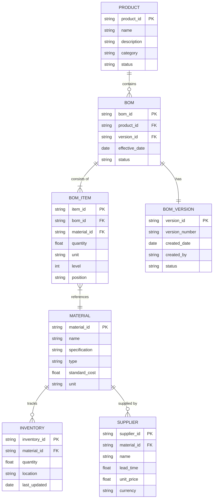

# BOM: 생산을 체계화하는 핵심 데이터 구조

<!-- mtoc-start -->

- [BOM의 정의 및 개념](#bom의-정의-및-개념)
- [BOM의 유형](#bom의-유형)
  - [1. Single Level BOM](#1-single-level-bom)
  - [2. Indented BOM](#2-indented-bom)
  - [3. Summarized BOM](#3-summarized-bom)
- [BOM의 종류](#bom의-종류)
  - [1. 설계 BOM (E-BOM)](#1-설계-bom-e-bom)
  - [2. 제조 BOM (M-BOM)](#2-제조-bom-m-bom)
  - [3. 계획 BOM (P-BOM)](#3-계획-bom-p-bom)
- [BOM 데이터 구조도](#bom-데이터-구조도)
- [BOM의 유효성 관리](#bom의-유효성-관리)
- [BOM의 활용 사례](#bom의-활용-사례)
  - [1. 제조업의 생산 관리](#1-제조업의-생산-관리)
  - [2. 원가 관리 및 분석](#2-원가-관리-및-분석)
- [BOM 도입의 기대 효과](#bom-도입의-기대-효과)
  - [1. 생산 효율성 향상](#1-생산-효율성-향상)
  - [2. 품질 관리 및 비용 절감](#2-품질-관리-및-비용-절감)
- [마무리](#마무리)
- [키워드](#키워드)

<!-- mtoc-end -->

BOM(Bill Of Material)은 제품 생산에 필요한 모든 조립품, 반조립품, 부분품, 원자재의 목록과 제품 구조 정보를 체계화한 데이터베이스입니다. 이는 생산에 필요한 수량, 자재 구조, 유효성을 관리하며 효율적인 생산 관리와 원가 절감에 중요한 역할을 합니다.

## BOM의 정의 및 개념

BOM은 제품 설계, 생산, 판매 계획에 필요한 구성 정보를 포함하여 제조 프로세스를 체계적으로 지원하는 도구.

- **구성 정보**: Product Structure, Part Master 정보, Plant Record 정보
- **주요 용도**: 설계 구조 분석, 필요 부품 확인, 원가 식별, 구매/생산 일정 수립, 자재 부족 확인
- **표현 방식**: BOM Tree 형태로 계층적 구성 정보 시각화

## BOM의 유형

### 1. Single Level BOM

- 단일 계층으로 구성된 BOM
- 한 단계의 구성 요소만 표시하여 단순성 강조

### 2. Indented BOM

- 계층 구조를 통해 구성 요소 간의 관계를 표현
- 하위 구성 요소와 상위 요소 간의 종속 관계를 명확히 표시

### 3. Summarized BOM

- 필요한 자재의 총 수량을 집계하여 제공
- 대량 생산 및 자재 계획 수립에 유용

## BOM의 종류

### 1. 설계 BOM (E-BOM)

- 제품 설계 정보를 기반으로 작성된 BOM
- 설계 단계에서 필요한 모든 구성 요소를 포함

### 2. 제조 BOM (M-BOM)

- 제조 과정에 맞춘 BOM으로, 제조 단계의 세부 정보를 포함
- E-BOM과 일치해야 품질 문제 방지 가능

### 3. 계획 BOM (P-BOM)

- 생산 계획 및 조립 전략을 반영한 BOM
- **Modular BOM**: 완제품 제외한 구성 모듈 중심의 BOM
- **Super BOM**: 횡배치를 통해 다양한 조합 지원
- **Comparative BOM**: 표준 BOM과 비교 분석 가능

## BOM 데이터 구조도

1. PRODUCT(제품): 최상위 완제품 정보를 관리.
2. BOM(자재명세서): 제품 구성에 대한 기본 정보.
3. BOM_ITEM(BOM 항목): 실제 자재 구성 정보 상세.
4. MATERIAL(자재): 모든 원자재와 부품의 기본 정보 관리.
5. BOM_VERSION(BOM 버전): BOM의 이력관리를 위한 버전 정보.
6. INVENTORY(재고): 자재의 재고 현황을 관리.
7. SUPPLIER(공급업체): 자재별 공급업체 정보 관리.

**엔티티 간의 관계:**

- 하나의 제품은 여러 개의 BOM 구성 (1:N)
- 각 BOM은 여러 개의 BOM 항목으로 구성 (1:N)
- 각 BOM 항목은 하나의 자재를 참조 (N:1)
- 하나의 자재는 여러 공급업체와 연결 가능 (1:N)
- 각 자재는 여러 재고 정보로 구성 (1:N)

제품 구성, 자재 소요량, 재고 관리, 공급망 관리 등을 체계적으로 수행

## BOM의 유효성 관리

- **날짜**: 특정 기간에 사용되는 BOM 정의
- **일련번호**: 고유 식별자를 통해 데이터 추적 가능
- **작업 단위(Lot)**: 생산 단위별 BOM 관리로 정확성 확보

## BOM의 활용 사례

### 1. 제조업의 생산 관리

- BOM Tree를 활용한 부품 필요량 계산
- 생산 공정 최적화를 위한 자재 사용 계획 수립

### 2. 원가 관리 및 분석

- 제품 구성의 세부 정보를 통해 원가 식별
- 부품 단가 데이터와 결합하여 비용 절감 전략 수립

## BOM 도입의 기대 효과

### 1. 생산 효율성 향상

- 명확한 자재 목록으로 생산 계획과 자재 조달 간소화
- 계층 구조를 통한 데이터 시각화로 정보 전달력 증대

### 2. 품질 관리 및 비용 절감

- E-BOM과 M-BOM의 일치를 통해 품질 문제 방지
- 자재 부족 방지를 통한 생산 지연 최소화

## 마무리

BOM은 제품 생산에 필요한 모든 데이터를 체계적으로 관리하여 생산성과 품질을 동시에 향상시키는 핵심 도구입니다. 이를 통해 제조업체는 설계에서 생산, 판매에 이르는 전 과정을 통합적으로 관리하며, 경쟁력을 강화할 수 있습니다. BOM을 적극 활용하여 효율적이고 정확한 생산 관리를 실현해 보세요.

## 키워드

BOM, Bill Of Material, 제품 구성 정보, 생산 관리, 자재 조달, E-BOM, M-BOM, P-BOM, 원가 관리, 제조업 혁신