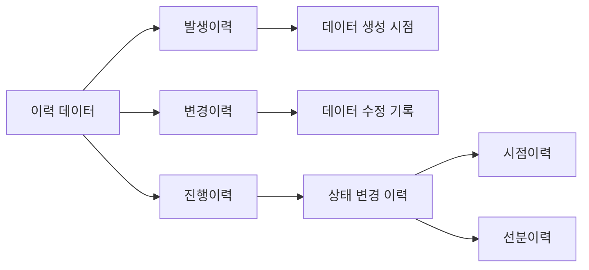

# DHM (Data History Management): 효과적 데이터 이력관리

<!-- mtoc-start -->

- [정의 및 개념](#정의-및-개념)
- [주요 특징 또는 구성 요소](#주요-특징-또는-구성-요소)
- [이력관리 구조](#이력관리-구조)
- [활용 사례](#활용-사례)
- [기대 효과 및 필요성](#기대-효과-및-필요성)
- [마무리](#마무리)
- [Keywords](#keywords)

<!-- mtoc-end -->

데이터 이력관리는 조직의 데이터 활용 능력을 높이는 핵심 기법이다. 시간의 흐름에 따라 데이터가 생성되고 수정되는 과정을 체계적으로 관리함으로써, 데이터의 신뢰성과 추적 가능성을 확보할 수 있다. 특히 DHM은 데이터의 과거 기록을 효과적으로 관리하여 데이터 기반 의사결정을 지원하는 데 중요한 역할을 한다.

## 정의 및 개념

**DHM(Data History Management)**은 데이터의 시간 변화에 따라 발생하는 **생성 및 수정사항**을 체계적으로 관리하는 기법과 관련 활동\
이력관리는 데이터의 시간적 상태를 기록하고, 이를 필요 시 분석하거나 복원하기 위한 체계를 제공한다.

## 주요 특징 또는 구성 요소

1. **이력 데이터 종류**

   - **발생이력데이터**: 데이터가 최초로 생성된 시점의 정보 기록.
   - **변경이력데이터**: 데이터가 수정된 기록을 포함한 변경 사항 관리.
   - **진행이력데이터**: 프로세스나 작업의 상태가 진행됨에 따라 변경된 데이터의 기록.

2. **이력관리 유형**

   - **시점이력 (Point-in-Time History)**: 특정 시점에서의 데이터 상태를 관리. 스냅샷 방식으로 저장.
   - **선분이력 (Interval History)**: 데이터의 유효 기간(시작과 종료 시점)을 포함한 상태를 관리.

3. **시간 변화 기록**  
   데이터가 생성, 변경, 삭제되는 모든 시점에 대한 기록을 남김으로써, 데이터의 완전성을 보장.

4. **효율적 저장**  
   대량의 이력 데이터를 저장하고 관리하기 위한 최적화된 데이터베이스 설계와 압축 기법 적용.

5. **데이터 복구와 추적성**  
   과거 데이터 상태의 복원 및 분석 가능성 제공.

## 이력관리 구조

## 활용 사례

6. **금융기관의 거래 이력 관리**  
   금융 거래 내역의 변경과 발생 시점을 기록하여 감사 및 규제 준수를 지원.

7. **공급망 관리**  
   재고 및 주문 상태의 진행 이력을 기록하여 공급망의 투명성 확보.

8. **헬스케어 시스템**  
   환자 진료 기록의 시점별 상태를 관리하여 의료 데이터의 추적 가능성 보장.

9. **정부 및 공공 데이터**  
   공공 행정 데이터의 변경 내역 관리로 신뢰성 증대.

## 기대 효과 및 필요성

10. **데이터 신뢰성 확보**  
   데이터의 과거 상태와 변경 과정을 명확히 기록하여 신뢰성 향상.

11. **의사결정 지원**  
   시점별 데이터 분석을 통해 변화 추세를 예측하고 전략적 결정을 지원.

12. **법적 및 규제 준수**  
   데이터 감사 및 규제 요건 충족을 위한 데이터 추적성 제공.

13. **운영 효율성 증가**  
   데이터 복원과 변경 추적 과정을 간소화하여 비용 절감.

## 마무리

DHM(Data History Management)은 데이터의 생성, 수정, 삭제 이력을 체계적으로 관리하여 데이터의 신뢰성과 활용도를 극대화하는 필수 기법이다. 데이터의 시간적 맥락을 이해하고 이를 바탕으로 데이터 기반 의사결정을 강화하려는 모든 조직에서 DHM의 도입은 더 이상 선택이 아닌 필수라 할 수 있다.

## Keywords

Data History Management, 발생이력 데이터, 변경이력 데이터, 진행이력 데이터, 시점이력 (Point-in-Time History), 선분이력 (Interval History), 데이터 추적성, 데이터 신뢰성, 데이터 복구, 데이터 감사