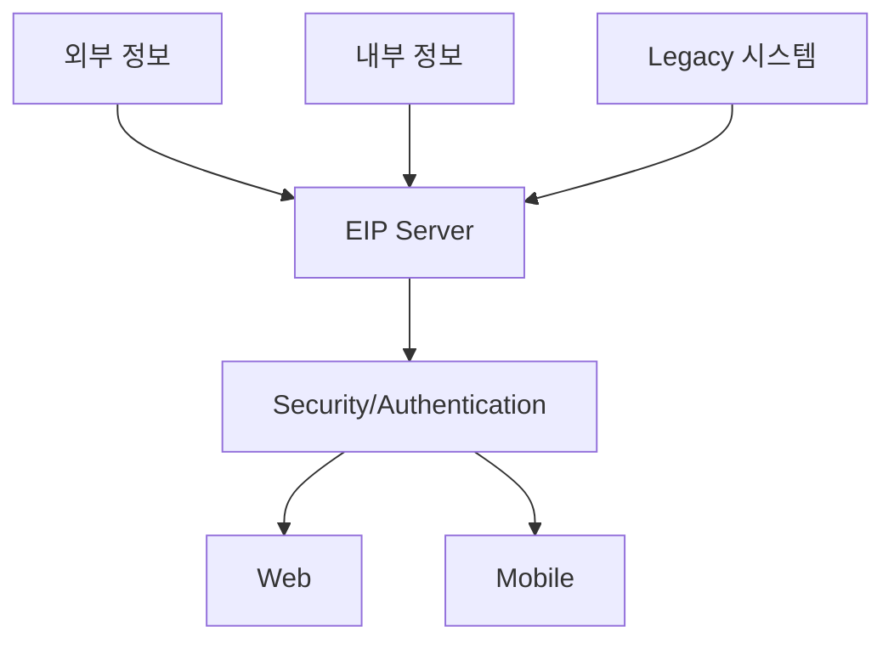

# EIP (Enterprise Integration Portal): 기업 시스템 통합

<!-- mtoc-start -->

- [정의 및 개념](#정의-및-개념)
- [주요 특징](#주요-특징)
- [구성도](#구성도)
  - [구성 요소 설명](#구성-요소-설명)
- [활용 사례](#활용-사례)
- [기대 효과 및 필요성](#기대-효과-및-필요성)
- [마무리](#마무리)
- [Keywords](#keywords)

<!-- mtoc-end -->

기업의 시스템 환경이 점점 복잡해지면서 다양한 시스템과 데이터를 하나로 통합하고 사용자에게 일원화된 접근 방식을 제공하는 것이 중요해졌습니다. Enterprise Integration Portal(EIP)은 이러한 요구를 해결하기 위해 설계된 시스템으로, 단일 창구, 개인화, SSO(Single Sign-On)와 같은 기능을 통해 사용자 경험을 향상시키고 정보 활용 효율성을 극대화합니다.

## 정의 및 개념

Enterprise Integration Portal(EIP)은 기업 내외부의 다양한 시스템과 정보를 통합하여 사용자에게 단일 인터페이스로 제공하는 포털 시스템. EIP는 다양한 정보 및 시스템 간의 연결성을 강화하고, 효율적인 정보 이용과 관리를 지원하는 핵심 역할을 수행합니다.

- **단일창구**: 여러 시스템을 통합하여 하나의 창구로 제공
- **개인화**: 사용자 맞춤형 정보와 서비스를 제공
- **SSO(Single Sign-On)**: 하나의 인증으로 여러 시스템에 접근 가능
- **포털시스템**: 다양한 애플리케이션과 데이터를 통합 관리
- **효율적 정보 이용**: 정보 접근성과 사용성을 개선

## 주요 특징

1. **통합 플랫폼**: 기업 내부와 외부 시스템을 통합하여 데이터와 애플리케이션의 효율적 활용 가능
2. **사용자 맞춤형 인터페이스**: 사용자별 요구사항에 따라 개인화된 대시보드 제공
3. **강화된 보안**: 인증 및 접근 제어를 통해 안전한 데이터 환경 제공
4. **다중 채널 지원**: 웹과 모바일 환경 모두에서 원활한 정보 접근 가능
5. **운영 효율성**: 통합된 관리 환경으로 유지보수 비용 절감

## 구성도

### 구성 요소 설명

| 구성 요소                   | 설명                                       |
| --------------------------- | ------------------------------------------ |
| **외부 정보**               | 인터넷 및 제휴사 데이터를 포함한 외부 소스 |
| **내부 정보**               | 기업 내부 시스템에서 생성되는 데이터       |
| **Legacy 시스템**           | 기존의 ERP, CRM 등 핵심 시스템             |
| **EIP Server**              | 통합 및 데이터 처리를 담당하는 핵심 엔진   |
| **Security/Authentication** | SSO 및 인증/인가 처리 모듈                 |
| **Web/Mobile**              | 다양한 채널로 최종 사용자에게 정보 제공    |

## 활용 사례

6. **대기업의 통합 업무 플랫폼**: ERP, CRM, HR 시스템을 EIP로 통합하여 직원들이 단일 포털에서 모든 업무를 처리할 수 있도록 지원
7. **공공기관의 시민 서비스 포털**: 공공 데이터를 통합하여 시민들이 필요한 정보를 한 곳에서 조회 및 신청 가능
8. **금융권의 고객 서비스 플랫폼**: 고객 정보를 통합하여 개인화된 금융 상품과 서비스를 제공

## 기대 효과 및 필요성

9. **생산성 향상**: 단일 포털을 통해 정보 접근성을 높이고 업무 효율성을 증대
10. **운영 비용 절감**: 통합 관리를 통해 시스템 유지보수와 운영 비용 감소
11. **사용자 경험 개선**: 개인화와 단일 인증(Single Sign-On)을 통해 사용자 만족도 향상
12. **데이터 통합성 확보**: 다양한 시스템 간 데이터를 연결하여 일관된 정보 제공
13. **보안 강화**: 중앙 집중형 인증 및 접근 제어로 보안 수준 향상

## 마무리

EIP는 기업 시스템 통합의 핵심적인 역할을 하며, 다양한 정보와 애플리케이션을 효율적으로 관리할 수 있는 환경을 제공합니다. 이를 통해 기업은 업무 효율성을 증대시키고, 사용자 경험을 개선하며, 운영 비용을 절감할 수 있습니다. 디지털 전환 시대에 필수적인 솔루션인 EIP를 도입하여 경쟁력을 강화해보세요.

## Keywords

Enterprise Integration Portal, 기업 시스템 통합, 단일창구, 개인화, SSO, 포털 시스템, 정보 통합, 데이터 관리, 정보 보안, 효율적 정보 이용