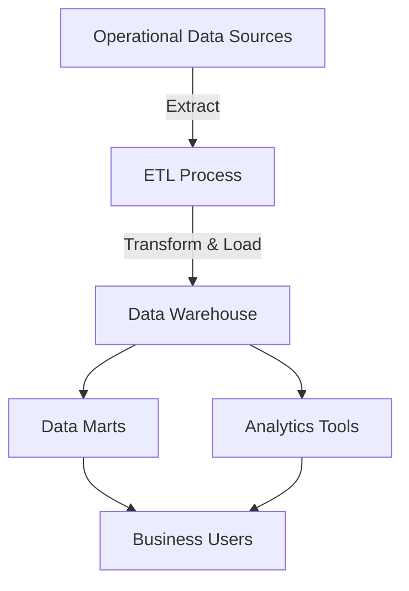

# Data Warehouse: 논리적 중앙 집중식 데이터 집합체

<!-- mtoc-start -->

- [정의 및 개념(주통시비)](#정의-및-개념주통시비)
- [주요 특징](#주요-특징)
- [구성도](#구성도)
  - [구성 요소 설명](#구성-요소-설명)
- [활용 사례](#활용-사례)
- [기대 효과 및 필요성](#기대-효과-및-필요성)
- [마무리](#마무리)
- [Keywords](#keywords)

<!-- mtoc-end -->

데이터 웨어하우스(Data Warehouse)는 기업의 다양한 데이터 소스를 통합하여 분석과 의사결정을 지원하는 논리적 중앙 집중식 데이터 집합체입니다. 데이터는 물리적으로 분리되어 있을 수 있지만, 논리적으로는 일관된 구조와 체계를 갖추고 있어 다양한 분석 작업을 효율적으로 수행할 수 있습니다. 이는 데이터 기반 경영을 위한 핵심 기술 중 하나로, 현대 기업에서 중요한 역할을 합니다.

## 정의 및 개념(주통시비)

데이터 웨어하우스는 대량의 데이터를 저장, 관리, 분석하기 위한 시스템.

- **통합성**: 다양한 소스에서 데이터를 수집하여 일관된 형식으로 통합
- **주제 중심적**: 분석과 의사결정을 지원하기 위해 특정 주제(예: 판매, 고객, 제품) 중심으로 설계
- **비휘발성**: 한 번 저장된 데이터는 변경되지 않으며, 분석 목적으로만 사용
- **시간 가변성**: 시간이 지남에 따라 데이터의 변화를 추적 가능

## 주요 특징

1. **ETL 프로세스**: 데이터 추출(Extract), 변환(Transform), 적재(Load)를 통해 데이터 품질과 일관성을 확보
2. **대량 데이터 처리**: 다양한 소스에서 오는 데이터를 대규모로 처리하고 저장
3. **분석 최적화**: 복잡한 분석 쿼리를 빠르게 처리하기 위한 구조 제공
4. **데이터 마트**: 특정 부서나 주제에 맞춘 소규모 데이터 웨어하우스 지원
5. **중앙 집중 관리**: 데이터 관리를 중앙화하여 신뢰성 확보

## 구성도

### 구성 요소 설명

| 구성 요소                    | 설명                                                |
| ---------------------------- | --------------------------------------------------- |
| **Operational Data Sources** | 운영 데이터베이스, 로그 파일, 외부 데이터 소스      |
| **ETL Process**              | 데이터를 추출, 변환, 적재하여 웨어하우스로 전달     |
| **Data Warehouse**           | 통합된 데이터를 저장하고 관리하는 중앙 저장소       |
| **Data Marts**               | 부서별 혹은 주제별로 최적화된 소규모 데이터 저장소  |
| **Analytics Tools**          | BI 도구를 활용한 데이터 분석 및 시각화              |
| **Business Users**           | 데이터를 활용하여 인사이트를 도출하고 의사결정 수행 |

## 활용 사례

6. **소매업의 고객 분석**: 구매 패턴 분석을 통해 맞춤형 마케팅 캠페인 실행
7. **금융권의 리스크 관리**: 대출 데이터 분석을 통해 신용 위험 예측
8. **헬스케어 산업**: 환자 기록 데이터를 통합하여 치료 결과 분석
9. **제조업의 공급망 관리**: 재고와 물류 데이터를 분석하여 효율성 향상

## 기대 효과 및 필요성

10. **의사결정 지원**: 데이터 기반의 정확한 의사결정 가능
11. **운영 효율성 향상**: 데이터의 중앙 집중화를 통해 중복 작업 감소
12. **미래 예측 가능성**: 과거 데이터를 기반으로 트렌드와 패턴 분석
13. **비용 절감**: 데이터 분석 프로세스 최적화로 자원 낭비 방지
14. **경쟁 우위 확보**: 데이터로부터 도출된 인사이트를 통해 시장에서 차별화된 전략 수립

## 마무리

데이터 웨어하우스는 현대 비즈니스 환경에서 데이터 통합과 분석의 핵심 역할을 합니다. 이는 기업이 데이터 중심의 경영을 실현하고 경쟁력을 강화하는 데 필수적인 기술입니다. 데이터 웨어하우스를 도입하여 데이터를 가치 있는 자산으로 전환해보세요.

## Keywords

Data Warehouse, 데이터 웨어하우스, ETL, 데이터 통합, 데이터 분석, 데이터 마트, 중앙 집중 관리, 비휘발성 데이터, 의사결정 지원, 데이터 기반 경영