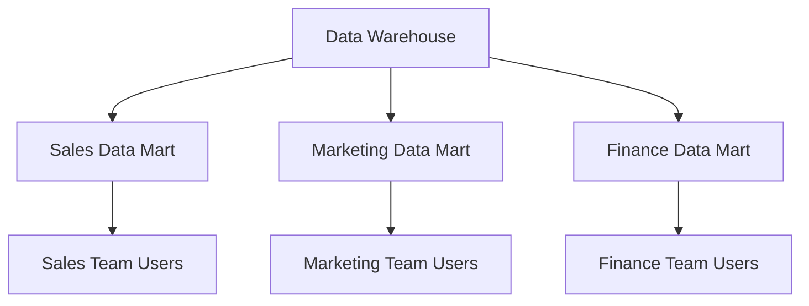

# Data Mart: 전술적 즉각적 요구 충족 데이터 저장소

<!-- mtoc-start -->

- [정의 및 개념](#정의-및-개념)
- [주요 특징](#주요-특징)
- [구성도](#구성도)
  - [구성 요소 설명](#구성-요소-설명)
- [활용 사례](#활용-사례)
- [기대 효과 및 필요성](#기대-효과-및-필요성)
- [마무리](#마무리)
- [Keywords](#keywords)

<!-- mtoc-end -->

데이터 마트(Data Mart)는 전사적으로 구축된 데이터 웨어하우스(DW) 내에서 특정 주제나 부서 중심으로 구축된 소규모 데이터 저장소입니다. 이는 전술적인 즉각적 요구를 충족시키기 위해 설계되었으며, 사용 목적에 맞춘 접근성과 사용성을 제공하는 것이 핵심입니다. 데이터 마트는 특정 사용자 그룹이 신속하게 필요한 데이터를 분석하고 활용할 수 있도록 지원합니다.

## 정의 및 개념

데이터 마트는 DW의 하위 단위로, 특정 주제나 부서를 중심으로 설계된 데이터 저장소.

- **전술적 요구 충족**: 특정 비즈니스 부문이나 부서의 분석 요구를 신속히 처리
- **주제 중심**: 판매, 마케팅, 고객 관리 등 특정 주제를 중심으로 데이터 구성
- **DW의 하위 단위**: 전사적 DW의 데이터를 특정 목적으로 세분화하여 저장
- **접근성과 사용성 강화**: 특정 사용자 그룹에 맞춘 데이터 접근 및 분석 환경 제공

## 주요 특징

1. **주제별 설계**: 특정 주제나 비즈니스 기능에 초점을 맞춘 데이터 저장소
2. **빠른 데이터 접근**: 특정 부서나 사용자가 신속히 필요한 데이터를 사용할 수 있도록 설계
3. **저비용 운영**: DW보다 작은 규모로 구축되어 운영 비용이 상대적으로 낮음
4. **DW와의 연계**: DW로부터 데이터를 추출하거나 연계하여 활용
5. **사용자 맞춤형**: 특정 부서나 팀의 요구를 충족하기 위해 맞춤화된 데이터 구조 제공

## 구성도

### 구성 요소 설명

| 구성 요소               | 설명                                                    |
| ----------------------- | ------------------------------------------------------- |
| **Data Warehouse**      | 전사적으로 구축된 중앙 데이터 저장소                    |
| **Sales Data Mart**     | 판매 데이터를 분석하기 위해 설계된 소규모 데이터 저장소 |
| **Marketing Data Mart** | 마케팅 데이터를 분석하기 위해 설계된 데이터 저장소      |
| **Finance Data Mart**   | 재무 데이터를 분석하기 위한 데이터 저장소               |
| **Team Users**          | 특정 부서의 데이터를 분석 및 활용하는 최종 사용자       |

## 활용 사례

6. **판매 부서의 데이터 분석**: 판매 데이터 마트를 활용해 지역별, 제품별 매출 분석
7. **마케팅 캠페인 성과 분석**: 마케팅 데이터 마트를 통해 캠페인 효과와 고객 반응 분석
8. **재무 데이터 모니터링**: 재무 데이터 마트를 이용해 비용 구조와 예산 현황 분석
9. **특정 프로젝트 지원**: 프로젝트 중심으로 데이터를 집계하여 분석 결과를 신속히 제공

## 기대 효과 및 필요성

10. **신속한 의사결정 지원**: 특정 요구를 충족하는 데이터 제공으로 빠른 의사결정 가능
11. **분석 효율성 증대**: 소규모로 최적화된 데이터 저장소로 빠른 분석 수행
12. **사용자 만족도 향상**: 사용 목적에 맞춘 데이터 제공으로 데이터 활용성 강화
13. **DW 부담 경감**: DW의 데이터를 세분화하여 부하를 줄이고 효율적 운영 가능
14. **비용 절감**: 필요한 데이터만 저장 및 분석하여 운영 비용 절감

## 마무리

데이터 마트는 특정 주제나 부서의 요구를 충족시키기 위해 설계된 작지만 강력한 데이터 저장소입니다. 이는 전사적 DW와의 연계를 통해 기업의 데이터 활용도를 극대화하고, 신속하고 정확한 의사결정을 지원합니다. 데이터 마트를 도입하여 부서 중심의 분석 요구를 효과적으로 해결해 보세요.

## Keywords

Data Mart, 데이터 마트, 전술적 데이터, 주제 중심 데이터, 데이터 웨어하우스, DW 하위 단위, 데이터 분석, 부서 중심, 데이터 저장소, 데이터 활용