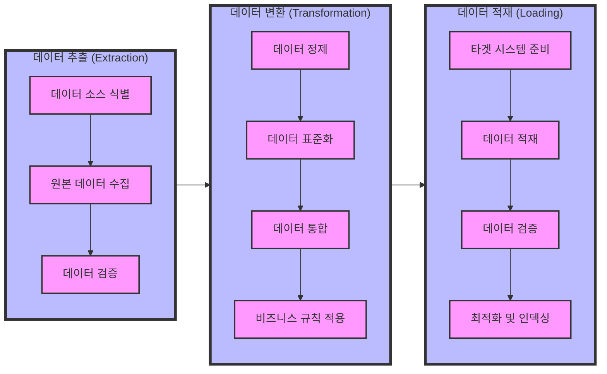

# ETL (Extraction, Transformation, Loading): 데이터 처리의 핵심

<!-- mtoc-start -->

- [정의 및 개념](#정의-및-개념)
- [주요 특징](#주요-특징)
- [아키텍처](#아키텍처)
- [ETL 도구](#etl-도구)
  - [DBMS Embedded ETL](#dbms-embedded-etl)
  - [DBMS Independent ETL](#dbms-independent-etl)
- [ETL Process Flow](#etl-process-flow)
- [활용 사례](#활용-사례)
- [기대 효과 및 필요성](#기대-효과-및-필요성)
- [마무리](#마무리)
- [Keywords](#keywords)

<!-- mtoc-end -->

데이터를 소스 시스템에서 추출하고 정제하여 데이터 웨어하우스(Data Warehouse, DW)에 적재하는 일련의 과정은 데이터 처리에서 중요한 역할을 한다. 기존 ETL 방식과 최근 대두되는 ELT 방식의 차이를 이해하고, ETL의 기능과 아키텍처, 주요 도구를 살펴본다.

## 정의 및 개념

- ETL: 데이터를 추출(Extraction), 변환(Transformation), 적재(Loading)하는 데이터 처리 프로세스
- ELT: 데이터를 먼저 적재(Loading)한 후 변환(Transformation)하는 방식으로 최근 추세
- 기능: 데이터 선택, 추출, 정련, 변환, 통합

## 주요 특징

- 다양한 데이터 소스에서 데이터 추출 가능
- 변환을 통해 정제 및 표준화 수행
- 데이터 웨어하우스 또는 데이터 레이크에 적재
- ETL과 ELT 방식의 차이점: ELT는 대용량 데이터 처리 및 클라우드 환경에서 유리

## 아키텍처

- 운영 시스템 중심: 소스 시스템에서 직접 ETL 수행
- DW 중심: 데이터 웨어하우스에서 데이터 정제 및 변환
- 별도 ETL 서버: 전용 ETL 서버에서 변환 및 적재 수행

## ETL 도구

### DBMS Embedded ETL

- DBMS 기능 활용하여 ETL 수행
- 높은 통합성과 종속성
- 다양한 환경 지원이 어려움

### DBMS Independent ETL

- 다양한 환경 지원 가능
- 사전 정의된 추출 프로세스(어댑터) 제공
- 독립적인 ETL 도구 활용 가능

## ETL Process Flow

1. 데이터 추출 (Extraction)

   - 데이터 소스 식별: 필요한 데이터의 위치와 형식 파악
   - 원본 데이터 수집: 다양한 소스에서 데이터 추출
   - 데이터 검증: 추출된 데이터의 완전성과 정확성 확인

2. 데이터 변환 (Transformation)

   - 데이터 정제: 오류 수정, 중복 제거
   - 데이터 표준화: 일관된 형식으로 변환
   - 데이터 통합: 여러 소스의 데이터 결합
   - 비즈니스 규칙 적용: 데이터 품질 규칙 적용

3. 데이터 적재 (Loading)
   - 타겟 시스템 준비: 대상 시스템 구성
   - 데이터 적재: 변환된 데이터 저장
   - 데이터 검증: 적재된 데이터의 정확성 확인
   - 최적화 및 인덱싱: 성능 향상을 위한 작업

## 활용 사례

- 기업의 데이터 웨어하우스 구축
- 실시간 데이터 분석을 위한 데이터 정제
- 빅데이터 환경에서의 데이터 처리 및 적재
- 클라우드 기반 데이터 레이크 활용

## 기대 효과 및 필요성

- 데이터 일관성 및 품질 향상
- 분석 및 보고서 생성 속도 개선
- 다양한 소스 데이터를 통합하여 비즈니스 인사이트 제공
- 클라우드 및 빅데이터 환경에서 최적화된 데이터 처리

## 마무리

ETL은 데이터 처리의 핵심 프로세스로, 다양한 환경과 요구사항에 맞춰 변화하고 있다. 최근에는 ELT 방식이 클라우드 및 대규모 데이터 처리에 적합한 대안으로 부상하고 있다. 기업은 자사의 데이터 아키텍처에 적합한 ETL 또는 ELT 방식을 선택하여 효율적인 데이터 운영을 할 필요가 있다.

## Keywords

ETL, ELT, 데이터 변환, 데이터 적재, 데이터 웨어하우스, DBMS Embedded ETL, DBMS Independent ETL, 데이터 정제, 빅데이터 처리, 클라우드 데이터