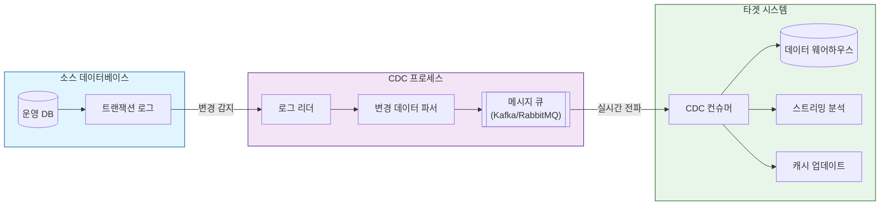

# CDC (Change Data Capture): 실시간 데이터 통합 기술

<!-- mtoc-start -->

- [정의 및 개념](#정의-및-개념)
- [주요 특징](#주요-특징)
- [활용 사례](#활용-사례)
- [CDC 구현 기법](#cdc-구현-기법)
  - [1. Time Stamp on Rows](#1-time-stamp-on-rows)
  - [2. Version Numbers on Rows](#2-version-numbers-on-rows)
  - [3. Status on Rows](#3-status-on-rows)
  - [4. Time/Version/Status on Rows](#4-timeversionstatus-on-rows)
  - [5. Triggers on Tables](#5-triggers-on-tables)
  - [6. Event Programming](#6-event-programming)
  - [7. Log Scanner on Database](#7-log-scanner-on-database)
- [CDC 구현 방식](#cdc-구현-방식)
  - [1. 푸시(Push) 방식](#1-푸시push-방식)
  - [2. 풀(Pull) 방식](#2-풀pull-방식)
- [CDC Architecture and Data Flow](#cdc-architecture-and-data-flow)
- [기대 효과 및 필요성](#기대-효과-및-필요성)
- [마무리](#마무리)
- [Keywords](#keywords)

<!-- mtoc-end -->

데이터베이스 내 데이터 변경을 식별하여 필요한 후속 처리를 자동화하는 기술 또는 설계 기법이다. 실시간 또는 근접 실시간 데이터 통합을 기반으로 하는 데이터 웨어하우스 및 기타 데이터 저장소 구축에 폭넓게 활용된다.

## 정의 및 개념

- CDC: 데이터베이스 내 데이터 변경을 자동으로 감지하여 전송 및 공유하는 기술
- 특징: 실시간 데이터 통합, 유연성, 확장성, Redo 로그 기반 마이그레이션, 데이터 일관성 유지, 트랜잭션 전송, 고속/저부하

## 주요 특징

- 실시간 데이터 통합 지원
- 데이터 마이그레이션 및 백업 시스템과 연계 가능
- 다양한 CDC 구현 기법 활용 가능
- 변경 데이터의 효율적 전송 및 저장 지원

## 활용 사례

- DW 실시간 데이터 통합
- 데이터베이스 마이그레이션 및 U2L(Unix→Linux) 전환: 다운타임 최소화, 비용 절감
- DR(재해 복구) 및 백업 시스템: 실시간 데이터 동기화, 네트워크 비용 절감, 신속한 복구

## CDC 구현 기법

### 1. Time Stamp on Rows

- 각 행에 타임스탬프 추가하여 변경 식별

### 2. Version Numbers on Rows

- 각 행에 버전 번호를 부여하여 변경 사항 추적

### 3. Status on Rows

- 불린(boolean) 값을 활용하여 변경 여부 판단

### 4. Time/Version/Status on Rows

- 타임스탬프, 버전 번호, 상태 값을 조합하여 변경 사항 식별

### 5. Triggers on Tables

- 데이터베이스 트리거를 활용하여 변경 사항 기록
- 복잡성 증가, 확장성 저하 등의 단점 존재

### 6. Event Programming

- 애플리케이션 내에서 데이터 변경 감지 및 처리 구현
- 개발 부담 증가하지만 다양한 CDC 매커니즘 적용 가능

### 7. Log Scanner on Database

- 트랜잭션 로그를 스캔하여 변경 사항 분석
- 데이터베이스 및 애플리케이션 영향 최소화
- 데이터베이스 스키마 변경 불필요

## CDC 구현 방식

### 1. 푸시(Push) 방식

- 데이터 원천(Source)에서 변경 사항을 즉시 대상 시스템(Target)으로 전송

### 2. 풀(Pull) 방식

- 대상 시스템(Target)이 정기적으로 원천(Source) 데이터를 모니터링 후 필요 시 다운로드

## CDC Architecture and Data Flow

1. 소스 데이터베이스:

   - 운영 데이터베이스에서 발생하는 모든 변경사항이 트랜잭션 로그에 기록

2. CDC 프로세스:

   - 로그 리더가 트랜잭션 로그의 변경사항을 실시간으로 감지
   - 파서가 변경 데이터를 구조화된 형태로 변환
   - 변환된 데이터는 메시지 큐(Kafka/RabbitMQ)를 통해 전파

3. 타겟 시스템:
   - CDC 컨슈머가 변경 데이터를 수신하여 다양한 타겟 시스템에 적용
   - 데이터 웨어하우스 동기화
   - 실시간 스트리밍 분석
   - 캐시 업데이트

## 기대 효과 및 필요성

- 실시간 데이터 처리 및 동기화 가능
- 데이터 무결성 및 일관성 유지
- 네트워크 및 운영 비용 절감
- 데이터 마이그레이션 시 다운타임 최소화

## 마무리

CDC(Change Data Capture)는 실시간 데이터 통합을 가능하게 하는 핵심 기술로, 다양한 데이터 환경에서 유연하게 활용될 수 있다. 적절한 CDC 기법과 구현 방식을 선택하여 데이터 일관성을 유지하고, 운영 효율성을 극대화할 수 있다.

## Keywords

CDC, Change Data Capture, 실시간 데이터 통합, 데이터 마이그레이션, 트랜잭션 로그, 데이터 동기화, 푸시 방식, 풀 방식, 데이터 무결성, 데이터베이스 변경 감지