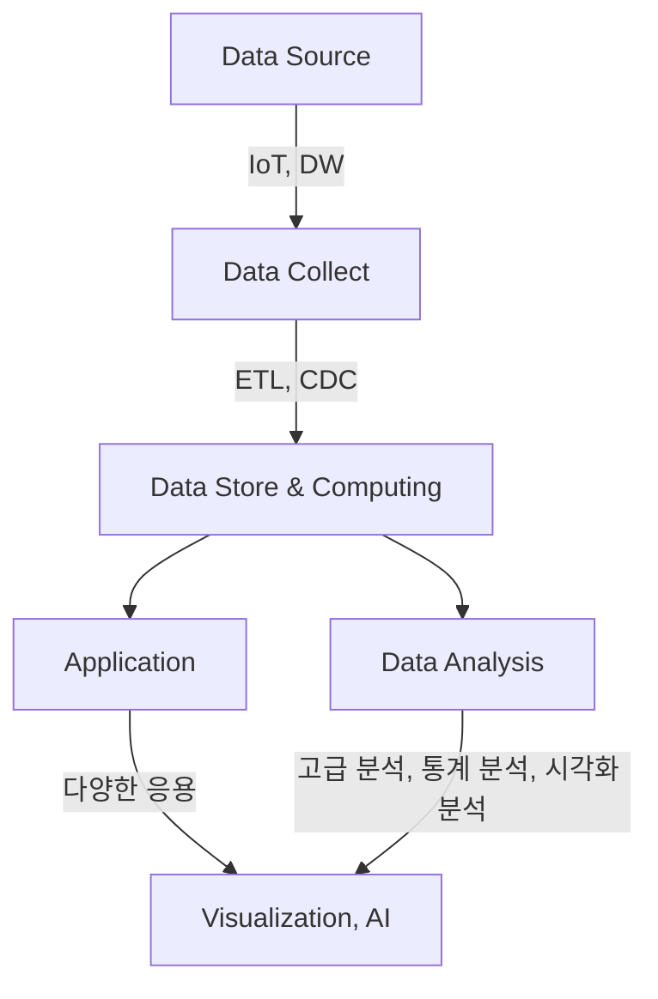

# LDW (Logical Data Warehouse): 차세대 정보 분석 아키텍처

<!-- mtoc-start -->

- [정의 및 개념](#정의-및-개념)
- [주요 특징](#주요-특징)
- [LDW의 구성 요소](#ldw의-구성-요소)
  - [1. Repository Management](#1-repository-management)
  - [2. Data Virtualization](#2-data-virtualization)
  - [3. Distributed Processing](#3-distributed-processing)
  - [4. Metadata Management](#4-metadata-management)
  - [5. Taxonomy/Ontology Resolution](#5-taxonomyontology-resolution)
  - [6. Auditing & Performance Services](#6-auditing--performance-services)
  - [7. SLA Management](#7-sla-management)
- [LDW 아키텍처](#ldw-아키텍처)
- [활용 유형](#활용-유형)
- [기대 효과 및 필요성](#기대-효과-및-필요성)
- [마무리](#마무리)
- [Keywords](#keywords)

<!-- mtoc-end -->

LDW(Logical Data Warehouse)는 기존 EDW(Enterprise Data Warehouse)와 Hadoop을 통합하여 정형 및 비정형 데이터를 분석하는 차세대 정보 분석 아키텍처이다. 하이브리드 DW(Hybrid Data Warehouse) 및 하이브리드 정보 아키텍처(HIA, Hybrid Information Architecture) 개념을 포함하며, 인공지능과 빅데이터 분석을 위한 중요한 기술로 자리 잡고 있다.

## 정의 및 개념

- LDW: 정형 데이터(EDW)와 비정형 데이터(Hadoop 기반)를 통합하여 정보 분석을 수행하는 아키텍처
- 특징: 정형 및 비정형 데이터 저장, 병렬 처리, 데이터 가상화 지원

## 주요 특징

- 비용 절감: Hadoop을 활용한 대용량 데이터 처리
- 분석의 적시성 확보: 분산 병렬 처리 기술 적용
- 데이터 효용성 증대: 정형 + 비정형 데이터의 효과적인 결합
- 확장성 있는 인프라: OSS 기반 Scale-Out 인프라 구축

## LDW의 구성 요소

### 1. Repository Management

- 데이터 저장소 및 메타데이터 관리

### 2. Data Virtualization

- 단일 가상 뷰 제공, 필요 시 데이터 취합

### 3. Distributed Processing

- 분산 병렬 처리 및 결과 통합

### 4. Metadata Management

- 기술적/업무적 정보 관리

### 5. Taxonomy/Ontology Resolution

- 데이터 간 연관 정보 분석 및 데이터 분류 체계 정립

### 6. Auditing & Performance Services

- 성능 최적화 및 서비스 개선

### 7. SLA Management

- 분석 성능, 보고서 조회 성능, 데이터 정합성 관리

## LDW 아키텍처

- **Data Source**: IoT, DW 등 다양한 데이터 원천
- **Data Collect**: ETL, CDC 등을 통한 데이터 수집
- **Data Store & Computing**: 핵심 LDW 영역
- **Application**: 데이터 활용을 위한 다양한 응용
- **Data Analysis**: 고급 분석, 통계 분석, 시각화 분석 지원

## 활용 유형

- IoT 플랫폼
- 하이브리드 DW
- 데이터 분석 및 시각화
- 데이터 가상화(Data Virtualization): 실제 데이터 대신 필요 시 가상 뷰 제공

## 기대 효과 및 필요성

- 대량 데이터의 비용 효율적 저장 및 분석 가능
- 실시간 및 비실시간 데이터 분석 유연성 제공
- 정형 및 비정형 데이터를 통합하여 데이터 활용도 증대
- AI 및 빅데이터 기반의 고급 분석 지원

## 마무리

LDW(Logical Data Warehouse)는 기존 EDW와 Hadoop을 결합한 차세대 데이터 분석 아키텍처로, 정형 및 비정형 데이터를 통합하여 유연한 분석을 지원한다. 확장성이 뛰어난 인프라와 분산 병렬 처리 기술을 활용하여 빅데이터 환경에서 최적의 데이터 운영 방식을 제공한다.

## Keywords

LDW, Logical Data Warehouse, 하이브리드 DW, 데이터 가상화, 분산 병렬 처리, 데이터 분석, Hadoop, EDW, 빅데이터, AI 기반 분석