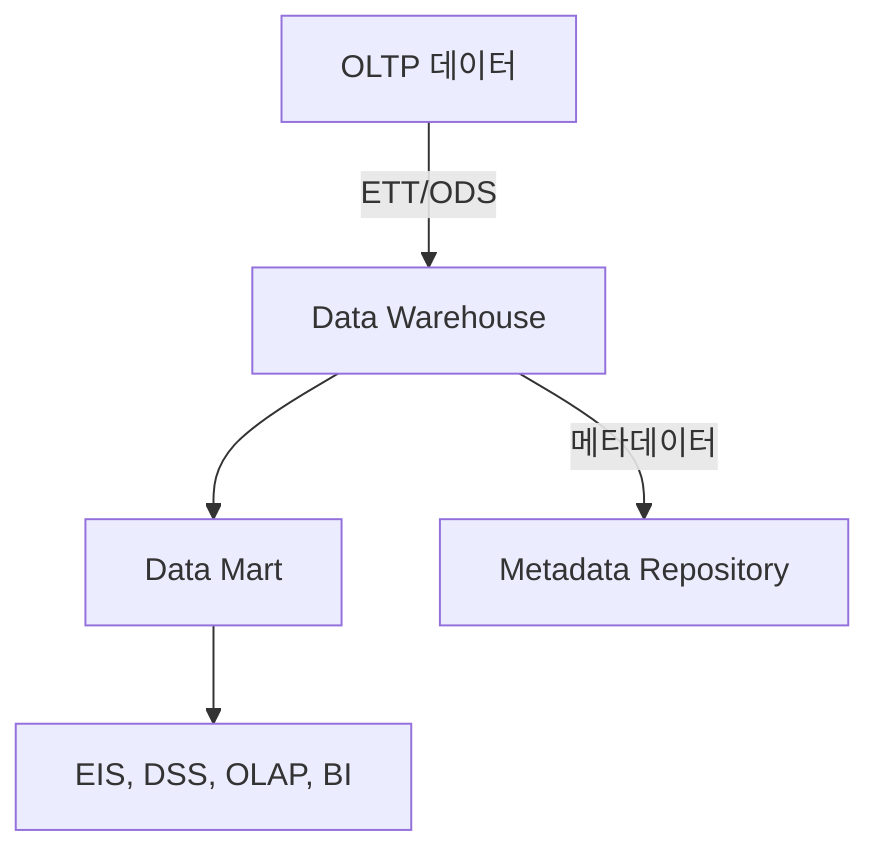

# OLAP (Online Analytical Processing): 다차원 데이터 분석

<!-- mtoc-start -->

- [정의 및 개념](#정의-및-개념)
- [주요 특징](#주요-특징)
- [OLAP의 구성도](#olap의-구성도)
- [OLAP의 유형](#olap의-유형)
- [주요 분석 기법](#주요-분석-기법)
  - [1. Pivot](#1-pivot)
  - [2. Drill-down](#2-drill-down)
  - [3. Roll-up](#3-roll-up)
  - [4. Drill-through](#4-drill-through)
  - [5. Slice and Dice](#5-slice-and-dice)
  - [6. Ad-hoc Query](#6-ad-hoc-query)
  - [7. Ranking](#7-ranking)
  - [8. Filter](#8-filter)
- [OLAP 큐브](#olap-큐브)
- [기대 효과 및 필요성](#기대-효과-및-필요성)
- [마무리](#마무리)
- [Keywords](#keywords)

<!-- mtoc-end -->

OLAP(Online Analytical Processing)는 사용자가 데이터 웨어하우스(DW)의 다차원 정보를 직접 접근하여 대화식으로 분석하고 의사결정에 활용하는 대용량 데이터 분석 처리 기법이다. 다차원성, 직접 접근성, 대화식 분석 기능을 통해 의사결정을 효과적으로 지원한다.

## 정의 및 개념

- OLAP: 대용량 데이터를 다차원적으로 분석하여 의사결정을 지원하는 시스템
- 특징: 다차원성, 대화식 분석, 신속한 데이터 접근

## 주요 특징

- 사용자가 직접 다차원 데이터를 조회 및 분석 가능
- 실시간 대화형 분석을 통한 의사결정 지원
- 다양한 OLAP 유형을 활용하여 데이터 처리 최적화

## OLAP의 구성도

- **OLTP 데이터, 외부 데이터**: 원천 데이터
- **ETT/ODS**: 데이터 정제 및 변환
- **DW(Data Warehouse)**: 중앙 집중 데이터 저장소
- **DM(Data Mart)**: 특정 목적에 맞춘 데이터 저장소
- **EIS, DSS, OLAP, BI**: 분석 및 의사결정 지원 시스템
- **Metadata Repository**: 데이터 정의 및 관리

## OLAP의 유형

- **ROLAP (Relational OLAP)**: 관계형 데이터베이스와 SQL을 활용한 OLAP
- **MOLAP (Multidimensional OLAP)**: 큐브 캐싱 및 데이터 큐브를 활용한 OLAP
- **HOLAP (Hybrid OLAP)**: ROLAP과 MOLAP의 장점을 결합한 OLAP

## 주요 분석 기법

### 1. Pivot

- 데이터의 차원을 교환하여 다양한 관점에서 분석

### 2. Drill-down

- 상세 내역 조회로 세부 데이터 탐색

### 3. Roll-up

- 상위 계층으로 집계하여 요약된 정보 제공

### 4. Drill-through

- 관계형 데이터베이스(ROLAP)에서 상세 데이터 조회

### 5. Slice and Dice

- 큐브를 수직 또는 수평으로 분할하여 분석

### 6. Ad-hoc Query

- 사용자가 직접 정의하는 즉석 질의

### 7. Ranking

- 조건에 따른 데이터 순위 분석

### 8. Filter

- 특정 조건을 적용하여 데이터 제외 또는 숨김 처리

## OLAP 큐브

- 대용량 데이터를 다차원으로 분석하여 신속한 결과 제공을 위한 다차원 배열
- **구성 요소**:
  - **차원(Dimension)**: 데이터 분석의 기준 축
  - **차원 항목(Dimension Items)**: 차원 내 개별 요소
  - **셀(Cell)**: 데이터를 저장하는 기본 단위

## 기대 효과 및 필요성

- 대용량 데이터 분석 속도 향상
- 다차원 분석을 통한 인사이트 도출
- 실시간 데이터 분석을 통한 신속한 의사결정 지원
- 다양한 OLAP 기법을 활용하여 유연한 데이터 탐색 가능

## 마무리

OLAP은 대용량 데이터를 다차원적으로 분석하여 신속한 의사결정을 지원하는 핵심 기술이다. 다양한 분석 기법과 큐브 기반의 데이터 저장 방식을 활용하여 기업의 데이터 분석 역량을 극대화할 수 있다.

## Keywords

OLAP, Online Analytical Processing, 데이터 웨어하우스, 다차원 분석, 데이터 큐브, ROLAP, MOLAP, HOLAP, Drill-down, Pivot, Slice and Dice