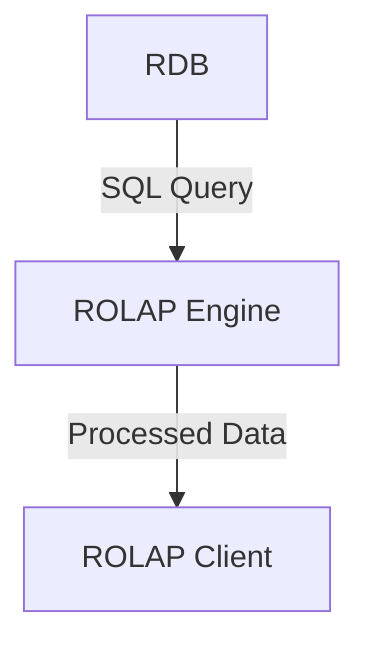

# ROLAP (Relational OLAP): SQL 기반 다차원 데이터 분석

<!-- mtoc-start -->

- [정의 및 개념](#정의-및-개념)
- [주요 특징](#주요-특징)
- [ROLAP 아키텍처](#rolap-아키텍처)
- [기대 효과 및 필요성](#기대-효과-및-필요성)
- [마무리](#마무리)
- [Keywords](#keywords)

<!-- mtoc-end -->

ROLAP(Relational Online Analytical Processing)은 관계형 데이터베이스(RDB)와 SQL 같은 관계형 질의어를 활용하여 대용량 데이터를 다차원적으로 저장하고 분석하는 OLAP 방식이다.

## 정의 및 개념

- ROLAP: 관계형 데이터베이스를 활용한 OLAP 방식으로 SQL을 사용하여 다차원 데이터를 분석
- 특징: 3-Tier 아키텍처 기반, 대용량 데이터 처리, 전사적 활용 가능, 높은 확장성

## 주요 특징

- 관계형 데이터베이스를 활용한 대용량 데이터 저장 및 분석
- 확장성이 뛰어나며 전사적 데이터 분석에 적합
- 다차원 분석 지원이 제한적(SQL의 한계)
- Star Schema 구조 사용으로 인한 상대적으로 느린 응답 속도

## ROLAP 아키텍처

- **RDB(Relational Database)**: 관계형 데이터 저장소
- **ROLAP Engine**: SQL 기반 다차원 분석 수행
- **ROLAP Client**: 분석 결과 제공 및 시각화

## 기대 효과 및 필요성

- 대용량 데이터 분석 가능
- 관계형 데이터베이스를 활용하여 기존 시스템과의 호환성 유지
- 높은 확장성을 통해 다양한 데이터 소스를 통합 가능
- OLAP 기능을 SQL 기반으로 구현하여 분석 환경의 유연성 확보

## 마무리

ROLAP은 관계형 데이터베이스와 SQL을 활용하여 대용량 데이터를 다차원적으로 분석하는 방식으로, 전사적 데이터 분석과 확장성이 필요한 환경에서 유용하다. 그러나 SQL 기반의 한계로 인해 다차원 분석 기능이 제한될 수 있으며, 이에 대한 보완이 필요하다.

## Keywords

ROLAP, Relational OLAP, 관계형 데이터베이스, SQL 분석, 다차원 데이터, Star Schema, 3-Tier, 대용량 데이터, 확장성, 전사적 분석