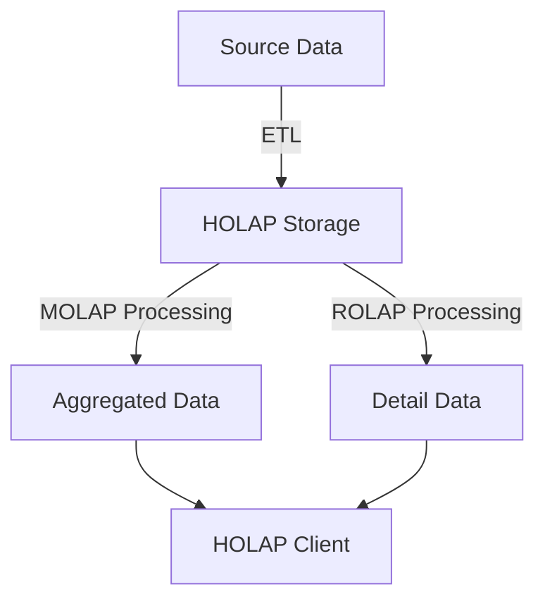

# HOLAP (Hybrid OLAP): ROLAP과 MOLAP의 장점 결합

<!-- mtoc-start -->

- [정의 및 개념](#정의-및-개념)
- [주요 특징](#주요-특징)
- [HOLAP 아키텍처](#holap-아키텍처)
- [기대 효과 및 필요성](#기대-효과-및-필요성)
- [마무리](#마무리)
- [Keywords](#keywords)

<!-- mtoc-end -->

HOLAP(Hybrid Online Analytical Processing)은 ROLAP(Relational OLAP)과 MOLAP(Multidimensional OLAP)의 장점을 결합한 OLAP 방식으로, 관계형 데이터베이스와 다차원 데이터 큐브를 함께 활용하여 분석 성능과 확장성을 동시에 제공한다.

## 정의 및 개념

- HOLAP: ROLAP과 MOLAP의 장점을 혼합하여 빠른 데이터 조회와 대용량 데이터 처리를 지원하는 OLAP 방식
- 특징: 관계형 DB와 다차원 큐브를 조합하여 최적의 성능 제공

## 주요 특징

- 관계형 데이터베이스와 다차원 데이터 큐브의 장점을 모두 활용
- 자주 조회되는 데이터는 MOLAP 방식으로 저장하여 빠른 응답 속도 제공
- 대용량 데이터 처리는 ROLAP 방식을 통해 확장성 확보
- 균형 잡힌 성능과 데이터 저장 공간 활용 가능

## HOLAP 아키텍처

- **Source Data**: 원천 데이터
- **HOLAP Storage**: 관계형 데이터베이스 및 다차원 큐브 저장소
- **MOLAP Processing**: 요약 데이터 저장 및 빠른 분석 제공
- **ROLAP Processing**: 상세 데이터 조회 및 확장성 제공
- **HOLAP Client**: 분석 결과 제공 및 시각화

## 기대 효과 및 필요성

- 빠른 분석 성능과 높은 확장성을 동시에 제공
- 자주 사용하는 데이터는 MOLAP 방식으로 캐싱하여 성능 최적화
- 대용량 데이터는 ROLAP 방식으로 관리하여 저장 공간 절약
- 다양한 분석 시나리오에 유연하게 대응 가능

## 마무리

HOLAP은 ROLAP과 MOLAP의 장점을 결합한 하이브리드 OLAP 방식으로, 빠른 분석 속도와 확장성을 동시에 제공한다. 이를 통해 다양한 데이터 분석 환경에서 최적의 성능을 발휘할 수 있다.

## Keywords

HOLAP, Hybrid OLAP, ROLAP, MOLAP, 다차원 분석, 관계형 데이터베이스, OLAP 성능 최적화, 데이터 큐브, 하이브리드 분석