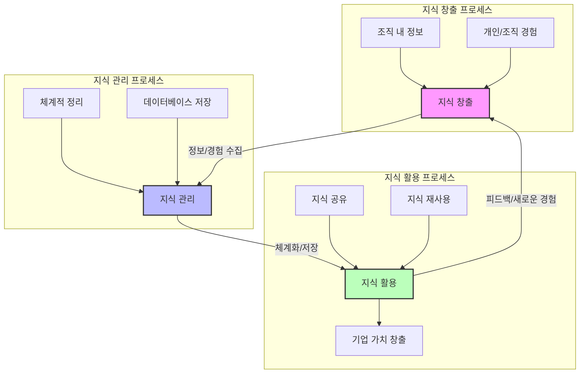

# KMS (Knowledge Management System): 조직의 지식 자산 최적화

<!-- mtoc-start -->

- [정의 및 개념](#정의-및-개념)
- [4대 핵심 요소](#4대-핵심-요소)
- [KMS 구성도](#kms-구성도)
- [기대 효과 및 필요성](#기대-효과-및-필요성)
- [마무리](#마무리)
- [Keywords](#keywords)

<!-- mtoc-end -->

KMS(Knowledge Management System)는 조직 내 지식 자원의 가치를 극대화하기 위해 통합적인 지식 관리 프로세스를 지원하는 정보 기술 시스템이다. 이를 통해 기업은 정보 공유, 협업 촉진, 의사결정 지원 등을 실현할 수 있다.

## 정의 및 개념

- KMS: 조직 내 지식을 체계적으로 관리하고 공유하여 업무 효율성을 극대화하는 시스템
- 특징: EIP, EP, EKP, SSO, 개인화, DW, Enterprise 2.0, Portal 기반

## 4대 핵심 요소

1. **지식 창고(Repository)**
   - 기업 내 지식을 체계적으로 저장하고 관리하는 공간
2. **지식 창고 관리자(Reference Worker)**
   - 지식의 품질을 유지하고 체계적으로 정리하는 역할
3. **갱신(Refresh)**
   - 최신 정보를 유지하기 위한 지속적인 업데이트
4. **보상(Reward)**
   - 지식 공유 및 관리에 대한 동기부여 체계

## KMS 구성도

- **지식 창출**: 조직 내에서 발생하는 다양한 형태의 정보와 경험
- **지식 관리(경영)**: 정보를 체계적으로 정리하고 저장하는 과정
- **지식 활용**: 공유 및 재사용을 통해 기업 가치 창출

## 기대 효과 및 필요성

- 조직 내 지식의 공유 촉진
- 업무 효율성 및 의사결정 과정 개선
- 기업 경쟁력 강화 및 혁신 촉진
- 지식 자산의 체계적 관리 및 최적화

## 마무리

KMS는 조직의 지식 자산을 효과적으로 관리하여 업무 효율성을 극대화하는 핵심 시스템이다. 이를 통해 조직 구성원 간 협업을 촉진하고, 지속적인 혁신을 가능하게 한다.

## Keywords

KMS, Knowledge Management System, 지식 관리, 지식 창고, 지식 활용, EIP, EP, EKP, SSO, Enterprise 2.0, Portal