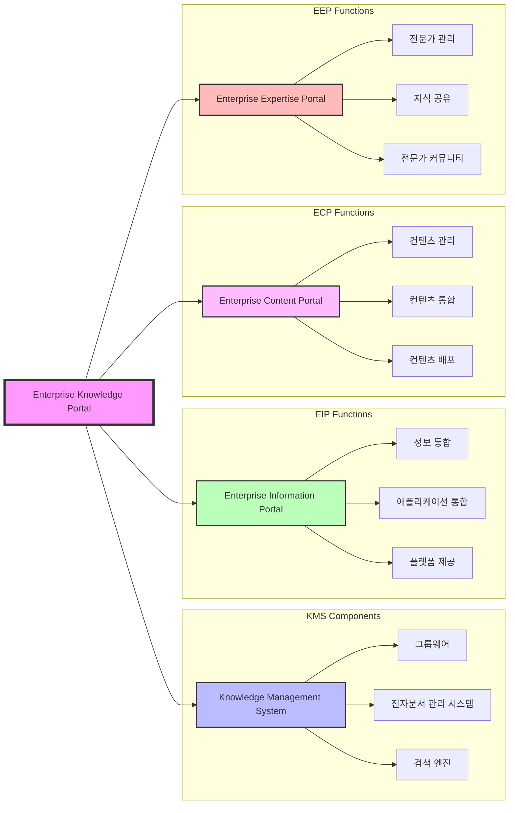

# EKP (Enterprise Knowledge Portal): 통합 지식정보 포털 시스템

<!-- mtoc-start -->

- [정의 및 개념](#정의-및-개념)
- [EKP의 구성 요소](#ekp의-구성-요소)
- [EKP 구성도](#ekp-구성도)
- [EKP의 역할 및 기능](#ekp의-역할-및-기능)
- [기대 효과 및 필요성](#기대-효과-및-필요성)
- [마무리](#마무리)
- [Keywords](#keywords)

<!-- mtoc-end -->

EKP(Enterprise Knowledge Portal)는 기업 내·외부의 정보 소스와 지식을 통합하여 업무 프로세스와 연계하고, 개인화된 단일 창구를 통해 제공하는 통합 지식정보 포털 시스템이다. 이를 통해 기업의 지식 활용 가치를 극대화할 수 있다.

## 정의 및 개념

- **EKP**: 기업의 정보와 지식을 통합하여 체계적으로 제공하는 포털 시스템
- **특징**: EIP의 일종으로 기업 내부뿐만 아니라 외부 정보까지 통합하여 활용 가능

## EKP의 구성 요소

EKP는 다양한 정보 관리 시스템을 결합하여 기업 내 지식 관리를 최적화한다.

- **KMS (Knowledge Management System)**: 그룹웨어, EDMS(전자문서 관리 시스템), 검색 엔진 포함
- **EIP (Enterprise Information Portal)**: 기업 내 정보 및 애플리케이션을 통합하는 플랫폼
- **ECP (Enterprise Content Portal)**: 기업의 컨텐츠를 통합 관리하는 시스템
- **EEP (Enterprise Expertise Portal)**: 기업 내 전문가 및 지식 공유 시스템

## EKP 구성도

## EKP의 역할 및 기능

- **통합 지식 관리**: 기업 내·외부의 정보와 지식을 중앙에서 통합하여 제공
- **업무 프로세스 연계**: 지식과 정보가 업무 흐름과 연계되어 효율적인 의사결정 지원
- **개인화 서비스 제공**: 사용자별 맞춤형 지식 제공을 통한 생산성 향상
- **검색 및 탐색 기능**: 효과적인 검색 엔진을 활용한 정보 접근성 강화

## 기대 효과 및 필요성

- 기업 내 지식의 체계적 공유 및 활용
- 업무 효율성과 협업 증진
- 사용자 맞춤형 정보 제공을 통한 생산성 향상
- 기업 경쟁력 강화 및 지속적인 혁신 촉진

## 마무리

EKP는 기업의 지식 자산을 효과적으로 관리하고 활용할 수 있도록 지원하는 통합 포털 시스템으로, 업무 생산성을 높이고 조직 내 협업을 촉진하는 데 중요한 역할을 한다.

## Keywords

EKP, Enterprise Knowledge Portal, 통합 지식정보, KMS, EIP, ECP, EEP, 기업 포털, 지식 관리, 개인화 포털, 정보 통합