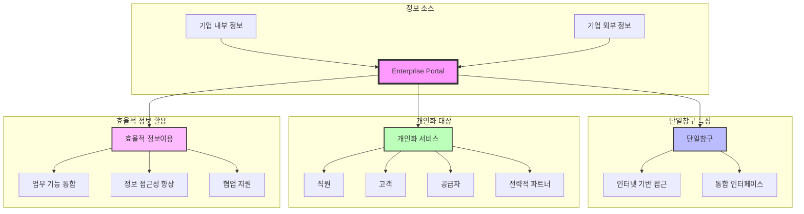

# EP (Enterprise Portal): 단일 창구 기반의 기업 포털 시스템

<!-- mtoc-start -->

- [정의 및 개념](#정의-및-개념)
- [주요 특징](#주요-특징)
- [EP 구성도](#ep-구성도)
- [EP의 역할 및 기능](#ep의-역할-및-기능)
- [기대 효과 및 필요성](#기대-효과-및-필요성)
- [마무리](#마무리)
- [Keywords](#keywords)

<!-- mtoc-end -->

EP(Enterprise Portal)는 인터넷이라는 단일화된 창구를 통해 기업 내·외부의 정보 및 관련 업무 기능을 개인화하여 직원, 고객, 공급자 및 전략적 파트너가 효율적으로 활용할 수 있도록 지원하는 포털 시스템이다.

## 정의 및 개념

- **EP**: 기업 내·외부의 정보를 단일 창구를 통해 제공하는 포털 시스템
- **특징**: 개인화된 정보 제공, 효율적 정보 이용, 업무 기능 연계

## 주요 특징

- **단일 창구 제공**: 기업의 모든 정보를 하나의 포털에서 접근 가능
- **개인화 기능 지원**: 사용자별 맞춤형 정보 및 인터페이스 제공
- **업무 기능 연계**: 기업 내부 시스템과 연계하여 업무 프로세스 최적화
- **보안 및 접근 관리**: 사용자별 권한을 적용하여 안전한 정보 관리 가능

## EP 구성도

## EP의 역할 및 기능

- **정보 통합**: 다양한 내부 및 외부 데이터를 수집하여 중앙에서 제공
- **워크플로우 최적화**: 업무 흐름을 단순화하고 협업 도구 제공
- **문서 및 콘텐츠 관리**: 기업의 주요 문서와 지식 자산을 체계적으로 관리
- **실시간 협업 지원**: 직원 및 외부 관계자 간 실시간 정보 공유 가능

## 기대 효과 및 필요성

- 기업 내 정보의 효과적인 활용 및 접근성 향상
- 업무 생산성 증대 및 운영 비용 절감
- 사용자 맞춤형 서비스 제공을 통한 만족도 향상
- 보안 강화 및 데이터 무결성 유지

## 마무리

EP는 기업 내 다양한 정보를 단일 창구에서 접근할 수 있도록 지원하는 포털 시스템으로, 업무 효율성을 극대화하고 협업 환경을 최적화하는 데 중요한 역할을 한다.

## Keywords

EP, Enterprise Portal, 단일 창구, 정보 통합, 업무 최적화, 개인화 포털, 협업 도구, 문서 관리, 보안 관리