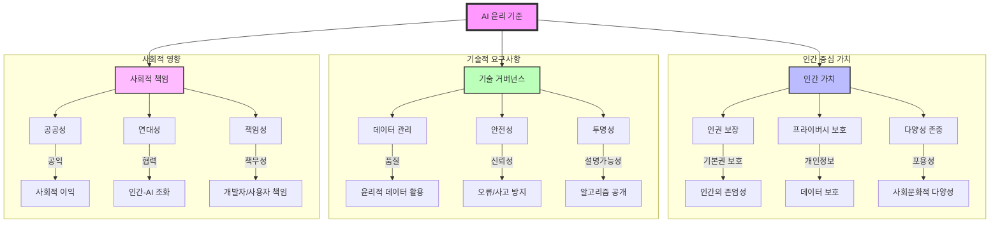

# AI 윤리기준: 사람 중심의 인공지능

<!-- mtoc-start -->

- [취지](#취지)
- [3대 기본원칙](#3대-기본원칙)
- [10대 핵심 요건](#10대-핵심-요건)
- [10대 핵심 요건 분류](#10대-핵심-요건-분류)
- [향후 전망](#향후-전망)
- [마무리](#마무리)
- [Keywords](#keywords)

<!-- mtoc-end -->

AI 윤리기준은 인공지능의 개발과 활용에 있어 인간 중심의 접근 방식을 강조하며, 인공지능의 전체 생명주기를 고려한 윤리적 가이드라인을 제시한다. 4차 산업혁명위원회에서 수립한 이 기준은 인간성을 최고 가치로 삼고, 기술의 윤리적 개발과 활용을 위한 3대 기본원칙과 10대 핵심요건을 포함한다.

## 취지

- 인간 고유의 성품 유지
- 개인의 윤택한 삶과 행복 증진
- 사회적 불평등 해소
- 기술의 목적에 맞는 활용
- 국가 경쟁력 및 생산성 향상 vs. 기술 오용 및 데이터 편향성 방지

## 3대 기본원칙

1. **인간의 존엄성 원칙**
   - 인공지능이 인간의 존엄성과 가치를 훼손하지 않도록 설계 및 운영
2. **사회의 공공선 원칙**
   - 인공지능이 공공의 이익을 증진하며 사회 전체에 긍정적인 영향을 미칠 것
3. **합목적성 원칙**
   - 인공지능 기술이 정당한 목적을 위해 사용되도록 보장

## 10대 핵심 요건

4. **인권 보장**: 인간의 기본권 보호
5. **프라이버시 보호**: 데이터 보호 및 개인정보 유출 방지
6. **다양성 존중**: 사회적, 문화적 다양성을 고려한 AI 개발
7. **침해금지**: AI의 악용을 방지하고 부정적 영향 최소화
8. **공공성**: 사회 전체의 이익을 위한 기술 개발 및 활용
9. **연대성**: 인간과 AI 간의 협력과 조화로운 발전
10. **데이터 관리**: 데이터의 품질 유지 및 윤리적 활용
11. **책임성**: AI 개발자 및 사용자의 책임 명확화
12. **안전성**: 기술적 오류와 사고 방지를 위한 설계
13. **투명성**: AI의 의사결정 과정 및 알고리즘 공개

## 10대 핵심 요건 분류

- 인간 중심 가치
- 기술적 요구사항
- 사회적 영향

## 향후 전망

- **도덕적 규범 및 자율 규범**: AI 기술이 사회적 신뢰를 구축할 수 있도록 윤리적 규범 강화
- **주제별 체크리스트 개발**: AI 윤리 기준을 실질적으로 적용하기 위한 가이드라인 마련
- **인공지능 윤리 교육프로그램**: 개발자 및 일반인을 대상으로 AI 윤리 교육 확산

## 마무리

AI 윤리기준은 인공지능 기술이 인간 중심으로 발전할 수 있도록 가이드라인을 제공하며, 사회적 신뢰 확보와 기술 오용 방지를 위해 필수적이다. 지속적인 윤리 규범 강화와 교육을 통해 인공지능의 긍정적 영향력을 극대화할 필요가 있다.

## Keywords

AI 윤리, 인공지능 윤리기준, 인간 중심 AI, 인공지능 원칙, 데이터 윤리, AI 투명성, AI 책임성, AI 안전성, AI 공공성, AI 프라이버시