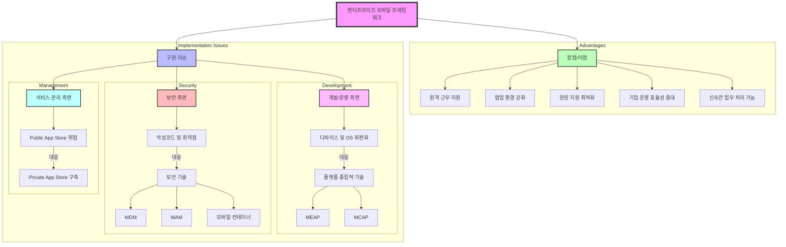

# 엔터프라이즈 모바일: 비즈니스 유연성과 이동성 확보

<!-- mtoc-start -->

- [개요](#개요)
- [엔터프라이즈 모바일 프레임워크](#엔터프라이즈-모바일-프레임워크)
  - [장점](#장점)
  - [구현 이슈](#구현-이슈)
    - [1. 개발/운영 측면](#1-개발운영-측면)
    - [2. 보안 측면](#2-보안-측면)
    - [3. 서비스 관리 측면](#3-서비스-관리-측면)
- [엔터프라이즈 모바일 프레임워크 구조](#엔터프라이즈-모바일-프레임워크-구조)
- [MEAP (Mobile Enterprise Application Platform): 엔터프라이즈 모바일 구현 기술](#meap-mobile-enterprise-application-platform-엔터프라이즈-모바일-구현-기술)
  - [MEAP 구성 요소](#meap-구성-요소)
    - [1. 개발환경](#1-개발환경)
    - [2. 실행환경](#2-실행환경)
    - [3. 운영환경](#3-운영환경)
  - [MEAP 구현 방식](#meap-구현-방식)
- [마무리](#마무리)
- [Keywords](#keywords)

<!-- mtoc-end -->

엔터프라이즈 모바일은 RTE(Real-Time Enterprise) 환경에서 비즈니스 민첩성을 구현하고, 변화하는 환경과 빠른 비즈니스 속도에 대응하기 위한 필수 요소이다. 모바일 디바이스의 확산으로 원격 및 이동 근무 환경이 증가하면서 기업에서는 엔터프라이즈 모바일 시스템의 필요성이 커지고 있다.

## 개요

- **비즈니스 Agility 구현**: 신속한 의사결정과 업무 수행 가능
- **이동성과 유연성 확보**: 언제 어디서나 업무 처리 가능
- **원격 및 이동 근무 지원**: 다양한 근무 환경에서의 생산성 극대화

## 엔터프라이즈 모바일 프레임워크

기업이 다수의 엔터프라이즈 애플리케이션을 모바일 환경에서 원활히 적용하기 위한 체계적 접근 방식.

### 장점

- 원격 근무 지원
- 협업 환경 강화
- 현장 지원 최적화
- 기업 운영 효율성 증대
- 신속한 업무 처리 가능

### 구현 이슈

#### 1. 개발/운영 측면

- **디바이스 및 OS 파편화** → 플랫폼 중립적인 기술 필요
- **대응 기술**: MEAP(Mobile Enterprise Application Platform), MCAP(Mobile Cross Application Platform)

#### 2. 보안 측면

- **악성코드 및 취약점 보호 필요**
- **대응 기술**: MDM(Mobile Device Management), MAM(Mobile Application Management), 모바일 컨테이너

#### 3. 서비스 관리 측면

- **Public App Store 활용 시 기업 데이터 유출 가능성**
- **대응 기술**: Private App Store 구축

## 엔터프라이즈 모바일 프레임워크 구조

1. 프레임워크 구성

   - 장점/이점: 기업의 모바일 환경 도입을 통한 5가지 핵심 이점 제시
   - 구현 이슈: 3가지 주요 측면(개발/운영, 보안, 관리)의 문제점과 대응 기술

2. 주요 대응 기술

   - 개발/운영: MEAP, MCAP을 통한 플랫폼 호환성 확보
   - 보안: MDM, MAM, 모바일 컨테이너를 통한 보안 강화
   - 관리: Private App Store를 통한 애플리케이션 배포 관리

## MEAP (Mobile Enterprise Application Platform): 엔터프라이즈 모바일 구현 기술

MEAP는 기업 내 다양한 모바일 애플리케이션을 일관된 환경에서 개발, 실행, 운영할 수 있도록 지원하는 플랫폼이다.

### MEAP 구성 요소

#### 1. 개발환경

- **IDE 제공**: 다양한 OS와 디바이스를 지원하는 개발 도구
- **모바일 프레임워크**: 공통 개발 기반 제공

#### 2. 실행환경

- **배포 관리**: 애플리케이션 배포 및 유지보수
- **실행 프레임워크**: 플랫폼 및 단말 독립적인 코드 실행
- **Device API 연동 Wrapper**: 하드웨어 및 OS별 API 차이를 해소
- **백엔드 통합 인터페이스**: 기업 시스템과의 연동 지원

#### 3. 운영환경

- **MDM (Mobile Device Management)**: 단말 관리, 애플리케이션 보안, 접근 제어, 단말 분실 대응
- **서비스 운영 및 관리**: 애플리케이션 성능 모니터링 및 유지보수

### MEAP 구현 방식

1. **Native**: OS별 맞춤형 개발, 성능 최적화
2. **Hybrid**: 웹과 네이티브 기술을 혼합하여 개발, 유연성 확보
3. **Web**: 웹 기술 기반 애플리케이션, 운영 및 유지보수 용이

## 마무리

엔터프라이즈 모바일은 현대 기업이 변화하는 환경에서 민첩하게 대응할 수 있도록 지원하며, 보안과 서비스 관리를 고려한 최적의 솔루션을 제공한다. MEAP 등의 기술을 활용하여 개발과 운영의 효율성을 극대화하는 것이 중요하다.

## Keywords

엔터프라이즈 모바일, RTE, 비즈니스 Agility, MEAP, MCAP, MDM, MAM, Private App Store, Hybrid 앱, 모바일 보안