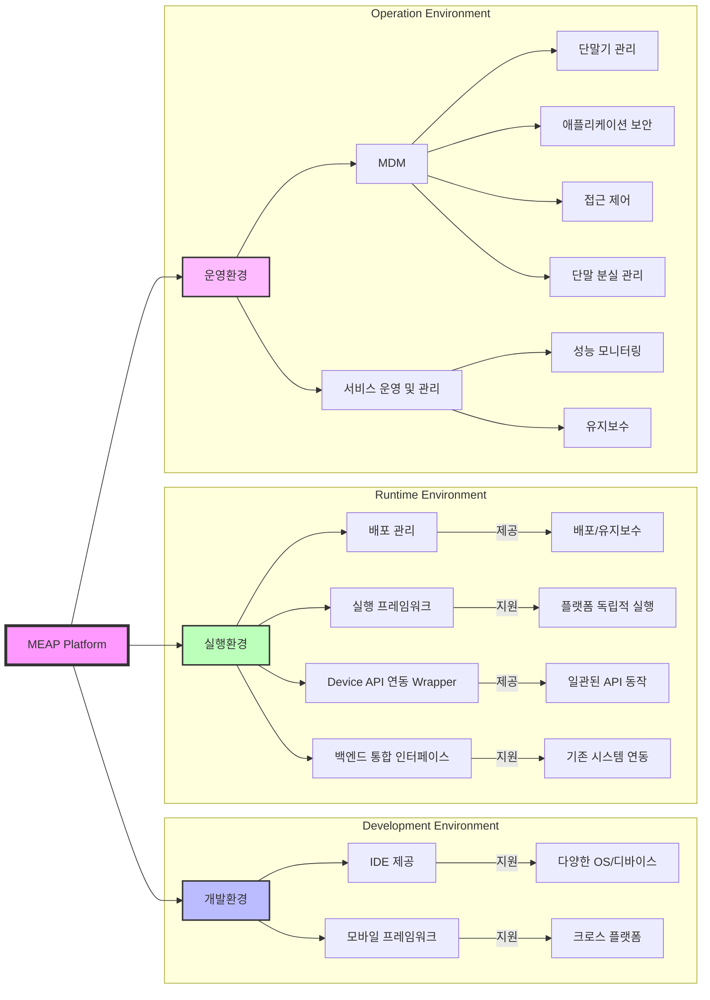

# MEAP (Mobile Enterprise Application Platform): 엔터프라이즈 모바일 구현 기술

<!-- mtoc-start -->

- [MEAP 구성 요소](#meap-구성-요소)
  - [1. 개발환경](#1-개발환경)
  - [2. 실행환경](#2-실행환경)
  - [3. 운영환경](#3-운영환경)
- [MEAP 플랫폼 구성도](#meap-플랫폼-구성도)
- [MEAP 구현 방식](#meap-구현-방식)
- [기대 효과 및 필요성](#기대-효과-및-필요성)
- [마무리](#마무리)
- [Keywords](#keywords)

<!-- mtoc-end -->

MEAP(Mobile Enterprise Application Platform)는 기업이 다양한 모바일 애플리케이션을 일관된 환경에서 개발, 실행, 운영할 수 있도록 지원하는 플랫폼이다. 이를 통해 기업은 플랫폼 및 디바이스에 관계없이 업무 프로세스를 최적화하고 보안을 강화할 수 있다.

## MEAP 구성 요소

### 1. 개발환경

- **IDE 제공**: 통합 개발 환경을 통해 다양한 OS와 디바이스 지원
- **모바일 프레임워크**: 크로스 플랫폼 개발을 위한 공통 프레임워크 제공

### 2. 실행환경

- **배포 관리**: 모바일 애플리케이션 배포 및 유지보수 지원
- **실행 프레임워크**: 플랫폼 및 단말 독립적인 코드 실행 가능
- **Device API 연동 Wrapper**: 하드웨어 및 OS별 API 차이를 해소하여 일관된 동작 보장
- **백엔드 통합 인터페이스**: 기업의 기존 시스템과 원활한 연동 가능

### 3. 운영환경

- **MDM (Mobile Device Management)**: 단말기 관리, 애플리케이션 보안, 접근 제어 및 단말 분실 관리
- **서비스 운영 및 관리**: 모바일 애플리케이션의 성능 모니터링 및 유지보수

## MEAP 플랫폼 구성도

1. MEAP 주요 환경

   - 개발환경: IDE와 프레임워크를 통한 크로스 플랫폼 개발 지원
   - 실행환경: 배포, 실행, API 연동, 백엔드 통합을 위한 4가지 핵심 기능 제공
   - 운영환경: MDM과 서비스 운영 관리를 통한 보안 및 유지보수 지원

2. 환경별 주요 기능

   - 개발: 다양한 OS/디바이스 지원을 위한 통합 개발 환경
   - 실행: 플랫폼 독립적 실행과 시스템 연동을 위한 인터페이스
   - 운영: 보안, 접근 제어, 모니터링 등 종합적인 관리 기능

3. 연동 구조
   - 각 환경이 독립적이면서도 상호 연계되어 통합 플랫폼 구성
   - API Wrapper와 백엔드 통합을 통한 시스템 연계성 확보

## MEAP 구현 방식

4. **Native**: 특정 OS 및 디바이스에 최적화된 방식, 성능이 우수하지만 개발 비용이 높음
5. **Hybrid**: 웹과 네이티브 기술을 혼합한 방식, 개발 효율성과 성능의 균형 제공
6. **Web**: 웹 기술 기반 애플리케이션으로, 유지보수가 용이하지만 네이티브 기능 접근이 제한적

## 기대 효과 및 필요성

- **다양한 디바이스 및 OS 지원**: 크로스 플랫폼 개발을 통한 비용 절감
- **보안 및 관리 최적화**: MDM, MAM 등을 활용한 강력한 보안 정책 적용
- **업무 생산성 향상**: 모바일 환경에서의 신속한 데이터 처리 및 협업 지원

## 마무리

MEAP는 기업의 모바일 환경을 체계적으로 관리하고, 다양한 디바이스 및 플랫폼에서 원활한 애플리케이션 운영을 가능하게 하는 필수적인 기술이다. Native, Hybrid, Web 개발 방식을 적절히 활용하여 기업의 요구사항에 맞춘 최적의 모바일 솔루션을 구축하는 것이 중요하다.

## Keywords

MEAP, Mobile Enterprise Application Platform, 모바일 프레임워크, MDM, MAM, Hybrid 앱, Native 앱, Web 앱, 모바일 애플리케이션 관리, 모바일 보안