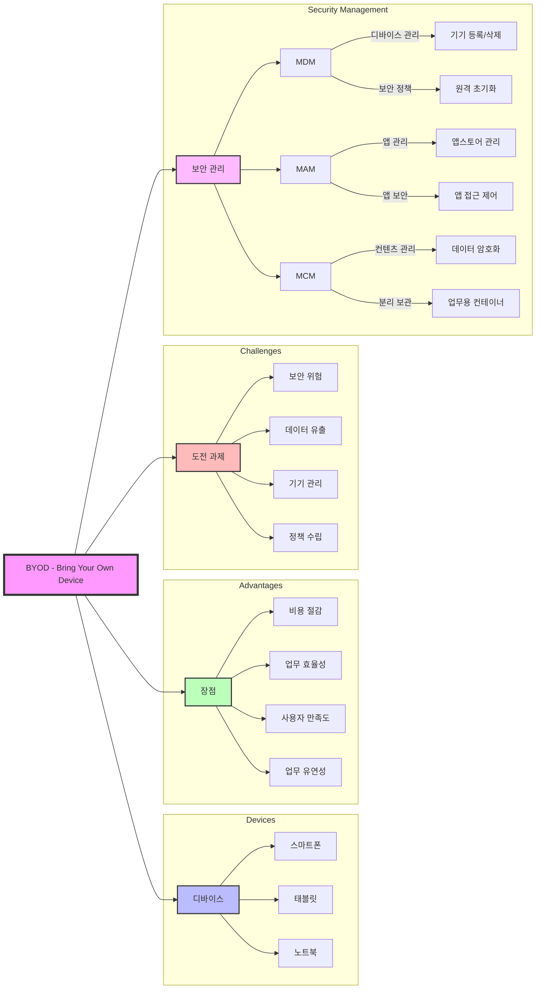

# BYOD (Bring Your Own Device): 개인 디바이스의 업무 활용

<!-- mtoc-start -->

- [정의 및 개념](#정의-및-개념)
- [BYOD의 특징](#byod의-특징)
- [BYOD 구성요소](#byod-구성요소)
- [BYOD 개념도](#byod-개념도)
- [BYOD의 보안 이슈](#byod의-보안-이슈)
- [BYOD 보안 강화 방안](#byod-보안-강화-방안)
- [BYOD의 장점과 단점](#byod의-장점과-단점)
  - [장점](#장점)
  - [단점](#단점)
- [마무리](#마무리)
- [Keywords](#keywords)

<!-- mtoc-end -->

BYOD(Bring Your Own Device)는 직원이 개인 소유의 스마트폰, 태블릿, 노트북 등의 디바이스를 업무에 활용하는 IT 환경을 의미한다. 이는 유연한 근무 환경을 제공하고, 생산성을 향상시키는 동시에 보안 문제에 대한 해결책이 필요하다.

## 정의 및 개념

- **BYOD**: 개인이 소유한 디바이스를 업무에 활용하는 IT 환경
- **목적**: 기업의 IT 비용 절감, 직원의 업무 효율성 증대, 유연한 근무 환경 제공
- **필요성**: 원격 근무 증가, 업무 이동성 확대, IT 인프라 최적화

## BYOD의 특징

- **업무의 유연성 증가**: 언제 어디서나 업무 가능
- **비용 절감**: 기업이 별도의 하드웨어를 제공할 필요 없음
- **생산성 향상**: 직원이 익숙한 기기를 활용하여 업무 효율 극대화
- **보안 문제 발생 가능**: 데이터 유출, 해킹 등 보안 위험 증가

## BYOD 구성요소

- 지원 디바이스: 스마트폰, 태블릿, 노트북 등 개인 기기
- 주요 장점: 비용 절감, 효율성, 만족도, 유연성
- 도전 과제: 보안, 데이터, 관리, 정책 관련 이슈

## BYOD 개념도

1. 보안 관리 체계

   - MDM(Mobile Device Management): 기기 등록/삭제, 원격 초기화 등 디바이스 관리
   - MAM(Mobile Application Management): 기업용 앱스토어, 앱 접근 제어
   - MCM(Mobile Content Management): 데이터 암호화, 업무용 컨테이너 분리

2. 보안 관리 특징
   - 기기-앱-컨텐츠의 3단계 보안 체계
   - 업무용 데이터의 분리 보관
   - 중앙 집중식 관리 및 통제

## BYOD의 보안 이슈

- **데이터 유출 위험**: 분실, 도난 시 기업 정보 보호 필요
- **악성코드 및 해킹**: 개인 기기를 통한 보안 취약점 노출 가능
- **네트워크 보안 문제**: 사설 네트워크 사용 시 보안 위협 증가
- **기업 정보와 개인 정보 분리 필요**

## BYOD 보안 강화 방안

- **MDM (Mobile Device Management)**: 기기 원격 제어 및 보안 정책 적용
- **MAM (Mobile Application Management)**: 기업 애플리케이션 보안 관리
- **VPN 사용**: 안전한 네트워크 연결을 통한 보안 강화
- **2단계 인증 및 데이터 암호화 적용**

## BYOD의 장점과 단점

### 장점

- 직원의 업무 만족도 증가
- 업무 생산성 향상
- 비용 절감 및 IT 인프라 최적화

### 단점

- 보안 문제 발생 가능
- 기업 IT 관리 부담 증가
- 개인 정보와 기업 정보의 경계 관리 필요

## 마무리

BYOD는 기업의 업무 유연성을 확대하고 생산성을 향상시키는 중요한 IT 전략이지만, 보안 문제를 해결하기 위한 철저한 정책과 기술적 대응이 필수적이다. 기업은 적절한 보안 솔루션을 도입하여 BYOD 환경을 안전하게 운영해야 한다.

## Keywords

BYOD, 모바일 보안, MDM, MAM, VPN, 업무 유연성, 데이터 보호, 네트워크 보안, 기업 정보 관리