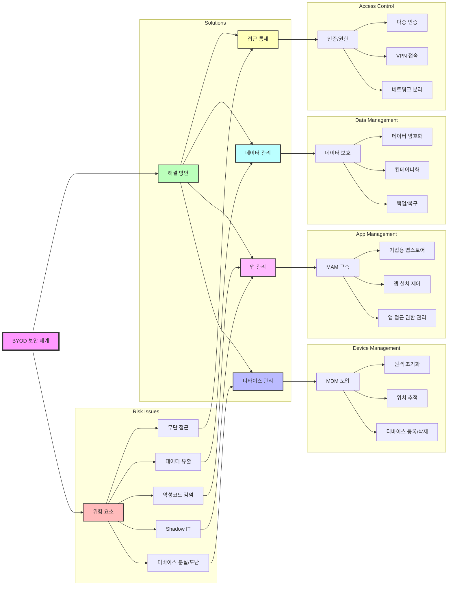

# BYOD 보안이슈: 개인 디바이스 활용의 위험성과 해결 방안

<!-- mtoc-start -->

- [1. BYOD의 주요 보안 이슈](#1-byod의-주요-보안-이슈)
  - [1.1 데이터 유출 위험](#11-데이터-유출-위험)
  - [1.2 악성코드 및 해킹 공격](#12-악성코드-및-해킹-공격)
  - [1.3 네트워크 보안 취약점](#13-네트워크-보안-취약점)
  - [1.4 기업 정보와 개인 정보의 분리 어려움](#14-기업-정보와-개인-정보의-분리-어려움)
  - [1.5 규제 및 컴플라이언스 문제](#15-규제-및-컴플라이언스-문제)
- [2. BYOD 보안 강화 방안](#2-byod-보안-강화-방안)
  - [2.1 MDM (Mobile Device Management)](#21-mdm-mobile-device-management)
  - [2.2 MAM (Mobile Application Management)](#22-mam-mobile-application-management)
  - [2.3 네트워크 보안 강화](#23-네트워크-보안-강화)
  - [2.4 데이터 보호 및 암호화](#24-데이터-보호-및-암호화)
  - [2.5 보안 인식 교육](#25-보안-인식-교육)
- [3. BYOD 보안 체계](#3-byod-보안-체계)
- [마무리](#마무리)
- [Keywords](#keywords)

<!-- mtoc-end -->

BYOD(Bring Your Own Device)는 기업의 유연성과 업무 생산성을 높이는 중요한 IT 트렌드이지만, 보안 문제를 해결하지 않으면 기업 데이터와 네트워크에 심각한 위협을 초래할 수 있다. 개인 기기를 업무 환경에서 활용할 경우 발생할 수 있는 주요 보안 이슈를 분석하고, 효과적인 대응 방안을 제시한다.

## 1. BYOD의 주요 보안 이슈

### 1.1 데이터 유출 위험

- 개인 기기에 기업 데이터를 저장할 경우 분실 또는 도난 시 정보 유출 가능성 증가
- 클라우드 및 파일 공유 서비스 이용 시 승인되지 않은 데이터 전송 위험
- 스크린샷, 복사/붙여넣기 등을 통한 내부 정보 유출 가능성

### 1.2 악성코드 및 해킹 공격

- 개인 디바이스에 보안 소프트웨어 미설치 시 악성코드 감염 위험 증가
- 피싱 공격 및 랜섬웨어 감염으로 인한 기업 네트워크 위협
- 공공 네트워크 사용으로 인한 해킹 가능성

### 1.3 네트워크 보안 취약점

- BYOD 사용자는 다양한 네트워크(Wi-Fi, 모바일 데이터)를 이용하며, 보안성이 낮은 네트워크를 사용할 경우 기업 네트워크로의 침입 경로 제공
- 공공 네트워크에서의 데이터 가로채기 및 중간자 공격(Man-in-the-Middle Attack) 가능성

### 1.4 기업 정보와 개인 정보의 분리 어려움

- 하나의 기기에서 업무 및 개인 활동이 병행됨에 따라 정보 분리 관리가 어려움
- 기업 데이터가 개인 소셜 미디어, 이메일 등에 노출될 가능성

### 1.5 규제 및 컴플라이언스 문제

- 산업별 보안 규제 준수를 위한 기업 데이터 보호 필요성 증가
- 개인 기기에서 기업 데이터를 다룰 경우 GDPR, HIPAA 등의 개인정보 보호 규정 준수 여부 검토 필요

## 2. BYOD 보안 강화 방안

### 2.1 MDM (Mobile Device Management)

- 기업 내 등록된 BYOD 기기를 중앙에서 관리 및 모니터링
- 원격 잠금 및 데이터 삭제 기능을 통해 분실/도난 기기 보호
- 보안 정책 적용(비밀번호 설정, 암호화, 앱 제어 등)

### 2.2 MAM (Mobile Application Management)

- 업무용 애플리케이션과 개인 애플리케이션을 분리하여 관리
- 기업 데이터가 승인된 애플리케이션에서만 접근 가능하도록 설정
- 애플리케이션 수준의 암호화 및 보안 정책 적용

### 2.3 네트워크 보안 강화

- VPN(가상사설망) 사용을 통한 안전한 네트워크 접속 보장
- 공공 Wi-Fi 사용 제한 및 기업 내부 네트워크 접속 정책 수립
- Zero Trust 네트워크 아키텍처 도입을 통해 사용자 및 기기 인증 강화

### 2.4 데이터 보호 및 암호화

- 기기 및 애플리케이션 내 데이터 암호화 적용
- 업무 데이터의 클라우드 기반 저장 및 원격 접근 보안 강화
- 복사 및 파일 공유 제한 정책 적용

### 2.5 보안 인식 교육

- BYOD 사용자 대상 보안 인식 및 교육 강화
- 피싱 공격, 데이터 보호, 안전한 네트워크 사용법 등 교육 제공
- 지속적인 보안 점검 및 평가 수행

## 3. BYOD 보안 체계

1. 주요 위험 요소

   - 디바이스: 분실/도난 위험
   - 보안: 악성코드, 무단 접근
   - 데이터: 유출, Shadow IT 위험

2. 해결 방안 체계

   - 디바이스 관리: MDM을 통한 원격 제어 및 추적
   - 앱 관리: MAM을 통한 앱 설치 및 접근 통제
   - 데이터 관리: 암호화, 컨테이너화, 백업
   - 접근 통제: 다중 인증, VPN, 네트워크 분리

3. 보안 관리 특징
   - 각 위험 요소별 맞춤형 대응 방안 구축
   - 기술적/관리적 보안 조치 통합
   - 중앙 집중식 보안 관리 체계

## 마무리

BYOD 환경에서 기업의 보안성을 유지하기 위해서는 강력한 보안 정책과 기술적 대응이 필수적이다. MDM, MAM, 데이터 암호화, 네트워크 보안 등 다양한 보안 솔루션을 적절히 활용하여 보안 위협을 최소화하고, 기업과 직원 모두가 안전하게 BYOD를 활용할 수 있도록 해야 한다.

## Keywords

BYOD 보안, 데이터 보호, 네트워크 보안, MDM, MAM, VPN, 악성코드 방지, 정보 유출 방지, 기업 보안 정책, Zero Trust