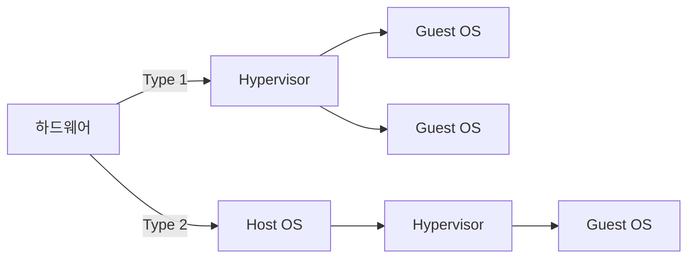

# 모바일 가상화: 복수 운영체제 실행을 위한 기술

<!-- mtoc-start -->

- [정의 및 개념](#정의-및-개념)
- [주요 특징](#주요-특징)
- [모바일 가상화 아키텍처](#모바일-가상화-아키텍처)
- [활용 사례](#활용-사례)
- [기대 효과 및 필요성](#기대-효과-및-필요성)
- [마무리](#마무리)
- [Keywords](#keywords)

<!-- mtoc-end -->

모바일 가상화는 디바이스 칩셋 혹은 운영체제 위에 하이퍼바이저를 구성하여 하나의 모바일 장치에서 복수의 운영체제를 실행하는 기술이다. 이는 BYOD(Bring Your Own Device) 환경에서 업무용과 개인용 환경을 분리하여 보안성을 강화하는 데 중요한 역할을 한다.

## 정의 및 개념

모바일 가상화는 하나의 모바일 기기에서 복수의 운영체제를 실행할 수 있도록 지원하는 기술. 이를 통해 업무용과 개인용 환경을 분리하고, 보안성을 강화할 수 있다.

- 필요성: BYOD 환경에서 업무용과 개인용 데이터 분리, 보안성 강화
- 가상화 유형:
  - **Type 1 (BareMetal Virtualization)**: 하드웨어 위에 직접 하이퍼바이저를 배치하여 운영체제를 가상화 (HW → Hypervisor → GuestOS)
  - **Type 2 (Hosted Virtualization)**: 기존 운영체제 위에 하이퍼바이저를 추가로 실행하여 가상 운영체제를 구동 (HW → HostOS → Hypervisor → GuestOS)

## 주요 특징

1. **BYOD 환경 지원**: 업무용과 개인용 OS를 분리하여 보안성과 사용성을 극대화
2. **보안성 강화**: 하이퍼바이저를 통한 애플리케이션 및 데이터 보호
3. **유연한 운영체제 관리**: 단말기 내에서 여러 운영체제 실행 가능
4. **기업 IT 정책 준수 용이**: 중앙에서 가상화된 환경을 통제 및 관리 가능
5. **데이터 유출 방지**: 업무용 데이터를 개인용 환경과 분리하여 보안성 확보

## 모바일 가상화 아키텍처

Type 1은 하드웨어 위에 직접 하이퍼바이저를 배치하여 성능이 우수하며, Type 2는 기존 운영체제 위에서 가상화를 실행하여 유연성이 높다.

## 활용 사례

- **기업 내 BYOD 환경 구축**: 업무용 OS와 개인용 OS를 분리하여 보안성을 유지하면서 개인 장치를 활용
- **보안이 중요한 산업 적용**: 금융, 의료, 정부기관에서 보안성을 강화하기 위해 사용
- **모바일 앱 테스트 환경 구축**: 다양한 OS 환경에서의 앱 테스트를 용이하게 수행

## 기대 효과 및 필요성

- **기업 IT 통제력 확보**: 개인 장치에서도 업무용 OS를 별도로 운영하여 보안 정책 적용 가능
- **일관된 보안정책 유지**: 다양한 플랫폼에서도 동일한 보안 정책 적용 가능
- **악성코드 확산 방지**: 업무용 환경을 별도로 분리하여 악성코드 감염 차단
- **데이터 유출 방지**: 단말기 분실 시에도 업무 데이터 보호 가능
- **보안 인식 강화**: 기업 보안 정책을 준수하면서도 개인의 자유로운 사용 보장

## 마무리

모바일 가상화는 BYOD 환경에서 보안성과 유연성을 동시에 확보할 수 있는 필수 기술이다. 기업은 NAC(Network Access Control), MDM(Mobile Device Management), 모바일 가상화, 모바일 가상 데스크탑 등의 보안 솔루션과 함께 도입함으로써 보다 안전한 모바일 업무 환경을 구축할 수 있다.

## Keywords

Mobile Virtualization, Hypervisor, BYOD Security, Mobile Device Management, Network Access Control, 업무용 OS, 개인용 OS, 데이터 분리, 보안 가상화, 모바일 가상 데스크탑