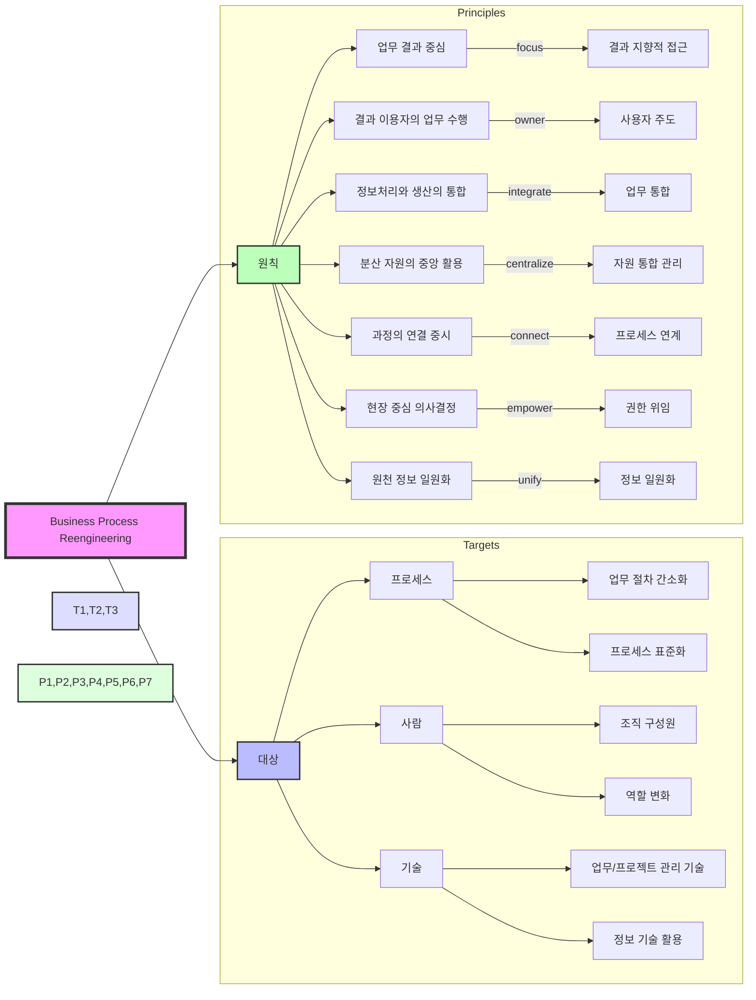

# BPR (Business Process Reengineering): 핵심업무 프로세스의 급진적 재설계

<!-- mtoc-start -->

- [정의 및 개념](#정의-및-개념)
- [BPR 대상](#bpr-대상)
- [BPR의 7가지 원칙](#bpr의-7가지-원칙)
- [BPR 수행 체계](#bpr-수행-체계)
- [기대 효과 및 필요성](#기대-효과-및-필요성)
- [마무리](#마무리)
- [Keywords](#keywords)

<!-- mtoc-end -->

BPR(Business Process Reengineering)은 기업이 경쟁 우위를 확보하기 위해 프로세스를 근본적인 사고 전환을 통해 혁신적으로 재설계하는 기법이다. 비용, 서비스, 품질, 속도(CSQS) 등의 기업 핵심 요소를 극적으로 상승시키며, 업무 프로세스를 근본적(fundamental)이고 혁신적(radical)으로 재설계하는 과정이다.

## 정의 및 개념

BPR은 기존의 업무 절차를 단순 개선하는 것이 아니라, 기업 프로세스를 완전히 새롭게 설계하는 접근 방식이다. 이를 통해 기업은 급격한 성과 향상을 도모하며, 정보 기술을 적극 활용하여 효율성을 극대화한다.

- **목적**: 기업 경쟁력 확보, 극적인 성과 향상, 프로세스 중심 혁신
- **특징**:
  - 리엔지니어링(Reengineering)
  - 프로세스 혁신
  - 획기적인 성과 창출
  - 정보 기술 활용 극대화
  - 근본적 발상
  - 제로베이스 접근법
  - 극적 개선
  - 프로세스 중심 사고

## BPR 대상

1. **프로세스(Process)**: 업무 절차 간소화, 프로세스 표준화
2. **사람(People)**: BPR을 수행하는 조직 구성원 및 역할 변화
3. **기술(Technology)**: 업무 기술 및 프로젝트 관리 기술, 정보 기술 활용

## BPR의 7가지 원칙

4. **업무 자체보다 업무 결과 중심**
5. **프로세스의 결과를 이용하는 사람이 해당 업무 수행**
6. **정보처리 업무는 정보를 실제로 생산하는 업무에 포함**
7. **지리적으로 분산된 자원을 중앙에 집중된 것처럼 활용**
8. **병행 업무에서 결과의 통합이 아닌 과정의 연결을 시도**
9. **의사 결정점을 실제로 업무가 수행되는 곳에 배치하고 통제를 프로세스 일부로 포함**
10. **정보는 한 번만 그 원천(발생 지역)에서 파악**

## BPR 수행 체계

11. BPR 대상 영역

   - 프로세스: 업무 절차의 간소화와 표준화 추구
   - 사람: 조직 구성원의 역할과 책임 재정의
   - 기술: 업무와 프로젝트 관리를 위한 기술 활용

12. BPR 7대 원칙

   - 결과 중심: 업무 과정보다 결과에 초점
   - 사용자 중심: 결과 활용자가 업무 수행
   - 통합 관리: 정보 처리와 생산의 일원화
   - 자원 활용: 분산된 자원의 통합적 관리
   - 프로세스 연계: 과정의 유기적 연결
   - 현장 중심: 업무 현장에서의 의사결정
   - 정보 일원화: 원천 정보의 단일 수집

13. 핵심 특징
   - 프로세스 혁신을 통한 근본적 변화 추구
   - 조직, 기술, 프로세스의 통합적 개선
   - 현장 중심의 효율적 업무 수행 체계 구축

## 기대 효과 및 필요성

- **비용 절감**: 불필요한 업무 절차 제거 및 효율적 운영
- **업무 속도 향상**: 프로세스 재설계를 통한 시간 절감
- **품질 향상**: 업무 절차 최적화를 통한 고객 만족도 증대
- **서비스 개선**: 프로세스 중심 접근을 통해 고객 지향적인 서비스 제공
- **기업 경쟁력 강화**: 정보 기술을 적극 활용하여 시장 내 우위 확보

## 마무리

BPR은 단순한 개선이 아닌 근본적이고 혁신적인 변화를 추구하는 프로세스 재설계 방식이다. 기업이 경쟁력을 강화하고 지속적으로 성장하기 위해서는 프로세스 중심의 사고를 바탕으로 BPR을 효과적으로 실행해야 한다.

## Keywords

BPR, Business Process Reengineering, 프로세스 혁신, 업무 재설계, 리엔지니어링, 정보기술, 경쟁력 강화, 제로베이스 접근, 프로세스 최적화, 기업 성과 향상