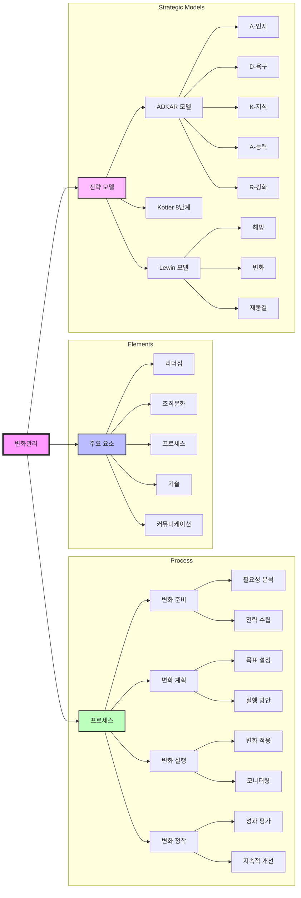

# 변화관리 (Change Management): 지속적인 혁신을 위한 관리 체계

<!-- mtoc-start -->

- [정의 및 개념](#정의-및-개념)
- [변화관리 주요 요소](#변화관리-주요-요소)
- [변화관리 프로세스](#변화관리-프로세스)
- [변화관리 전략 및 기법](#변화관리-전략-및-기법)
- [변화관리 프로세스 다이어그램](#변화관리-프로세스-다이어그램)
- [기대 효과 및 필요성](#기대-효과-및-필요성)
- [마무리](#마무리)
- [Keywords](#keywords)

<!-- mtoc-end -->

변화관리(Change Management)는 조직이 환경 변화에 효과적으로 대응하고 지속적인 혁신을 이루기 위해 체계적으로 변화를 계획, 실행, 유지하는 관리 기법이다. 조직 내 변화에 대한 저항을 최소화하고, 새로운 프로세스와 기술을 성공적으로 정착시키는 것을 목표로 한다.

## 정의 및 개념

변화관리는 조직의 구조, 프로세스, 기술, 문화적 변화를 관리하고 조정하는 활동. 성공적인 변화관리는 기업의 경쟁력 강화와 지속 가능한 성장을 가능하게 한다.

- **목적**: 조직의 변화 적응력 강화, 지속적인 혁신 추진, 기업 경쟁력 확보
- **특징**:
  - 계획적이고 체계적인 접근 방식
  - 조직 구성원의 저항 최소화
  - 변화의 효과적인 실행 및 정착
  - 지속적인 모니터링과 개선

## 변화관리 주요 요소

1. **리더십(Leadership)**: 변화 주도 및 조직 구성원 동기 부여
2. **조직문화(Organizational Culture)**: 변화를 수용할 수 있는 환경 조성
3. **프로세스(Process)**: 변화 적용을 위한 구체적인 절차 마련
4. **기술(Technology)**: 새로운 시스템과 도구 도입 및 활용
5. **커뮤니케이션(Communication)**: 조직 내 변화 내용을 명확하게 전달

## 변화관리 프로세스

6. **변화 준비**: 변화 필요성 분석 및 전략 수립
7. **변화 계획**: 목표 설정 및 구체적 실행 방안 마련
8. **변화 실행**: 계획에 따른 변화 적용 및 모니터링
9. **변화 정착**: 성과 평가 및 지속적 개선

## 변화관리 전략 및 기법

- **ADKAR 모델**: Awareness(인지) → Desire(욕구) → Knowledge(지식) → Ability(능력) → Reinforcement(강화)
- **Kotter의 8단계 변화 모델**: 긴급성 창출 → 변화팀 구성 → 비전 수립 → 비전 공유 → 실행 장애 제거 → 단기 목표 달성 → 변화 지속 → 정착
- **Lewin의 변화 관리 모델**: 해빙(Unfreeze) → 변화(Change) → 재동결(Refreeze)

## 변화관리 프로세스 다이어그램

10. 변화관리 구성 요소

   - 5대 핵심 요소: 리더십, 조직문화, 프로세스, 기술, 커뮤니케이션
   - 각 요소별 유기적 연계를 통한 변화 추진

11. 변화관리 프로세스

   - 4단계 순차적 진행: 준비→계획→실행→정착
   - 각 단계별 세부 활동 정의
   - 지속적인 모니터링과 개선 체계

12. 전략적 모델
   - ADKAR: 개인 중심의 변화 관리 모델
   - Kotter: 조직 차원의 단계별 변화 관리
   - Lewin: 변화의 기본 프레임워크 제시

## 기대 효과 및 필요성

- **조직의 변화 적응력 강화**: 급변하는 시장 환경에서 생존력 확보
- **혁신 지속 가능성 향상**: 변화의 효과적인 정착을 통해 장기적인 성과 창출
- **업무 효율성 증가**: 새로운 프로세스와 기술을 통한 생산성 증대
- **구성원의 적극적 참여 유도**: 변화에 대한 저항을 줄이고 참여율을 높임

## 마무리

변화관리는 단순한 변화 적용이 아니라, 조직의 성장과 지속적인 혁신을 위한 필수적인 요소이다. 성공적인 변화관리를 위해서는 명확한 전략과 체계적인 접근이 필요하며, 조직 구성원들의 적극적인 참여와 지속적인 개선이 중요하다.

## Keywords

Change Management, 변화관리, 조직 변화, 혁신 관리, 리더십, 프로세스 개선, 변화 적응, ADKAR, Kotter 모델, Lewin 모델