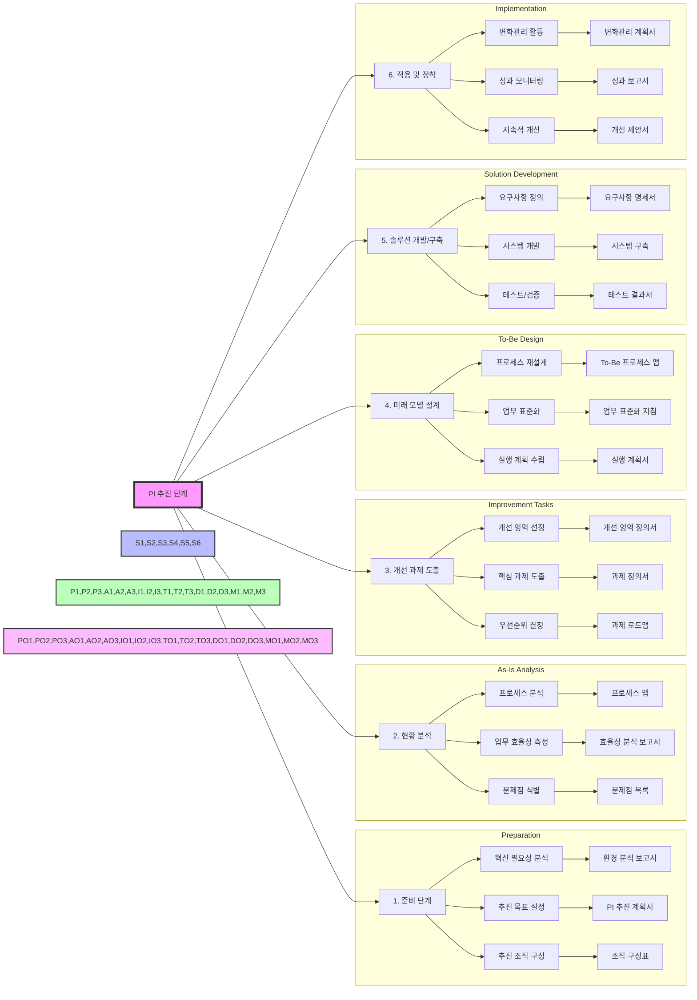

# PI (Process Innovation): 기업 경쟁력 극대화를 위한 프로세스 혁신

<!-- mtoc-start -->

- [정의 및 개념](#정의-및-개념)
- [PI 추진 단계](#pi-추진-단계)
- [PI 추진 프로세스](#pi-추진-프로세스)
- [주요 혁신 기법](#주요-혁신-기법)
- [기대 효과 및 필요성](#기대-효과-및-필요성)
- [마무리](#마무리)
- [Keywords](#keywords)

<!-- mtoc-end -->

PI(Process Innovation)는 기업이 경쟁력을 확보하기 위해 기존 프로세스를 근본적으로 분석하고, 새로운 방식으로 혁신하는 경영 기법이다. 이를 통해 업무 절차를 효율화하고, 생산성과 품질을 향상시키며, 고객 만족도를 극대화할 수 있다.

## 정의 및 개념

PI는 기업의 핵심 프로세스를 혁신적으로 개선하여 경쟁력을 강화하는 전략적 접근 기법. 기존 방식의 단순한 개선이 아니라, 근본적인 변화와 혁신을 목표로 한다.

- **목적**: 프로세스 최적화, 비용 절감, 생산성 향상, 경쟁력 강화
- **특징**:
  - 프로세스 중심의 혁신
  - 기존 업무 방식의 획기적인 개선
  - 정보기술(IT) 활용 극대화
  - 고객 중심 서비스 개선
  - 지속적인 혁신과 성과 관리

## PI 추진 단계

1. **준비 단계**: 혁신 필요성 분석 및 목표 설정
2. **현황 분석(As-Is)**: 기존 프로세스의 문제점 및 비효율성 파악
3. **개선 과제 도출**: 핵심 개선 요소 선정 및 혁신 목표 수립
4. **미래 모델(To-Be) 설계**: 최적화된 프로세스 설계 및 실행 계획 수립
5. **솔루션 개발 및 구축**: 새로운 프로세스를 구현하기 위한 기술 및 시스템 개발
6. **적용 및 정착**: 변화된 프로세스를 실무에 적용하고 지속적인 개선 진행

## PI 추진 프로세스

1. 단계별 주요 활동

   - 준비: 필요성 분석, 목표 설정, 조직 구성
   - 현황 분석: 프로세스 분석, 효율성 측정, 문제점 식별
   - 과제 도출: 개선 영역 선정, 핵심 과제 도출, 우선순위 결정
   - 미래 설계: 프로세스 재설계, 업무 표준화, 실행 계획
   - 솔루션 개발: 요구사항 정의, 시스템 개발, 테스트
   - 적용/정착: 변화관리, 모니터링, 지속적 개선

2. 단계별 산출물

   - 각 단계마다 구체적인 산출물 정의
   - 문서화된 결과물을 통한 체계적 관리
   - 다음 단계 진행을 위한 기초 자료로 활용

3. 프로세스 특징
   - 순차적이고 체계적인 단계별 접근
   - 각 단계의 명확한 목표와 활동 정의
   - 지속적인 모니터링과 개선 체계 구축

## 주요 혁신 기법

- **6시그마(Six Sigma)**: 품질 개선 및 불량률 최소화를 위한 계량적 접근 방식
- **BPR(Business Process Reengineering)**: 기존 프로세스를 근본적으로 재설계하는 혁신 기법
- **LEAN**: 불필요한 요소를 제거하여 효율성을 극대화하는 방식
- **IT 기반 혁신**: 디지털 기술을 활용한 자동화 및 데이터 기반 의사 결정 강화
- **PDCA(Plan-Do-Check-Act)**: 지속적인 프로세스 개선을 위한 반복적 접근

## 기대 효과 및 필요성

- **업무 효율성 극대화**: 불필요한 절차 제거 및 최적화된 프로세스 구축
- **비용 절감**: 생산성과 운영 효율성 향상을 통한 비용 절감
- **품질 개선**: 프로세스 최적화를 통한 제품 및 서비스 품질 향상
- **경쟁력 강화**: 혁신적인 프로세스를 통해 시장 경쟁력 확보
- **고객 만족도 증가**: 신속하고 정확한 서비스 제공을 통한 고객 경험 향상

## 마무리

PI(Process Innovation)는 단순한 개선을 넘어 혁신적인 변화를 통해 기업의 경쟁력을 강화하는 필수적인 전략이다. 디지털 기술을 적극 활용하고, 지속적인 개선을 통해 최적화된 프로세스를 유지하는 것이 중요하다.

## Keywords

Process Innovation, PI, 프로세스 혁신, BPR, 6시그마, LEAN, PDCA, 업무 효율화, 비용 절감, 품질 개선, 경쟁력 강화