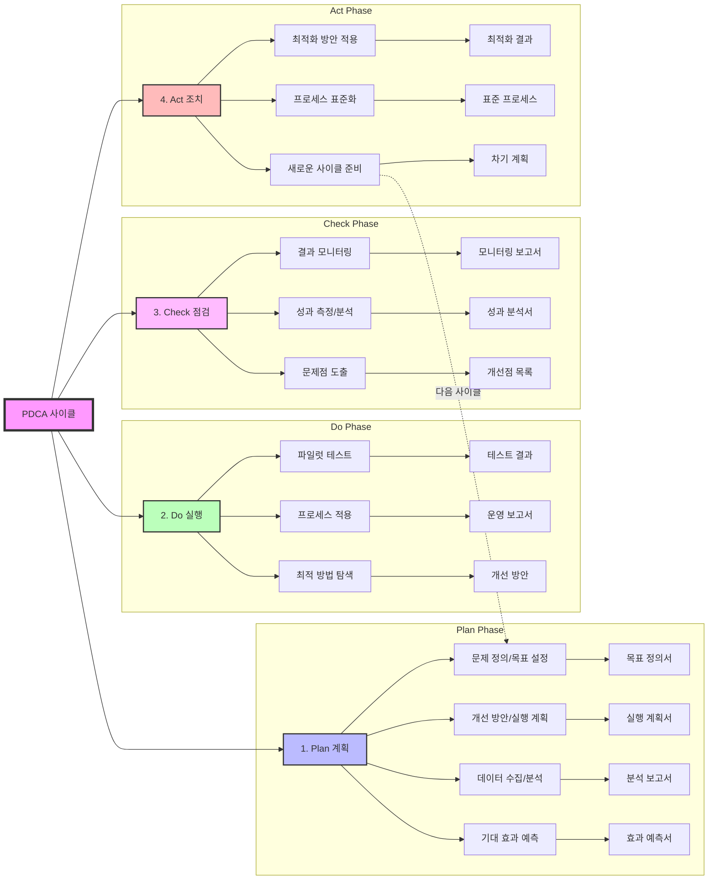

# PDCA (Plan-Do-Check-Act): 지속적인 개선을 위한 반복적 접근 방식

<!-- mtoc-start -->

- [정의 및 개념](#정의-및-개념)
- [PDCA 사이클의 4단계](#pdca-사이클의-4단계)
- [PDCA 사이클 체계도](#pdca-사이클-체계도)
- [PDCA의 활용 분야](#pdca의-활용-분야)
- [기대 효과 및 필요성](#기대-효과-및-필요성)
- [마무리](#마무리)
- [Keywords](#keywords)

<!-- mtoc-end -->

PDCA(Plan-Do-Check-Act) 사이클은 지속적인 프로세스 개선을 위한 반복적 관리 방법론으로, 품질 개선과 업무 최적화를 위한 핵심적인 접근 방식이다. 제조업, 서비스업, IT, 경영 등 다양한 분야에서 활용되며, 효율성과 성과 향상을 목표로 한다.

## 정의 및 개념

PDCA는 조직의 프로세스를 지속적으로 개선하기 위한 체계적인 관리 방법론으로, 계획(Plan), 실행(Do), 점검(Check), 조치(Action)의 4단계로 구성된다.

- **목적**: 지속적인 품질 개선, 업무 효율성 향상, 조직의 경쟁력 강화
- **특징**:
  - 반복적이고 순환적인 개선 활동
  - 명확한 목표 설정과 성과 측정
  - 신속한 피드백을 통한 최적화
  - 조직 내 협업과 참여 촉진

## PDCA 사이클의 4단계

1. **Plan (계획)**

   - 문제 정의 및 목표 설정
   - 개선 방안 및 실행 계획 수립
   - 데이터 수집 및 분석
   - 기대 효과 예측

2. **Do (실행)**

   - 계획에 따른 실행 및 파일럿 테스트 수행
   - 프로세스 변화 적용 및 운영
   - 실험적 접근을 통해 최적 실행 방법 탐색

3. **Check (점검)**

   - 실행 결과 모니터링 및 평가
   - 성과 측정 및 목표 달성 여부 분석
   - 문제점 및 개선점 도출

4. **Act (조치 및 개선)**
   - 분석 결과를 바탕으로 최적화 방안 적용
   - 표준화된 프로세스로 정착
   - 새로운 개선 사이클 시작

## PDCA 사이클 체계도

- 지속적인 순환 구조
- 단계별 명확한 산출물
- 데이터 기반의 의사결정

## PDCA의 활용 분야

- **제조업**: 생산 공정 개선 및 품질 관리
- **서비스업**: 고객 서비스 개선 및 업무 효율성 증대
- **IT 및 소프트웨어 개발**: 애자일 개발 및 지속적인 소프트웨어 개선
- **경영 및 전략 기획**: 조직의 목표 달성과 지속적인 성과 개선
- **공공 및 행정 서비스**: 정책 실행 및 공공 서비스 최적화

## 기대 효과 및 필요성

- **지속적인 품질 개선**: 반복적인 최적화를 통해 프로세스 성능 향상
- **비용 절감 및 생산성 향상**: 불필요한 자원 낭비 방지
- **리스크 관리 강화**: 프로세스 모니터링 및 신속한 대응 가능
- **데이터 기반 의사 결정**: 명확한 성과 분석을 통한 효과적인 개선
- **조직의 협업과 참여 촉진**: 구성원의 적극적인 참여를 유도하여 지속 가능한 개선 환경 조성

## 마무리

PDCA 사이클은 지속적인 개선을 위한 강력한 도구로, 프로세스 효율성과 품질 향상을 위해 필수적인 접근 방식이다. 조직은 PDCA를 활용하여 문제를 체계적으로 해결하고, 최적의 성과를 유지할 수 있다.

## Keywords

PDCA, Plan-Do-Check-Act, 지속적 개선, 품질 관리, 프로세스 최적화, 업무 효율성, 성과 분석, 리스크 관리, 데이터 기반 의사 결정, 조직 혁신