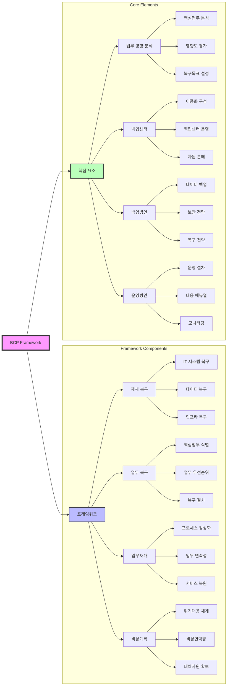

# BCP (Business Continuity Planning): 비즈니스 연속성 계획

<!-- mtoc-start -->

- [정의 및 개념](#정의-및-개념)
- [BCP 프레임워크 (재업재비)](#bcp-프레임워크-재업재비)
- [BCP 핵심 요소 (비센방운)](#bcp-핵심-요소-비센방운)
- [BCP 프레임워크 구성도](#bcp-프레임워크-구성도)
- [BCP 수립 절차](#bcp-수립-절차)
- [BCP 성공 요소](#bcp-성공-요소)
- [기대 효과 및 필요성](#기대-효과-및-필요성)
- [마무리](#마무리)
- [Keywords](#keywords)

<!-- mtoc-end -->

Business Continuity Planning (BCP)은 기업이 각종 재난 및 재해 발생 시에도 비즈니스의 연속성을 유지할 수 있도록 대비하는 체계적인 계획이다. 이를 통해 재해 복구, 업무 복구, 비상 계획 등을 수립하여 기업 운영을 지속할 수 있도록 한다.

## 정의 및 개념

BCP는 기업의 중요한 업무가 중단되지 않도록 사전 대비하는 전략, 비즈니스 영향 분석(BIA), 목표 복구 시점(RPO), 목표 복구 시간(RTO), 재해 복구 센터(DRS) 등의 요소를 포함한다.

- **목적**: 기업의 업무 연속성 유지, 재해 및 위기 대응 체계 구축, 신뢰도 확보
- **특징**:
  - **기술적 측면**: 시스템 복구 과정의 효율적 통제, 유·무형 손실 예방 및 최소화
  - **비즈니스 측면**: 고객 보호 및 만족도 유지, 기업의 대외 신뢰도 향상

## BCP 프레임워크 (재업재비)

1. **DR (Disaster Recovery, 재해 복구)**: IT 시스템 및 데이터 복구 계획
2. **BR (Business Recovery, 업무 복구)**: 핵심 업무 재개 및 운영 유지
3. **업무재개 (Operational Resumption)**: 주요 업무 프로세스의 정상화
4. **비상계획 (Emergency Management Plan)**: 긴급 상황 대응을 위한 계획 수립

## BCP 핵심 요소 (비센방운)

1. **BIA (Business Impact Analysis, 업무 영향 분석)**: 업무 연속성 확보를 위한 핵심 요소 분석
2. **백업센터 (Backup Center)**: 주요 데이터 및 시스템의 이중화 저장소 운영
3. **백업방안 (Backup Strategy)**: 정기적인 데이터 백업 및 보호 전략
4. **운영방안 (Operational Strategy)**: 위기 발생 시 운영 절차 및 대응 방안 수립

## BCP 프레임워크 구성도

1. 프레임워크 구성(재업재비)

   - DR(재해 복구): IT 인프라와 데이터의 복구 체계
   - BR(업무 복구): 핵심 업무의 우선순위별 복구
   - 업무재개: 업무 프로세스의 정상화 과정
   - 비상계획: 위기 상황 대응 체계

2. 핵심 요소(비센방운)

   - BIA: 업무 연속성을 위한 영향도 분석
   - 백업센터: 시스템과 데이터의 이중화
   - 백업방안: 데이터 보호와 복구 전략
   - 운영방안: 위기 대응 절차와 매뉴얼

3. 체계의 특징
   - 전사적 위기관리 체계
   - 예방-대비-대응-복구의 순환적 구조
   - 핵심 자원의 보호와 신속한 복구 지원

## BCP 수립 절차

4. **위험 분석 (RA, Risk Analysis)**: 잠재적인 위험 요소 평가 및 분석
5. **업무 환경 분석 (BIA, Business Impact Analysis)**: 중요 업무의 영향도 평가
6. **재해 복구 전략 수립**: 복구 목표 설정 및 대응 계획 수립
7. **시스템 구축 및 복구 계획 수립**: IT 및 인프라 복구 체계 마련
8. **운영 및 모의 훈련**: 실제 상황을 대비한 반복적인 테스트 및 개선

## BCP 성공 요소

- **임직원의 인식 제고 및 참여**: 위기 대응 훈련 및 교육 강화
- **TFT(Task Force Team) 운영**: 전담 팀을 구성하여 지속적인 관리
- **명확한 범위 설정**: 핵심 업무 및 중요 자산 식별 및 보호
- **지속적인 교육 및 훈련**: 실전 대응 능력 향상을 위한 반복 학습

## 기대 효과 및 필요성

- **기업 연속성 유지**: 재해 발생 시에도 중단 없는 운영 가능
- **신속한 복구**: 효율적인 대응 체계를 통해 업무 중단 최소화
- **고객 신뢰 확보**: 위기 관리 능력을 통해 고객 보호 및 만족도 유지
- **법규 및 규제 준수**: 기업의 법적 의무 이행 및 안정적인 운영 보장

## 마무리

BCP는 기업의 지속 가능한 경영을 위한 필수적인 전략으로, 사전 준비와 체계적인 대응이 중요하다. 이를 효과적으로 운영하기 위해서는 조직 전반의 참여와 지속적인 교육 및 훈련이 필수적이다.

## Keywords

Business Continuity Planning, BCP, 업무 연속성, 재해 복구, 업무 복구, 비상 계획, BIA, RPO, RTO, DRS, 위험 분석