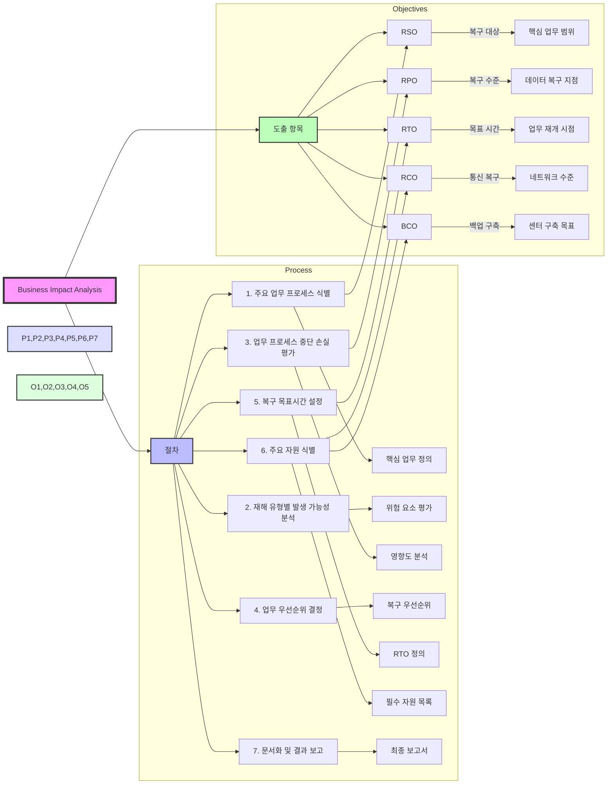

# BIA (Business Impact Analysis): 효과적인 업무 연속성 보장

<!-- mtoc-start -->

- [정의 및 개념](#정의-및-개념)
- [주요 특징](#주요-특징)
- [BIA Process](#bia-process)
- [도출 항목](#도출-항목)
- [활용 사례](#활용-사례)
- [기대 효과 및 필요성](#기대-효과-및-필요성)
- [마무리](#마무리)
- [Keywords](#keywords)

<!-- mtoc-end -->

비즈니스 연속성 계획(BCP)의 핵심 요소인 업무영향분석(BIA)은 조직이 직면할 수 있는 위험요인을 식별하고, 이에 따른 영향을 분석하여 핵심 활동을 유지하는 데 필요한 전략을 수립하는 과정이다. 이를 통해 기업은 재해나 위기 상황에서도 중요한 업무를 지속할 수 있도록 대비할 수 있다.

## 정의 및 개념

- BIA(Business Impact Analysis): 조직의 주요 업무 프로세스를 식별하고, 중단 시 영향을 분석하여 복구 우선순위를 정하는 과정
- 목적: 비즈니스 연속성 보장, 핵심 업무 보호, 복구 계획 수립
- 주요 요소: 위험요인 식별, 영향도 분석, 업무 중요도 평가, 핵심 활동 도출

## 주요 특징

- **업무 중단 영향 분석**: 재해 및 위기 상황에서 주요 업무의 영향을 평가하여 손실 최소화
- **업무 우선순위 설정**: 중요도에 따라 복구 순서를 결정하여 효율적 복구 지원
- **복구 목표 정의**: 복구 목표시간(RTO), 복구 수준(RPO) 등 구체적 목표 수립
- **자원 식별**: 업무 연속성 유지를 위한 핵심 자원 및 백업 시스템 파악
- **보고 및 문서화**: 분석 결과를 문서화하여 체계적 대응 전략 수립

## BIA Process

1. BIA 절차

   - 7단계 순차적 프로세스
   - 각 단계별 구체적인 산출물 정의
   - 단계간 유기적 연계성 확보

2. 도출 항목(5대 Objectives)

   - RSO: 복구 대상 업무 범위
   - RPO: 데이터 복구 수준
   - RTO: 업무 재개 목표 시간
   - RCO: 네트워크 복구 수준
   - BCO: 백업센터 구축 목표

3. 프로세스 특징
   - 체계적인 분석 절차
   - 명확한 복구 목표 설정
   - 구체적인 산출물 도출

## 도출 항목

- **RSO(Recovery Scope Objective)**: 복구 대상이 되는 핵심 업무
- **RPO(Recovery Point Objective)**: 핵심 업무 복구를 위한 복구 수준
- **RTO(Recovery Time Objective)**: 업무 재개를 위한 필요시간
- **RCO(Recovery Communication Objective)**: 네트워크 복구 수준
- **BCO(Backup Center Objective)**: 백업센터 구축 목표

## 활용 사례

- **금융업**: 금융 거래 중단 방지를 위한 핵심 시스템 복구 목표 설정
- **의료기관**: 전자의무기록(EMR) 시스템 복구 계획 수립
- **제조업**: 생산라인 중단 방지를 위한 백업 시스템 구축
- **IT 서비스 기업**: 클라우드 및 데이터 백업 전략 수립

## 기대 효과 및 필요성

- **비즈니스 연속성 보장**: 재해 발생 시에도 핵심 업무 지속 가능
- **위기 대응력 강화**: 체계적 복구 계획을 통해 리스크 최소화
- **고객 신뢰 확보**: 안정적인 서비스 제공으로 신뢰 유지
- **법규 준수**: 금융, 의료 등 규제 산업에서의 컴플라이언스 충족

## 마무리

BIA는 기업이 예상치 못한 위기에서도 안정적으로 운영을 지속할 수 있도록 지원하는 필수적인 분석 과정이다. 체계적인 업무 영향 분석을 통해 효과적인 복구 전략을 수립하고, 장기적인 비즈니스 연속성을 보장해야 한다.

## Keywords

Business Impact Analysis, BIA, 업무연속성, 복구 목표시간, 위험 분석, RPO, RTO, 재해 복구 계획, 비즈니스 지속성, BCP