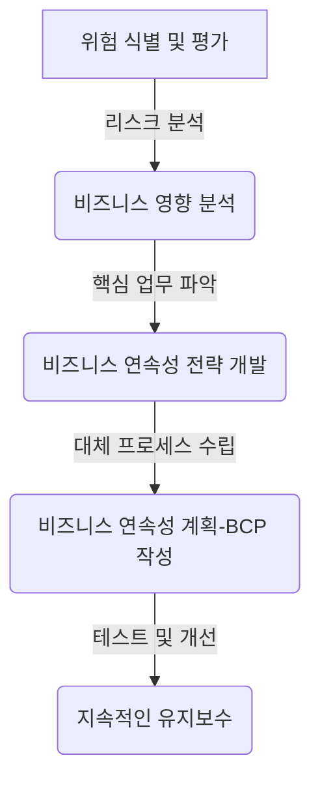

# BS 25999: 비즈니스 연속성 관리 표준

<!-- mtoc-start -->

- [정의 및 개념](#정의-및-개념)
- [주요 특징](#주요-특징)
- [구성도](#구성도)
- [활용 사례](#활용-사례)
- [기대 효과 및 필요성](#기대-효과-및-필요성)
- [마무리](#마무리)
- [Keywords](#keywords)

<!-- mtoc-end -->

BS 25999는 비즈니스 연속성 관리(BCM, Business Continuity Management)에 대한 영국 표준으로, 조직이 예상치 못한 재난이나 위기 상황에서도 핵심 업무를 지속할 수 있도록 체계적인 관리 프레임워크를 제공합니다. 이 표준은 BCM의 핵심 원칙을 정의하고, 계획 수립 및 운영을 위한 지침을 제공함으로써 조직의 복원력을 강화하는 데 기여합니다.

## 정의 및 개념

BS 25999는 조직이 비즈니스 연속성을 확보하기 위해 필요한 정책, 계획, 절차 및 자원을 체계적으로 관리하는 표준.

- 특징: 위험 식별, 비즈니스 영향 분석(BIA), 연속성 전략, 대응 계획, 테스트 및 유지보수
- 목적: 운영 중단 시 핵심 기능 유지, 조직의 복원력 강화, 이해관계자 신뢰 확보
- 필요성: 자연재해, 사이버 공격, 공급망 중단 등의 위협 증가에 대비

## 주요 특징

1. **위험 식별 및 평가**  
   조직이 직면할 수 있는 위협 요소를 분석하고, 발생 가능성과 영향을 평가하여 적절한 대응 전략을 마련함
2. **비즈니스 영향 분석(BIA, Business Impact Analysis)**  
   특정 리스크가 조직의 핵심 업무에 미치는 영향을 분석하여 우선순위를 설정하고 대응 계획을 수립함
3. **비즈니스 연속성 전략 개발**  
   조직의 업무 지속을 보장하기 위한 전략과 대체 프로세스를 마련하여 운영 중단 시에도 핵심 기능을 유지할 수 있도록 함
4. **BCP(비즈니스 연속성 계획) 수립**  
   위기 발생 시 대응 절차와 역할을 명확히 정의한 계획을 수립하고 실행 가능성을 검토함
5. **정기적인 테스트 및 개선**  
   연속성 계획을 정기적으로 점검하고 테스트하여 실제 위기 발생 시 효과적으로 대응할 수 있도록 유지함

## 구성도

BS 25999는 비즈니스 연속성을 확보하기 위한 단계별 접근법을 제공하며, 조직이 사전 예방과 사후 대응을 모두 고려할 수 있도록 지원합니다.

## 활용 사례

6. **금융 기관**: 사이버 공격이나 자연재해 발생 시 핵심 금융 서비스 제공을 유지하기 위해 BS 25999를 도입하여 리스크를 최소화함
7. **제조업체**: 공급망 중단을 대비하여 대체 공급원을 확보하고, 생산시설의 운영 연속성을 보장하는 전략을 수립함
8. **IT 서비스 기업**: 데이터센터 장애에 대비하여 백업 및 복구 절차를 구축하고, 고객 서비스 연속성을 유지함
9. **정부 기관**: 재난 대응 및 공공 서비스 지속성을 보장하기 위해 BS 25999 기반의 BCM을 운영함

## 기대 효과 및 필요성

- **조직의 복원력 강화**: 예상치 못한 운영 중단 상황에서도 핵심 기능을 유지하고 신속한 복구 가능
- **법규 및 규제 준수**: ISO 22301 등 국제 표준과의 정합성을 확보하여 규제 요구사항 충족
- **이해관계자 신뢰 구축**: 고객, 파트너, 투자자에게 안정적인 서비스 제공을 보장함으로써 신뢰도 향상
- **비용 절감 및 리스크 관리**: 사전 예방적 접근을 통해 사고 발생 시 복구 비용을 최소화하고 손실을 줄임

## 마무리

BS 25999는 조직이 지속 가능한 운영을 위해 필수적으로 고려해야 할 비즈니스 연속성 관리 표준입니다. 이를 통해 기업은 예상치 못한 위기 상황에서도 핵심 업무를 지속할 수 있으며, 고객 및 이해관계자들에게 신뢰를 줄 수 있습니다. ISO 22301이 BS 25999를 대체하면서 국제 표준으로 자리 잡았지만, BS 25999의 핵심 원칙과 접근 방식은 여전히 BCM 전략 수립에 중요한 기반이 되고 있습니다.

## Keywords

Business Continuity Management, BCM, BS 25999, 비즈니스 연속성 계획, 비즈니스 영향 분석, 위기 관리, 리스크 평가, ISO 22301, 복원력, 비즈니스 지속성