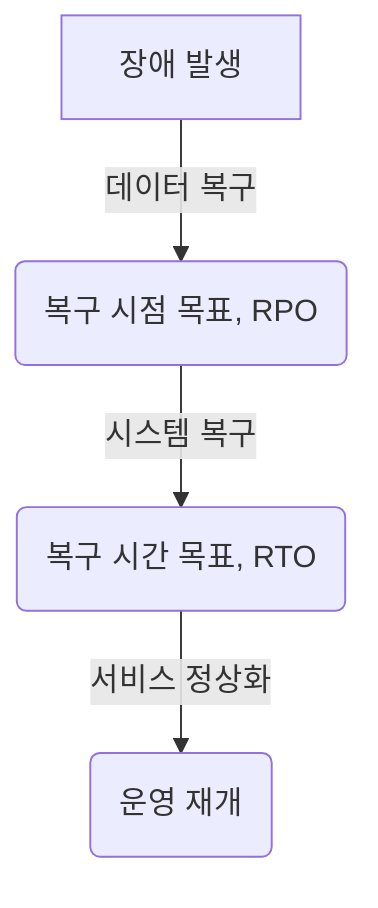

# RTO, RPO: 비즈니스 연속성을 위한 핵심 지표

<!-- mtoc-start -->

- [정의 및 개념](#정의-및-개념)
- [주요 특징](#주요-특징)
- [RTO와 RPO의 관계](#rto와-rpo의-관계)
- [활용 사례](#활용-사례)
- [기대 효과 및 필요성](#기대-효과-및-필요성)
- [마무리](#마무리)
- [Keywords](#keywords)

<!-- mtoc-end -->

비즈니스 연속성 관리(BCM, Business Continuity Management)에서 RTO(복구 시간 목표, Recovery Time Objective)와 RPO(복구 시점 목표, Recovery Point Objective)는 IT 시스템 및 비즈니스 프로세스의 복구 전략을 수립하는 핵심 지표입니다. 이들은 조직이 예상치 못한 장애 발생 시 데이터를 복구하고 운영을 재개하는 데 필요한 목표를 설정하는 데 중요한 역할을 합니다.

## 정의 및 개념

- **RTO (Recovery Time Objective, 복구 시간 목표)**: 시스템 장애 발생 후 허용 가능한 최대 복구 시간. 즉, 서비스가 중단된 후 정상 운영을 재개하는 데 걸리는 최대 시간.
- **RPO (Recovery Point Objective, 복구 시점 목표)**: 데이터 손실을 허용할 수 있는 최대 시점. 즉, 마지막 백업 이후 장애 발생 시 복구 가능한 데이터의 최신 시점.

## 주요 특징

1. **RTO와 비즈니스 영향 분석(BIA)**
   - RTO는 비즈니스 영향 분석(BIA)을 통해 조직의 서비스 및 시스템에 대한 복구 우선순위를 설정하는 데 활용됨
2. **RPO와 데이터 보호 전략**
   - RPO는 데이터 백업 주기와 밀접한 관련이 있으며, 백업 빈도가 짧을수록 RPO를 낮출 수 있음
3. **비즈니스 연속성과의 관계**
   - RTO와 RPO는 재해 복구(DR, Disaster Recovery) 및 비즈니스 연속성 계획(BCP) 수립의 핵심 요소로 작용함
4. **비용과의 상관관계**
   - 낮은 RTO 및 RPO를 유지하려면 고비용의 고가용성 시스템 및 실시간 데이터 복제 기술이 필요함
5. **IT 및 운영 프로세스 연계**
   - RTO/RPO를 기준으로 데이터 복구 프로세스, 백업 정책, 재해 복구 절차를 수립하여 실질적인 운영 연속성을 보장함

## RTO와 RPO의 관계

RTO는 시스템이 완전히 복구될 때까지의 시간을 의미하며, RPO는 장애 발생 시점을 기준으로 데이터 손실 허용 범위를 나타냅니다. 즉, RTO가 4시간이라면 장애 발생 후 4시간 이내에 시스템이 복구되어야 하고, RPO가 30분이라면 장애 발생 시점으로부터 최대 30분 전의 데이터까지만 복구 가능함을 의미합니다.

## 활용 사례

6. **금융 기관**
   - 초저 RTO/RPO 목표 설정(거의 실시간 복구)으로 금융 거래 연속성 보장
7. **전자상거래 기업**
   - 주문 및 결제 데이터 손실을 최소화하기 위해 짧은 RPO 설정
8. **제조업체**
   - 생산 데이터의 손실을 방지하기 위해 RTO/RPO를 공정 운영과 연계하여 설정
9. **클라우드 서비스 제공업체**
   - 다중 데이터 센터와 실시간 복제 기술을 활용하여 낮은 RTO/RPO 유지

## 기대 효과 및 필요성

- **데이터 손실 최소화**: 효과적인 RTO/RPO 설정을 통해 비즈니스 연속성을 보장하고 데이터 보호 강화
- **신속한 서비스 복구**: 적절한 복구 목표 설정으로 장애 발생 시 빠른 운영 재개 가능
- **비용 절감 및 운영 최적화**: 비즈니스 요구에 맞는 RTO/RPO 설정을 통해 불필요한 IT 비용 지출 방지
- **고객 신뢰 확보**: 안정적인 서비스 제공으로 고객 신뢰 및 만족도 향상

## 마무리

RTO와 RPO는 조직이 재해 및 장애에 대비하여 비즈니스 연속성을 보장하는 중요한 지표입니다. 효과적인 복구 목표를 설정하고 이를 운영에 반영함으로써, 기업은 예상치 못한 위기 속에서도 핵심 서비스와 데이터를 보호하고 신속하게 정상화할 수 있습니다. 조직의 요구사항에 맞는 RTO/RPO 설정을 통해 안정적인 IT 및 비즈니스 운영을 달성하는 것이 중요합니다.

## Keywords

RTO, RPO, Recovery Time Objective, Recovery Point Objective, 비즈니스 연속성, 재해 복구, 데이터 보호, IT 복구 전략, BCP, DR(Disaster Recovery)