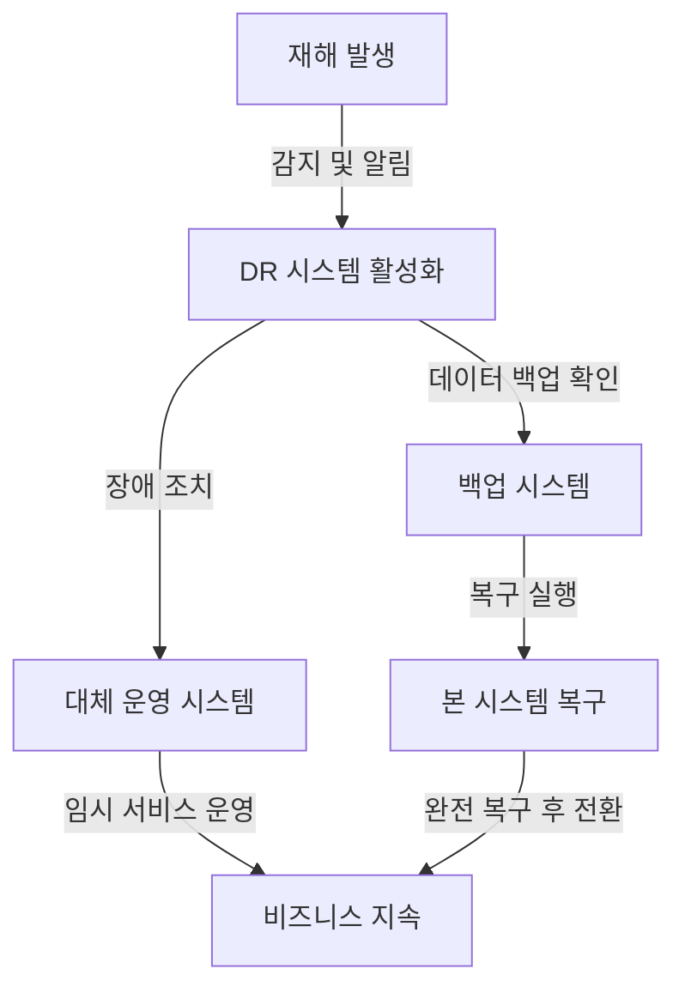

# 재해복구시스템 (DRS): 비즈니스 연속성을 위한 필수 전략

<!-- mtoc-start -->

- [정의 및 개념](#정의-및-개념)
- [주요 특징](#주요-특징)
- [DRS 주요 구성요소](#drs-주요-구성요소)
- [DRS 구성도](#drs-구성도)
- [활용 사례](#활용-사례)
- [기대 효과 및 필요성](#기대-효과-및-필요성)
- [마무리](#마무리)
- [Keywords](#keywords)

<!-- mtoc-end -->

기업과 조직은 자연재해, 사이버 공격, 시스템 장애 등 다양한 위협에 직면할 수 있다. 이러한 위기에 대비하여 IT 인프라와 데이터를 보호하고 비즈니스 연속성을 유지하기 위해 재해복구시스템(Disaster Recovery System, DRS)이 필수적이다. DRS는 갑작스러운 장애 발생 시 신속하게 시스템을 복구하고 정상 운영을 보장하는 전략과 기술을 포함한다.

## 정의 및 개념

- **재해복구시스템(DRS)**: IT 시스템 장애 발생 시 데이터 보호 및 서비스 지속성을 유지하기 위한 기술 및 운영 절차
- **목적**: 예상치 못한 재해로부터 데이터 및 시스템을 보호하고 신속한 복구를 통해 업무 연속성을 유지
- **필요성**: 기업의 데이터 보호, 법적 규제 준수, 서비스 가용성 보장, 경제적 손실 최소화

## 주요 특징

- **복구 목표 시간(RTO, Recovery Time Objective)**: 시스템 장애 발생 후 정상 운영까지의 목표 시간
- **복구 목표 지점(RPO, Recovery Point Objective)**: 데이터 손실을 허용할 수 있는 최대 시간 범위
- **재해 유형 대응**: 자연재해, 사이버 공격, 시스템 오류 등 다양한 위협에 대비
- **백업 및 복구 방식**: 온프레미스, 클라우드 기반, 하이브리드 백업 지원
- **자동화 및 모니터링**: 실시간 감시 및 자동 복구 기능 포함

## DRS 주요 구성요소

| 구성요소           | 설명                                                                                                                    |
| ------------------ | ----------------------------------------------------------------------------------------------------------------------- |
| 하드웨어 시스템    | • 주 센터와 동일한 사양의 서버, 스토리지, 네트워크 장비 • 데이터 복제를 위한 전용 통신 회선 • 백업 장비 및 미디어 |
| 소프트웨어 시스템  | • 운영체제(OS) • 데이터베이스 관리 시스템(DBMS) • 애플리케이션 서버 • 데이터 복제 및 동기화 소프트웨어         |
| 데이터 관리 시스템 | • 실시간 데이터 복제 시스템 • 백업 및 복구 관리 도구 • 데이터 무결성 검증 도구                                    |
| 모니터링 시스템    | • 시스템 상태 모니터링 • 네트워크 성능 모니터링 • 장애 감지 및 알림 시스템                                        |
| 보안 시스템        | • 방화벽 • 침입탐지/방지 시스템(IDS/IPS) • 접근 제어 시스템 • 암호화 시스템                                    |
| 운영 관리 시스템   | • 재해복구 정책 및 절차 • 비상 연락망 및 대응 체계 • 정기적인 훈련 및 테스트 계획                                 |

## DRS 구성도

DRS는 재해 발생 시 백업 시스템과 대체 운영 시스템을 활용하여 신속하게 비즈니스를 지속하고, 복구 후 정상 시스템으로 전환하는 방식으로 운영된다.

## 활용 사례

- **금융권**: 온라인 결제 시스템 장애 시 대체 서버를 통해 서비스 지속
- **공공기관**: 정부 데이터센터 장애 시 백업 데이터센터에서 업무 연속성 유지
- **제조업**: ERP 시스템 장애 발생 시 생산 일정 및 공급망 관리 지속
- **전자상거래**: 대형 트래픽 장애 시 클라우드 기반 DR 시스템을 활용한 복구

## 기대 효과 및 필요성

- **업무 연속성 보장**: 재해 발생 시에도 서비스 중단 없이 운영 가능
- **데이터 보호 및 규제 준수**: 금융, 의료 등 민감한 데이터를 안전하게 보호
- **비용 절감**: 재해로 인한 운영 중단과 데이터 손실에 따른 경제적 피해 최소화
- **고객 신뢰 확보**: 안정적인 서비스 제공을 통한 기업 이미지 및 신뢰도 향상

## 마무리

재해복구시스템(DRS)은 예기치 않은 재해와 시스템 장애에 대비하는 필수 전략이다. 기업과 기관은 효과적인 DRS를 구축하여 데이터 보호, 비즈니스 연속성 유지, 경제적 손실 최소화를 실현할 수 있다. 따라서 각 조직의 IT 환경에 적합한 DRS 솔루션을 도입하고, 정기적인 테스트 및 개선을 수행하는 것이 중요하다.

## Keywords

Disaster Recovery System, DRS, 재해복구, 데이터 보호, 업무 연속성, 백업 시스템, 복구 목표 시간, 복구 목표 지점, 클라우드 DR, IT 재해 대비