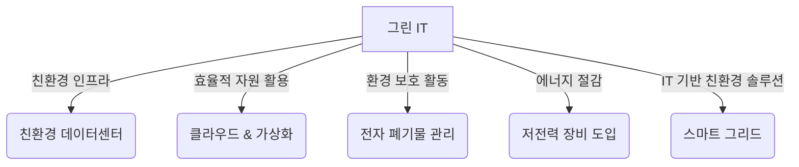

# 그린 IT (Green IT): 지속 가능한 IT 실천

<!-- mtoc-start -->

- [정의 및 개념](#정의-및-개념)
- [주요 특징](#주요-특징)
- [구성도](#구성도)
- [활용 사례](#활용-사례)
- [기대 효과 및 필요성](#기대-효과-및-필요성)
- [마무리](#마무리)
- [Keywords](#keywords)

<!-- mtoc-end -->

IT 산업이 발전하면서 에너지 소비와 전자 폐기물 증가 등의 환경적 문제가 대두되고 있다. 이에 따라 IT 자체를 친환경적으로 운영하고, IT를 활용하여 지속 가능한 환경을 조성하는 "그린 IT(Green IT)" 개념이 중요해지고 있다. 이는 환경을 해치지 않으면서 지속 가능한 IT를 유지하고, IT 기술을 통해 친환경 활동을 지원하는 포괄적인 개념이다.

## 정의 및 개념

그린 IT(Green IT)는 IT 자체를 친환경적으로 운영하고, IT 기술을 활용하여 환경 보호에 기여하는 개념.

- 특징: 에너지 절감, 전자 폐기물 최소화, 친환경 데이터센터 운영, 지속 가능한 IT 인프라 구축
- 목적: 환경 보호, 기업의 사회적 책임(CSR) 강화, 비용 절감, 지속 가능한 IT 환경 조성
- 필요성: 기후 변화 대응, 자원 효율성 증대, 친환경 정책 강화

## 주요 특징

- **친환경 데이터센터 운영**: 전력 효율이 높은 서버, 냉각 기술 최적화, 재생 에너지 활용
- **저전력·고효율 IT 장비 도입**: 에너지 스타(Energy Star) 인증 제품 사용, 전력 절감 기술 적용
- **전자 폐기물(E-waste) 관리**: IT 장비 재활용 및 폐기물 최소화 전략 실행
- **클라우드 및 가상화 기술 활용**: 서버 통합 및 가상화를 통한 자원 효율성 향상
- **스마트 그리드 및 친환경 SW 개발**: IT를 활용한 에너지 절감 및 탄소 배출 감소 지원

## 구성도

그린 IT는 친환경 인프라, 자원 활용 효율성, 환경 보호 활동, 에너지 절감, IT 기반 친환경 솔루션 등으로 구성되며, 지속 가능한 IT 실천을 목표로 한다.

## 활용 사례

- **구글(Google)의 친환경 데이터센터 운영**: AI 기반 냉각 기술 적용 및 재생 에너지 활용
- **마이크로소프트(Microsoft)의 탄소 네거티브 전략**: 2030년까지 탄소 배출보다 더 많은 탄소를 제거하는 목표 수립
- **에너지 스타(Energy Star) 인증**: 저전력·고효율 IT 제품 보급 확대
- **스마트 빌딩 및 스마트 시티 프로젝트**: IoT 기술을 활용한 에너지 절감 및 환경 보호

## 기대 효과 및 필요성

- **에너지 절감 및 비용 절약**: 전력 소비 감소를 통해 IT 운영 비용 절감
- **환경 보호 및 지속 가능성 확보**: 탄소 배출 감소 및 전자 폐기물 최소화
- **기업의 사회적 책임 강화**: 친환경 경영을 통한 브랜드 가치 향상
- **정부 및 국제 규제 대응**: 환경 관련 규제 및 정책 준수를 통한 리스크 관리

## 마무리

그린 IT는 IT 산업이 지속 가능성을 확보하고 환경 보호에 기여할 수 있도록 하는 필수적인 개념이다. 친환경 데이터센터 운영, 에너지 절감 기술 도입, 전자 폐기물 관리 등 다양한 전략을 통해 기업과 기관은 환경 보호와 비용 절감을 동시에 달성할 수 있다. IT 기술이 환경 문제 해결에 적극 기여할 수 있도록 그린 IT 실천이 더욱 확대될 필요가 있다.

## Keywords

Green IT, 친환경 IT, 에너지 절감, 전자 폐기물, 지속 가능한 IT, 친환경 데이터센터, 저전력 장비, 스마트 그리드, 탄소 배출 감소, 클라우드 가상화