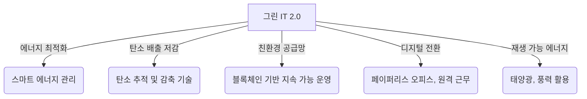

# 그린 IT 2.0: IT를 활용한 친환경 혁신

<!-- mtoc-start -->

- [정의 및 개념](#정의-및-개념)
- [주요 특징](#주요-특징)
- [구성도](#구성도)
- [활용 사례](#활용-사례)
- [기대 효과 및 필요성](#기대-효과-및-필요성)
- [마무리](#마무리)
- [Keywords](#keywords)

<!-- mtoc-end -->

IT 기술이 발전함에 따라 친환경적 접근 방식도 한층 고도화되고 있다. "그린 IT 2.0"은 기존의 친환경 IT 운영을 넘어, IT 기술을 활용하여 전 산업 분야에서 지속 가능한 환경 보호를 실현하는 개념이다. 이는 스마트 기술, 데이터 분석, AI, IoT 등을 활용하여 에너지 효율을 극대화하고 탄소 배출을 최소화하는 방향으로 발전하고 있다.

## 정의 및 개념

그린 IT 2.0은 IT 기술을 활용하여 다양한 산업에서 친환경 활동을 지원하고, 지속 가능한 환경을 조성하는 개념.

- 특징: 스마트 기술 활용, 에너지 최적화, 탄소 배출 저감, 지속 가능한 IT 생태계 구축
- 목적: 산업 전반의 친환경 전환, 지속 가능성 강화, 기후 변화 대응
- 필요성: 글로벌 환경 규제 강화, 기업의 ESG 경영 요구 증가, 자원 절감과 비용 절약

## 주요 특징

- **스마트 에너지 관리**: AI 기반 전력 최적화 및 에너지 소비 패턴 분석
- **탄소 배출 저감 기술**: IoT 센서를 활용한 탄소 배출 추적 및 감소 솔루션
- **친환경 공급망 구축**: 블록체인 기반의 투명한 지속 가능 공급망 운영
- **디지털 전환을 통한 자원 절감**: 페이퍼리스 오피스, 원격 근무 도입으로 자원 소비 절감
- **재생 가능 에너지 활용 확대**: IT 인프라 및 데이터센터의 태양광, 풍력 에너지 사용 증가

## 구성도

그린 IT 2.0은 스마트 기술, 디지털 전환, 블록체인 및 AI 활용을 통해 친환경적 혁신을 실현한다.

## 활용 사례

- **스마트 빌딩 시스템**: IoT 센서를 활용한 실시간 에너지 사용 최적화
- **전기차(EV) 및 충전 인프라 관리**: AI 기반 전력 공급 및 효율적 충전 시스템 운영
- **친환경 클라우드 컴퓨팅**: 탄소 중립을 목표로 하는 클라우드 데이터센터 운영
- **지속 가능한 스마트 팩토리**: AI 및 로봇 기술을 활용한 에너지 절감형 생산 공정

## 기대 효과 및 필요성

- **에너지 소비 절감**: 스마트 기술을 활용한 최적화로 운영 비용 절감
- **탄소 중립 실현**: 데이터 기반 친환경 정책 수립으로 기후 변화 대응
- **기업 경쟁력 강화**: ESG 경영 실천으로 지속 가능 경영 가능
- **정부 정책 및 글로벌 트렌드 대응**: 친환경 기술 도입을 통한 규제 준수

## 마무리

그린 IT 2.0은 IT 기술을 기반으로 산업 전반의 친환경 혁신을 실현하는 방향으로 나아가고 있다. 스마트 기술과 데이터 기반 접근 방식을 통해 지속 가능한 미래를 위한 친환경 전략이 필수적으로 요구된다. 기업과 기관은 적극적으로 그린 IT 2.0을 도입하여 환경 보호와 경영 효율성을 동시에 달성할 필요가 있다.

## Keywords

Green IT 2.0, 친환경 IT, 탄소 중립, 스마트 에너지 관리, IoT 친환경, ESG 경영, 지속 가능한 공급망, 블록체인 환경 보호, AI 에너지 최적화, 클린 테크