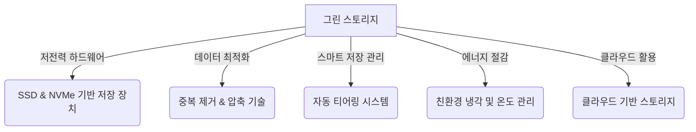

# 그린 스토리지 (Green Storage): 친환경 데이터 저장 기술

<!-- mtoc-start -->

- [정의 및 개념](#정의-및-개념)
- [주요 특징](#주요-특징)
- [구성도](#구성도)
- [활용 사례](#활용-사례)
- [기대 효과 및 필요성](#기대-효과-및-필요성)
- [마무리](#마무리)
- [Keywords](#keywords)

<!-- mtoc-end -->

디지털 데이터의 폭발적인 증가로 인해 스토리지 시스템의 에너지 소비와 환경 영향이 중요한 문제로 대두되고 있다. 이에 대응하기 위해 탄생한 개념이 바로 "그린 스토리지(Green Storage)"이다. 그린 스토리지는 저장 장치의 전력 소비를 줄이고, 효율적인 데이터 관리를 통해 탄소 배출을 최소화하는 기술과 전략을 포함한다. 기업과 기관은 친환경 스토리지 기술을 도입함으로써 운영 비용 절감과 지속 가능성을 동시에 확보할 수 있다.

## 정의 및 개념

그린 스토리지는 친환경적인 방식으로 데이터를 저장하고 관리하는 기술과 전략을 의미한다.

- 특징: 에너지 효율성 향상, 저전력 하드웨어 사용, 데이터 중복 제거, 친환경 냉각 기술 적용
- 목적: 데이터 저장 시스템의 전력 소비 절감, 탄소 배출 감소, 지속 가능한 IT 환경 구축
- 필요성: 데이터 증가로 인한 에너지 소비 증가 대응, 환경 규제 강화, 비용 절감 및 효율성 극대화

## 주요 특징

- **전력 효율적인 스토리지 하드웨어**: 저전력 SSD, NVMe 기반 스토리지, 에너지 스타(Energy Star) 인증 제품 사용
- **데이터 중복 제거 및 압축**: 불필요한 데이터 저장을 방지하여 저장 공간과 에너지 소비 감소
- **자동 티어링(Tiering) 기술**: 사용 빈도에 따라 데이터 위치를 조정하여 저장 효율 극대화
- **친환경 냉각 및 온도 관리**: 액체 냉각 기술 및 자연 공기 순환 방식 적용
- **클라우드 및 분산 스토리지 활용**: 클라우드 기반 스토리지로 자원 최적화 및 탄소 배출 저감

## 구성도

그린 스토리지는 저전력 하드웨어, 데이터 최적화, 스마트 저장 관리, 친환경 냉각, 클라우드 스토리지 등의 요소로 구성되며, 이를 통해 지속 가능한 데이터 저장 환경을 조성한다.

## 활용 사례

- **대형 데이터센터의 친환경 운영**: 구글과 마이크로소프트는 AI 기반 냉각 시스템과 저전력 SSD를 도입하여 스토리지 에너지 소비를 절감
- **기업의 클라우드 전환**: 아마존, IBM 등 주요 IT 기업은 클라우드 기반 데이터 저장을 통해 탄소 배출 감소에 기여
- **친환경 스토리지 솔루션 도입**: 넷앱(NetApp)과 델(Dell)은 데이터 중복 제거와 효율적인 전력 관리 기능을 제공하는 친환경 스토리지 솔루션 개발

## 기대 효과 및 필요성

- **전력 소비 절감 및 운영 비용 감소**: 스토리지 시스템의 에너지 효율성을 높여 기업 운영 비용 절감
- **환경 보호 및 지속 가능성 확보**: 탄소 배출을 줄이고 친환경적인 IT 환경 조성
- **데이터 저장 최적화**: 효율적인 데이터 저장 및 관리를 통해 리소스 활용 극대화
- **국제 환경 규제 대응**: 친환경 기술을 적용하여 지속 가능한 IT 시스템 운영 가능

## 마무리

그린 스토리지는 데이터 증가에 따른 에너지 소비 문제를 해결하고, 지속 가능한 IT 인프라를 구축하기 위한 필수적인 기술이다. 기업과 기관은 저전력 하드웨어, 데이터 최적화, 친환경 냉각 기술 등을 도입하여 친환경적인 데이터 저장 전략을 마련해야 한다. 이를 통해 비용 절감뿐만 아니라 환경 보호에도 기여할 수 있을 것이다.

## Keywords

Green Storage, 친환경 스토리지, 데이터 중복 제거, 에너지 효율 저장, 저전력 SSD, 자동 티어링, 친환경 데이터센터, 클라우드 스토리지, 탄소 배출 감소, 지속 가능한 IT