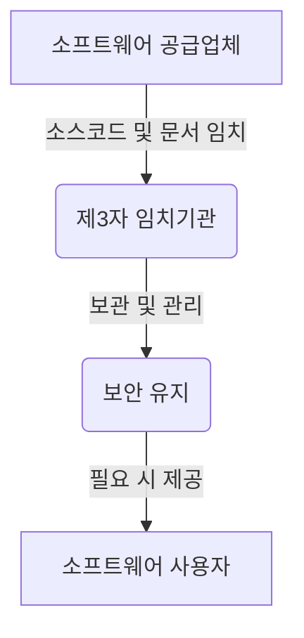

# SW Escrow (소프트웨어 임치제도): 소프트웨어 보호와 지속 가능한 운영

<!-- mtoc-start -->

- [정의 및 개념](#정의-및-개념)
- [주요 특징](#주요-특징)
- [SW Escrow 프로세스](#sw-escrow-프로세스)
- [활용 사례](#활용-사례)
- [기대 효과 및 필요성](#기대-효과-및-필요성)
- [마무리](#마무리)
- [Keywords](#keywords)

<!-- mtoc-end -->

소프트웨어 산업이 발전함에 따라 기업과 기관은 핵심 소프트웨어에 대한 지속적인 접근성과 보호 방안을 고민해야 한다. SW Escrow(소프트웨어 임치제도)는 이러한 문제를 해결하기 위한 제도로, 소프트웨어 소스코드를 제3자 기관에 보관하여 공급자의 파산, 계약 종료 등의 이슈 발생 시에도 지속적인 운영이 가능하도록 보장하는 시스템이다.

## 정의 및 개념

SW Escrow(소프트웨어 임치제도)는 소프트웨어 공급자가 소스코드 및 관련 문서를 신뢰할 수 있는 제3자 기관에 보관하여, 사용자(수요자)가 필요할 경우 이를 제공받을 수 있도록 하는 제도.

- **특징**: 공급자의 사업 지속성 보장, 소스코드 접근성 확보, 소프트웨어 보호 강화
- **목적**: 소프트웨어 공급자의 위험 관리, 고객의 비즈니스 연속성 보장, 소프트웨어 자산 보호
- **필요성**: 공급업체의 파산, 계약 종료, 기술 지원 중단 등으로 인한 리스크 관리

## 주요 특징

- **소프트웨어 보호 및 비즈니스 연속성 보장**: 공급업체 문제 발생 시에도 소프트웨어 사용 가능
- **공급업체와 고객 간 신뢰 형성**: 안정적인 계약 이행과 장기적 파트너십 구축
- **제3자 기관을 통한 보안성 강화**: 독립적인 기관이 소스코드를 관리하여 안전한 보호 제공
- **기업 및 공공기관에서의 활용 증가**: 정부, 금융, 의료 등 지속적 운영이 중요한 분야에서 도입 확대
- **법적 보호 및 계약 안정성 확보**: 계약 조항을 통해 소스코드 제공 조건 명확화

## SW Escrow 프로세스

SW Escrow는 공급업체가 제3자 기관에 소스코드 및 문서를 임치하면, 기관이 이를 보관하고 필요할 경우 사용자에게 제공하는 방식으로 운영된다.

## 활용 사례

- **금융권의 중요 소프트웨어 보호**: 은행 및 보험사는 핵심 시스템의 연속성을 보장하기 위해 Escrow 계약을 체결
- **공공기관의 IT 시스템 유지**: 국가기관의 전자정부 시스템 운영을 위해 소프트웨어 임치제도 활용
- **대기업의 ERP 및 핵심 소프트웨어 보호**: 글로벌 기업은 ERP, CRM 등의 주요 시스템을 Escrow로 보호하여 비즈니스 연속성 확보
- **스타트업 및 중소기업의 기술 보호**: 스타트업이 핵심 소프트웨어의 보호 및 투자 유치를 위해 Escrow 서비스 도입

## 기대 효과 및 필요성

- **비즈니스 연속성 보장**: 공급업체 문제 발생 시에도 지속적인 소프트웨어 운영 가능
- **고객 신뢰도 향상**: 계약 안정성과 리스크 관리를 통해 기업 신뢰도 증가
- **법적 보호 강화**: 명확한 계약 조항을 기반으로 소스코드 제공 조건을 정의하여 법적 분쟁 예방
- **IT 자산 보호**: 핵심 소프트웨어 자산을 보호하고 장기적인 관리 가능

## 마무리

SW Escrow는 소프트웨어의 지속 가능성과 보호를 위한 필수적인 제도로 자리 잡고 있다. 기업과 기관은 SW Escrow를 통해 공급업체 리스크를 관리하고, 안정적인 IT 환경을 구축할 수 있다. 특히, 금융, 공공, 제조업 등 핵심 시스템이 중요한 산업에서의 도입이 더욱 확대될 전망이다.

## Keywords

SW Escrow, 소프트웨어 임치, 소스코드 보호, 소프트웨어 자산 보호, 비즈니스 연속성, IT 리스크 관리, 소프트웨어 보안, Escrow 계약, IT 서비스 지속성, 소프트웨어 보호 정책