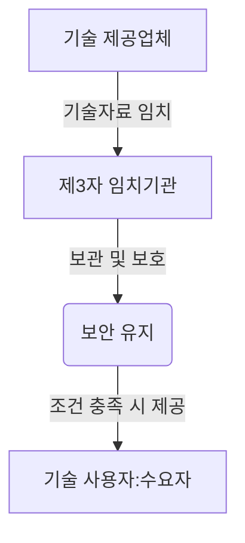

# Tech Escrow (기술자료 임치제도): 기업의 핵심 기술 보호 및 안정적 운영

<!-- mtoc-start -->

- [정의 및 개념](#정의-및-개념)
- [주요 특징](#주요-특징)
- [기술자료 임치제도 프로세스](#기술자료-임치제도-프로세스)
- [활용 사례](#활용-사례)
- [기대 효과 및 필요성](#기대-효과-및-필요성)
- [마무리](#마무리)
- [Keywords](#keywords)

<!-- mtoc-end -->

현대 산업에서 기업의 핵심 기술과 지식재산(IP)은 경쟁력을 좌우하는 중요한 요소이다. 하지만 기술을 보유한 공급업체가 사업을 중단하거나 계약이 종료될 경우, 해당 기술에 대한 지속적인 활용이 어려울 수 있다. 이러한 문제를 해결하기 위해 도입된 것이 "기술자료 임치제도"이다. 기술자료 임치제도는 기업의 핵심 기술 문서, 소스코드, 설계도 등을 제3의 신뢰할 수 있는 기관에 보관하여, 필요 시 수요자가 이를 활용할 수 있도록 보장하는 제도이다.

## 정의 및 개념

기술자료 임치제도는 기업의 핵심 기술자료(소프트웨어 소스코드, 설계도, 제조 공정 문서 등)를 신뢰할 수 있는 제3자 기관에 보관하여, 기술 제공자의 문제가 발생할 경우 기술 사용자가 이를 활용할 수 있도록 하는 보호 시스템.

- **특징**: 기술 보호, 비즈니스 연속성 보장, 제3자 신뢰성 확보
- **목적**: 핵심 기술 유출 방지, 공급업체 리스크 관리, 기술 지속성 보장
- **필요성**: 공급업체의 파산, 계약 종료, 기술 지원 중단 등의 위험에 대한 대비

## 주요 특징

- **핵심 기술 보호 및 보안 강화**: 기술 유출을 방지하면서도 수요자가 지속적으로 기술을 활용할 수 있도록 보장
- **비즈니스 연속성 확보**: 공급업체의 사업 지속성에 관계없이 기술 사용자(수요자)가 안정적으로 기술을 운영 가능
- **제3자 기관을 통한 안전한 보관**: 공신력 있는 기관이 기술자료를 보관하여 신뢰성 강화
- **계약 조건에 따른 기술 접근 보장**: 사전에 명시된 조건이 충족될 경우 기술자료가 수요자에게 공개됨
- **법적 보호 및 규제 준수**: 계약 및 법적 조치를 기반으로 기술자료의 보호와 접근성을 강화

## 기술자료 임치제도 프로세스

기술자료 임치제도는 공급업체가 핵심 기술자료를 제3자 기관에 보관하면, 기관이 이를 안전하게 보관하고, 필요 시 계약 조건에 따라 기술 사용자에게 제공하는 방식으로 운영된다.

## 활용 사례

- **제조업의 핵심 설계도 보호**: 자동차, 항공, 반도체 등 산업에서 중요 기술 보호 및 지속적 운영 보장
- **소프트웨어 기업의 소스코드 보호**: IT 기업이 소프트웨어 소스코드를 임치하여 고객이 공급업체 리스크에 대비할 수 있도록 지원
- **공공기관의 필수 IT 시스템 보호**: 국가 기관에서 전자정부 시스템의 안정성을 보장하기 위해 기술자료 임치제도 도입
- **스타트업 및 중소기업의 기술 보호**: 스타트업이 핵심 기술을 투자자 보호 및 장기적인 지속성을 위해 임치 활용

## 기대 효과 및 필요성

- **기업의 핵심 기술 보호**: 기술 유출을 방지하고, 안정적인 운영 보장
- **공급업체 리스크 대비**: 사업 중단, 파산 등의 리스크 발생 시에도 기술 활용 가능
- **비즈니스 신뢰도 향상**: 기술 사용자와 공급업체 간의 신뢰 구축 및 계약 안정성 확보
- **법적 보호 및 규제 준수**: 계약 및 법적 조항을 명확히 하여 분쟁 방지 및 규제 대응 가능

## 마무리

기술자료 임치제도는 기업의 핵심 기술을 보호하고, 지속적인 운영을 보장하는 중요한 제도이다. 특히, 제조업, IT, 공공기관 등에서 공급업체 리스크를 대비하고 기술 보호를 강화하기 위한 필수적인 전략으로 자리 잡고 있다. 기업들은 이를 적극적으로 활용하여 기술 자산을 안전하게 보호하고, 장기적인 경쟁력을 확보할 필요가 있다.

## Keywords

기술자료 임치, 기술 보호, 소스코드 임치, 비즈니스 연속성, 공급업체 리스크 관리, 핵심 기술 보관, 계약 안정성, IT 보안, 제조업 기술 보호, 기술 지속성 보장