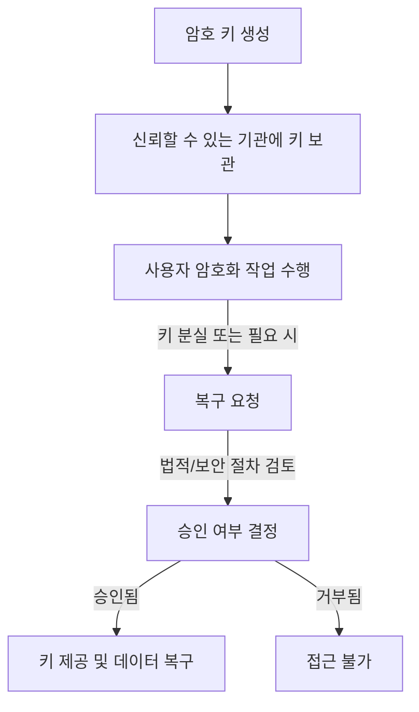

# Key Escrow: 암호 키 관리 및 보안 체계

<!-- mtoc-start -->

- [정의 및 개념](#정의-및-개념)
- [주요 특징](#주요-특징)
- [키 에스크로 프로세스](#키-에스크로-프로세스)
- [활용 사례](#활용-사례)
- [기대 효과 및 필요성](#기대-효과-및-필요성)
- [마무리](#마무리)
- [Keywords](#keywords)

<!-- mtoc-end -->

암호화 기술이 발전하면서 데이터 보호의 중요성이 더욱 커지고 있다. 하지만 암호 키를 분실하거나 접근할 수 없게 되면 데이터 복구가 불가능해지는 문제가 발생할 수 있다. 이를 해결하기 위한 방법 중 하나가 키 에스크로(Key Escrow)이다. 키 에스크로는 신뢰할 수 있는 제3자가 암호 키를 보관하고 필요 시 복구할 수 있도록 하는 시스템으로, 데이터 보안과 접근성 간의 균형을 유지하는 데 중요한 역할을 한다.

## 정의 및 개념

키 에스크로(Key Escrow)는 신뢰할 수 있는 제3자가 암호 키를 보관하고, 특정 조건에서만 접근을 허용하는 보안 관리 시스템. 주로 법적, 기업 보안 및 데이터 보호 정책에 따라 활용된다.

- 특징: 암호 키 위탁 보관, 법적 규제 준수, 긴급 복구 기능 제공
- 목적: 데이터 보호와 접근성의 균형 유지, 법적 준수를 위한 보안 체계 마련
- 필요성: 키 분실 방지, 보안 사고 시 데이터 복구, 기업 및 기관의 법적 요구 충족

## 주요 특징

1. **제3자 신뢰 보관**: 정부 기관, 기업 또는 공인된 보안 기관이 암호 키를 보관, 무단 접근 방지 역할.
2. **법적 요구 사항 준수**: 국가 보안, 법 집행 기관의 조사 등 특정 상황에서 합법적으로 키를 제공하도록 법적 요구 사항 충족.
3. **긴급 복구 기능**: 키 소유자가 키를 분실, 시스템 오류로 접근이 불가능할 때, 키 에스크로 시스템을 통해 복구.
4. **다중 보안 인증 적용**: 키 복구 과정에서 다중 인증 절차를 적용하여 무단 사용 방지.
5. **기업 보안 관리**: 기업 내부에서 권한을 가진 관리자만이 특정 조건에서 키를 사용할 수 있도록 제한하여 내부 보안 강화.

## 키 에스크로 프로세스

키 에스크로 시스템은 사용자의 암호 키를 안전하게 보관하고, 필요할 경우 복구할 수 있도록 절차를 마련하는 방식으로 운영된다. 법적 또는 보안상의 승인 절차를 거쳐야만 키를 복구할 수 있도록 설계되어 있다.

## 활용 사례

6. **기업 데이터 보호**: 대기업에서 중요 기밀 데이터 암호화 시, 내부 보안 관리자가 암호 키를 보관하고 필요할 때 복구할 수 있도록 함.
7. **정부 및 법 집행 기관**: 범죄 수사 과정에서 암호화된 데이터에 접근하기 위해 법적 절차를 거쳐 키를 요청할 수 있도록 운영됨.
8. **금융 및 의료 산업**: 금융 기관과 의료 기관에서 고객 데이터 보호를 위해 암호화를 적용하고, 비상 시 복구를 위한 시스템 구축.
9. **클라우드 보안 관리**: 클라우드 서비스 제공업체가 고객의 암호 키를 안전하게 보관하고 필요 시 복구할 수 있도록 지원.

## 기대 효과 및 필요성

- **데이터 복구 가능성 향상**: 키 분실로 인한 데이터 손실을 방지하고 복구 가능성을 높임.
- **법적 요구 사항 준수**: 금융, 의료, 공공 기관 등 다양한 산업에서 법적 요건을 충족할 수 있도록 지원.
- **보안 강화**: 키 보관을 위한 안전한 절차를 통해 암호 키 관리의 신뢰성을 확보.
- **위험 분산**: 개별 사용자가 키를 직접 관리하는 방식보다 분실 또는 도난 위험이 감소.
- **긴급 대응 체계 구축**: 기업이나 기관에서 보안 사고 발생 시 빠르게 대응할 수 있는 체계를 마련.

## 마무리

키 에스크로는 보안과 접근성의 균형을 유지하는 중요한 암호 키 관리 방법이다. 기업과 기관이 데이터를 보호하면서도 필요 시 접근할 수 있도록 보장하는 체계를 마련할 수 있다. 특히 법적 요구 사항을 준수하면서 보안성을 강화할 수 있어 금융, 의료, 공공 기관 등 다양한 분야에서 활용되고 있다. 암호 키 관리의 신뢰성을 높이고자 한다면 키 에스크로 시스템 도입을 고려할 필요가 있다.

## Keywords

Key Escrow, 암호 키 보관, 암호화 키 복구, 데이터 보안, 법적 규제 준수, 보안 관리, 키 관리 시스템, 긴급 복구, 클라우드 보안, 기업 데이터 보호