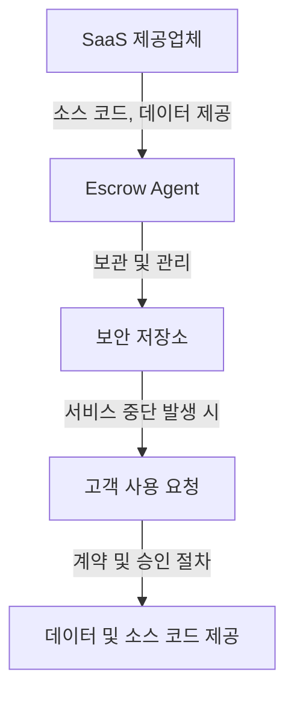

# SaaS Escrow: 클라우드 환경에서의 서비스 보호

<!-- mtoc-start -->

- [정의 및 개념](#정의-및-개념)
- [주요 특징](#주요-특징)
- [SaaS Escrow 프로세스](#saas-escrow-프로세스)
- [활용 사례](#활용-사례)
- [기대 효과 및 필요성](#기대-효과-및-필요성)
- [마무리](#마무리)
- [Keywords](#keywords)

<!-- mtoc-end -->

SaaS(Software as a Service) 환경이 보편화되면서 기업들은 클라우드 기반 소프트웨어에 의존하는 경우가 많아졌다. 하지만 SaaS 서비스 제공업체의 사업 중단이나 계약 종료 등의 리스크로 인해 기업의 핵심 비즈니스 운영이 중단될 위험이 존재한다. 이를 해결하기 위한 보안 전략 중 하나가 SaaS Escrow이다. SaaS Escrow는 서비스가 중단될 경우 기업이 지속적으로 SaaS 애플리케이션과 데이터를 이용할 수 있도록 보호하는 방안이다.

## 정의 및 개념

SaaS Escrow는 SaaS 공급업체가 제공하는 소프트웨어의 소스 코드, 데이터, 문서 등을 신뢰할 수 있는 제3자(Escrow Agent)에 예치하여, 특정 조건이 충족될 경우 사용자가 이를 액세스할 수 있도록 하는 보안 체계.

- **특징**: SaaS 서비스 보호, 제3자 보증, 사업 연속성 보장
- **목적**: SaaS 서비스 제공업체의 예기치 않은 서비스 중단으로부터 고객 보호
- **필요성**: 서비스 지속성 확보, 법적 리스크 감소, 비즈니스 운영 안정성 강화

## 주요 특징

1. **서비스 지속성 보장**: SaaS 공급업체의 문제 발생 시에도 고객이 소프트웨어와 데이터를 사용할 수 있도록 지원.
2. **제3자 신탁 관리**: 신뢰할 수 있는 제3자가 소스 코드, 데이터, 문서 등을 보관하고, 필요 시 제공.
3. **법적 보호 및 계약 기반 운영**: 고객과 공급업체 간의 법적 계약을 기반으로 운영되어 신뢰성을 확보.
4. **비즈니스 연속성 강화**: 기업이 SaaS 서비스에 의존하는 경우, 비즈니스 운영이 중단되지 않도록 보장.
5. **보안 및 규제 준수**: SaaS Escrow는 법적 및 산업 규정을 준수하도록 설계되어 데이터 보호를 강화.

## SaaS Escrow 프로세스

SaaS Escrow는 공급업체가 운영을 지속할 수 없는 경우 고객이 지속적으로 서비스를 이용할 수 있도록 하는 구조를 갖는다.

## 활용 사례

6. **금융 및 보험업계**: 금융 및 보험사는 SaaS Escrow를 활용하여 핵심 애플리케이션이 중단되지 않도록 보호.
7. **정부 및 공공 기관**: 국가 중요 시스템이 SaaS 모델을 통해 운영되는 경우, 비상 시 데이터 접근을 보장.
8. **의료 및 헬스케어 산업**: 의료 데이터 보호 및 서비스 연속성을 확보하기 위해 SaaS Escrow 활용.
9. **기업의 ERP 및 CRM 시스템**: 기업의 핵심 운영 시스템이 SaaS 기반인 경우, 안정적인 비즈니스 운영 보장.
10. **법률 및 규제 준수 기업**: 법적 요구 사항 준수를 위해 SaaS Escrow를 계약 조건으로 포함.

## 기대 효과 및 필요성

- **서비스 중단 리스크 감소**: 공급업체의 문제 발생 시에도 지속적인 서비스 운영 가능.
- **비즈니스 연속성 보장**: 기업이 SaaS 애플리케이션을 안정적으로 사용할 수 있도록 보호.
- **법적 보호 및 신뢰성 확보**: 계약 기반 운영으로 법적 보호를 강화.
- **데이터 및 애플리케이션 보안 강화**: 고객이 자신의 데이터를 보호하고 복구할 수 있도록 지원.
- **규제 및 컴플라이언스 준수**: 금융, 의료 등 규제 산업에서 요구하는 보안 및 법적 요건 충족.

## 마무리

SaaS Escrow는 클라우드 기반 서비스의 리스크를 최소화하고, 고객이 비즈니스 연속성을 보장받을 수 있도록 하는 필수적인 보안 솔루션이다. 기업은 SaaS 제공업체와의 계약에서 Escrow 조항을 포함하여 예상치 못한 서비스 중단으로 인한 영향을 최소화할 수 있다. SaaS 애플리케이션에 대한 신뢰성과 가용성을 높이기 위해 SaaS Escrow 도입을 고려하는 것이 바람직하다.

## Keywords

SaaS Escrow, 클라우드 보안, SaaS 서비스 보호, 데이터 보안, 비즈니스 연속성, 법적 보호, 소스 코드 보호, Escrow Agent, 금융 규제 준수, 서비스 중단 대응