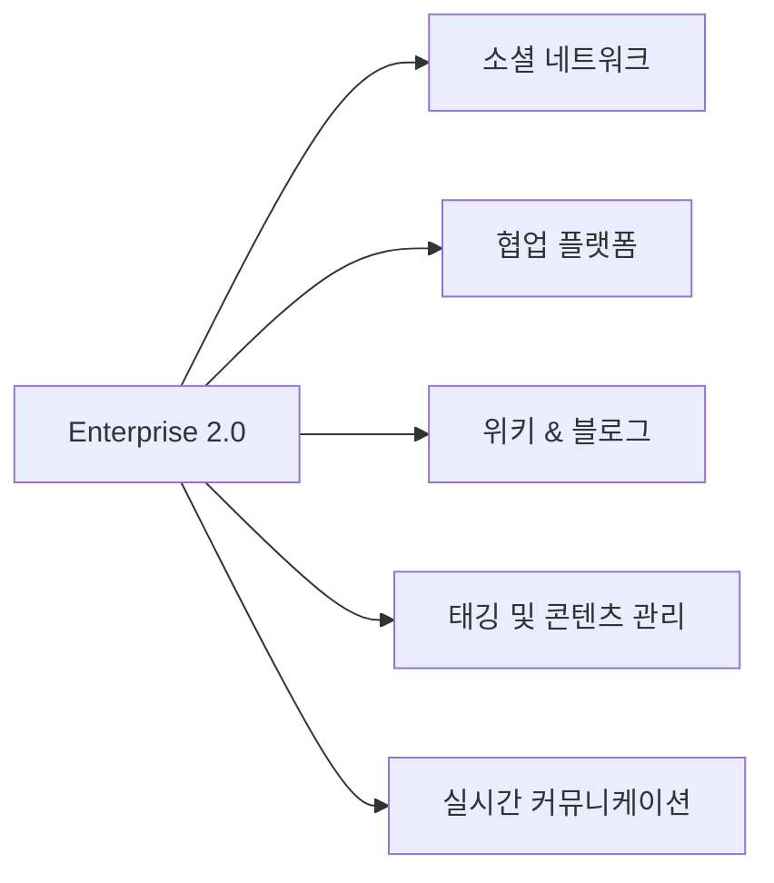

# Enterprise 2.0: 기업의 협업과 혁신을 위한 새로운 패러다임

<!-- mtoc-start -->

- [정의 및 개념](#정의-및-개념)
- [주요 특징](#주요-특징)
- [Enterprise 2.0 구성 요소](#enterprise-20-구성-요소)
- [활용 사례](#활용-사례)
- [기대 효과 및 필요성](#기대-효과-및-필요성)
- [마무리](#마무리)
- [Keywords](#keywords)

<!-- mtoc-end -->

디지털 전환 시대에 기업은 내부 협업과 정보 공유를 극대화할 수 있는 새로운 접근 방식이 필요하다. 이를 가능하게 하는 개념이 바로 Enterprise 2.0이다. Enterprise 2.0은 기업이 웹 2.0 기술을 활용하여 내부 및 외부 협업을 강화하고, 정보 흐름을 최적화하며, 조직 내 혁신을 촉진하는 방식이다.

## 정의 및 개념

Enterprise 2.0은 기업이 위키, 블로그, 소셜 네트워크, 태깅 시스템 등의 웹 2.0 기술을 활용하여 내부 협업과 지식 관리를 개선하는 전략.

- **특징**: 웹 2.0 기술 활용, 실시간 협업, 지식 공유 활성화
- **목적**: 조직 내외부 협업 강화, 정보 접근성 개선, 업무 생산성 향상
- **필요성**: 빠르게 변화하는 비즈니스 환경에서 유연성과 민첩성을 확보

## 주요 특징

1. **소셜 네트워크 및 협업 툴 활용**: 기업 내외부의 구성원 간 원활한 협업을 지원하는 플랫폼 도입
2. **실시간 정보 공유**: 기존의 문서 기반 업무에서 벗어나 실시간으로 지식과 데이터를 공유하는 체계 구축
3. **개방형 커뮤니케이션**: 조직 내 계층 구조를 최소화하고 투명한 의사소통을 촉진
4. **유연한 조직 구조**: 정형화된 업무 프로세스보다 자율적이고 유기적인 팀워크 강화
5. **사용자 중심 접근**: 전통적인 IT 시스템이 아닌 직관적이고 사용이 쉬운 도구 제공

## Enterprise 2.0 구성 요소

Enterprise 2.0은 다양한 웹 2.0 기술을 활용하여 기업 내외의 협업과 정보 흐름을 최적화하는 방향으로 구성된다.

## 활용 사례

6. **기업 내 위키 도입**: 사내 지식 공유를 위한 위키 시스템 도입
7. **실시간 협업 도구 활용**: Microsoft Teams, Slack 등의 툴을 이용한 업무 협업 개선
8. **소셜 미디어 기반 커뮤니케이션**: 내부 소셜 네트워크(SNS)를 활용한 원활한 정보 공유
9. **태그 기반 정보 검색 시스템**: 태깅을 통한 콘텐츠 관리 및 정보 검색 효율화
10. **크라우드소싱을 통한 혁신**: 직원 및 고객의 피드백을 실시간으로 반영하는 시스템 구축

## 기대 효과 및 필요성

- **조직 내 협업 강화**: 수직적 커뮤니케이션을 수평적으로 전환하여 업무 효율 극대화
- **정보 접근성 개선**: 필요한 정보를 빠르게 검색 및 공유하여 업무 속도 향상
- **지식 관리 최적화**: 조직의 암묵적 지식을 명확하게 문서화하고 관리 가능
- **혁신 촉진**: 다양한 의견과 아이디어를 자유롭게 교환하는 환경 조성
- **비즈니스 민첩성 확보**: 빠르게 변화하는 시장 환경에 유연하게 대응 가능

## 마무리

Enterprise 2.0은 단순한 IT 시스템 도입이 아닌 기업의 문화적 변화와 협업 방식의 혁신을 의미한다. 기업이 웹 2.0 기술을 적극 활용하여 실시간 협업과 지식 공유를 강화하면 조직의 생산성과 민첩성을 높일 수 있다. 빠르게 변화하는 시장에서 경쟁력을 유지하기 위해서는 Enterprise 2.0의 도입과 정착이 필수적이다.

## Keywords

Enterprise 2.0, 협업 플랫폼, 소셜 네트워크, 기업 혁신, 지식 관리, 실시간 협업, 웹 2.0, 업무 생산성, 크라우드소싱, 기업 문화 변화