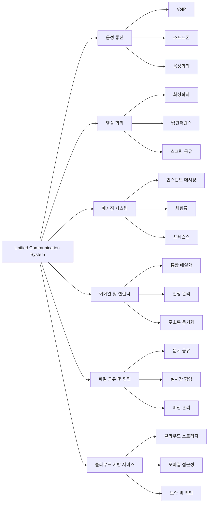

# UC (Unified Communication): 통합 커뮤니케이션의 미래

<!-- mtoc-start -->

- [정의 및 개념](#정의-및-개념)
- [주요 특징](#주요-특징)
- [UC 시스템 아키텍처](#uc-시스템-아키텍처)
- [활용 사례](#활용-사례)
- [기대 효과 및 필요성](#기대-효과-및-필요성)
- [마무리](#마무리)
- [Keywords](#keywords)

<!-- mtoc-end -->

디지털 시대가 도래하면서 기업과 조직은 더욱 효율적인 커뮤니케이션 시스템을 필요로 하게 되었다. 다양한 채널을 하나로 통합하는 UC(Unified Communication, 통합 커뮤니케이션) 솔루션은 기업이 실시간으로 협업하고 원활한 소통을 가능하게 하는 핵심 요소로 자리 잡고 있다. UC는 음성, 영상, 메시징, 이메일 및 협업 도구를 단일 플랫폼에서 통합하여 생산성을 극대화하는 기술이다.

## 정의 및 개념

UC(Unified Communication, 통합 커뮤니케이션)는 기업 내외의 다양한 커뮤니케이션 수단(음성, 영상, 이메일, 채팅 등)을 하나의 플랫폼에서 통합하여 원활한 소통을 가능하게 하는 기술.

- **특징**: 실시간 커뮤니케이션, 멀티 채널 통합, 클라우드 기반 협업 지원
- **목적**: 업무 효율성 향상, 원활한 협업 환경 구축, 비용 절감
- **필요성**: 비대면 업무 증가, 글로벌 협업 강화, IT 인프라 통합

## 주요 특징

1. **멀티 채널 통합**: 음성, 영상, 채팅, 이메일, 화상 회의 등을 하나의 플랫폼에서 통합하여 제공
2. **실시간 커뮤니케이션 지원**: 직원 간의 원활한 협업을 위한 인스턴트 메시징 및 프레즌스 기능 제공
3. **모바일 및 원격 근무 지원**: 다양한 디바이스와 플랫폼에서 일관된 커뮤니케이션 환경 제공
4. **보안 및 규제 준수**: 기업 내부 및 외부 통신 보안을 위한 암호화 및 인증 기능 제공
5. **클라우드 기반 솔루션 지원**: 온프레미스 및 클라우드 기반 UC 솔루션을 활용하여 유연한 확장 가능

## UC 시스템 아키텍처

6. 음성 통신: VoIP, 소프트폰, 음성회의를 통한 효율적 음성 커뮤니케이션 제공
7. 영상 회의: 화상회의, 웹컨퍼런스, 스크린 공유로 원격 협업 지원
8. 메시징: 인스턴트 메시징, 채팅룸, 프레즌스로 실시간 소통
9. 이메일/캘린더: 통합 메일함, 일정관리, 주소록 동기화로 업무 효율화
10. 협업: 문서 공유, 실시간 협업, 버전 관리로 팀워크 강화
11. 클라우드: 클라우드 스토리지, 모바일 접근성, 보안/백업으로 유연한 업무환경 구축

UC 시스템은 다양한 커뮤니케이션 기술을 하나의 통합된 환경에서 운영하여 업무 생산성을 극대화.

## 활용 사례

12. **기업 내 협업 강화**: Microsoft Teams, Zoom, Cisco Webex와 같은 UC 플랫폼을 활용하여 원격 및 대면 협업을 강화
13. **컨택 센터 및 고객 서비스 최적화**: 고객 상담 시스템(IVR, AI 챗봇)과 UC 통합을 통해 빠른 고객 응대 제공
14. **글로벌 업무 환경 지원**: 해외 지사 및 원격 근무자가 동일한 커뮤니케이션 환경에서 업무 수행 가능
15. **공공 기관 및 교육 기관 도입**: 원격 학습 및 스마트 오피스 구현을 위한 UC 시스템 활용
16. **의료 및 금융 산업 적용**: 보안이 중요한 산업에서 실시간 협업 및 데이터 공유를 안전하게 지원

## 기대 효과 및 필요성

- **업무 생산성 향상**: 신속한 정보 공유 및 협업 환경 구축으로 업무 효율성 증대
- **운영 비용 절감**: 다양한 커뮤니케이션 툴을 통합하여 유지보수 비용 절감
- **보안 및 규제 준수 강화**: 통합된 시스템을 통한 정보 보안 및 법적 규제 준수 용이
- **직원 만족도 및 업무 유연성 증가**: 원격 근무 및 하이브리드 근무 환경에서 원활한 소통 가능
- **비즈니스 민첩성 향상**: 빠르게 변화하는 시장 환경에 대응할 수 있는 유연한 커뮤니케이션 체계 구축

## 마무리

UC(Unified Communication)는 단순한 커뮤니케이션 시스템을 넘어 기업이 빠르게 변화하는 업무 환경에 적응할 수 있도록 지원하는 필수 기술이다. 실시간 협업과 다채널 통합을 통해 기업의 업무 효율성을 높이고, 운영 비용을 절감할 수 있다. UC를 도입함으로써 기업은 보다 원활한 협업과 효율적인 커뮤니케이션 환경을 구축할 수 있을 것이다.

## Keywords

Unified Communication, UC, 통합 커뮤니케이션, 원격 협업, 음성 통신, 영상 회의, 클라우드 기반 UC, 기업 협업, 컨택 센터, 실시간 커뮤니케이션