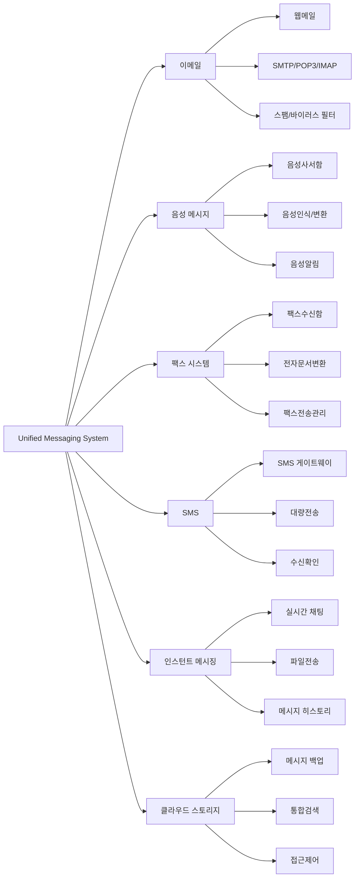

# UMS (Unified Messaging System): 통합 메시징 시스템의 핵심

<!-- mtoc-start -->

- [정의 및 개념](#정의-및-개념)
- [주요 특징](#주요-특징)
- [UMS 시스템 아키텍처](#ums-시스템-아키텍처)
- [활용 사례](#활용-사례)
- [기대 효과 및 필요성](#기대-효과-및-필요성)
- [마무리](#마무리)
- [Keywords](#keywords)

<!-- mtoc-end -->

디지털 커뮤니케이션이 발전하면서 기업과 조직은 다양한 메시징 채널을 하나의 플랫폼에서 관리하는 방안을 모색하고 있다. UMS(Unified Messaging System, 통합 메시징 시스템)는 이메일, 음성 메시지, 팩스, SMS 및 인스턴트 메시징을 통합하여 사용자가 단일 인터페이스에서 모든 메시지를 확인하고 관리할 수 있도록 하는 솔루션이다. 이를 통해 기업은 커뮤니케이션 효율성을 높이고 업무 생산성을 극대화할 수 있다.

## 정의 및 개념

UMS(Unified Messaging System)는 이메일, 음성 메시지, 팩스, SMS 및 인스턴트 메시징을 통합하여 하나의 인터페이스에서 모든 메시징 데이터를 관리하는 시스템.

- **특징**: 다양한 메시징 채널 통합, 단일 인터페이스 제공, 실시간 알림 지원
- **목적**: 커뮤니케이션 효율성 향상, 정보 접근성 개선, 업무 생산성 증대
- **필요성**: 멀티채널 메시징 환경에서 일관된 메시지 관리 제공

## 주요 특징

1. **멀티채널 메시징 통합**: 이메일, 음성 메시지, 팩스, SMS 등을 하나의 플랫폼에서 관리
2. **단일 인터페이스 제공**: 사용자는 웹, 모바일, 데스크톱을 통해 모든 메시지를 한 곳에서 확인 가능
3. **실시간 동기화 및 알림**: 모든 기기에서 실시간으로 메시지 동기화 및 알림 제공
4. **보안 및 규제 준수**: 데이터 암호화, 접근 제어 및 법적 규제 준수를 위한 보안 기능 제공
5. **기업 커뮤니케이션 최적화**: 부서 간 협업 및 고객 서비스 향상을 위한 통합 메시징 환경 제공

## UMS 시스템 아키텍처

6. 이메일: 웹메일, 다중 프로토콜 지원, 보안 필터링
7. 음성 메시지: 음성사서함, 음성-텍스트 변환, 알림
8. 팩스: 디지털 수신함, 전자문서 변환, 전송 관리
9. SMS: 게이트웨이, 대량전송, 수신확인
10. 인스턴트 메시징: 실시간 채팅, 파일전송, 이력관리
11. 클라우드: 메시지 백업, 통합검색, 보안관리

UMS는 다양한 메시징 기술을 하나의 환경에서 통합 운영하여 커뮤니케이션을 최적화.

## 활용 사례

12. **기업 내 커뮤니케이션 최적화**: 직원들이 하나의 플랫폼에서 모든 메시징을 관리하여 업무 생산성 향상
13. **컨택 센터 통합 메시징 도입**: 고객 서비스 센터에서 다양한 채널을 통한 문의를 UMS를 통해 일괄 관리
14. **의료 및 금융 산업 적용**: 보안이 중요한 산업에서 안전한 메시징 관리 환경 구축
15. **모바일 워크포스 지원**: 원격 근무자들이 어디서든 통합된 메시징 시스템을 통해 소통 가능
16. **공공 기관 및 교육 기관 활용**: 중요 공지 사항 및 커뮤니케이션 일관성을 유지하기 위한 솔루션으로 활용

## 기대 효과 및 필요성

- **업무 생산성 향상**: 직원들이 다양한 메시징 시스템을 일괄 관리하여 효율적인 업무 수행 가능
- **운영 비용 절감**: 여러 개의 메시징 플랫폼을 관리하는 비용을 절감
- **보안 및 규제 준수 강화**: 기업 내부 및 외부 메시징 보안을 확보
- **정보 접근성 개선**: 사용자 친화적인 인터페이스로 모든 메시지를 신속하게 확인 및 응답 가능
- **비즈니스 민첩성 향상**: 빠르게 변화하는 업무 환경에서도 효과적인 메시징 관리 가능

## 마무리

UMS(Unified Messaging System)는 기업과 조직이 다양한 메시징 채널을 하나의 통합된 환경에서 관리할 수 있도록 지원하는 필수 솔루션이다. 이를 통해 업무 생산성을 향상시키고 커뮤니케이션 효율성을 극대화할 수 있다. UMS 도입을 통해 기업은 보다 신속하고 안전한 메시징 환경을 구축할 수 있을 것이다.

## Keywords

Unified Messaging System, UMS, 통합 메시징, 이메일 통합, 음성 메시지, 팩스 시스템, 인스턴트 메시징, 기업 커뮤니케이션, 클라우드 메시징, 보안 메시징