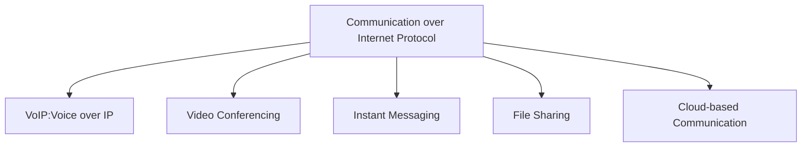

# CoIP (Communication over Internet Protocol): 인터넷 기반 커뮤니케이션의 혁신

<!-- mtoc-start -->

- [정의 및 개념](#정의-및-개념)
- [주요 특징](#주요-특징)
- [CoIP 시스템 아키텍처](#coip-시스템-아키텍처)
- [활용 사례](#활용-사례)
- [기대 효과 및 필요성](#기대-효과-및-필요성)
- [마무리](#마무리)
- [Keywords](#keywords)

<!-- mtoc-end -->

디지털 시대의 발전과 함께 기업과 개인은 보다 효율적이고 경제적인 커뮤니케이션 방식을 찾고 있다. CoIP(Communication over Internet Protocol)는 이러한 요구에 부합하는 기술로, 기존 전화망과 같은 전통적인 방식이 아닌 IP 네트워크를 통해 음성, 영상, 데이터 및 메시징을 통합하여 제공하는 통신 방식이다. 이를 통해 기업은 비용 절감과 높은 확장성을 확보할 수 있으며, 원격 근무와 글로벌 협업을 더욱 효과적으로 지원할 수 있다.

## 정의 및 개념

CoIP(Communication over Internet Protocol)는 인터넷 프로토콜(IP)을 기반으로 음성, 영상, 데이터 및 메시징을 통합하여 제공하는 통신 기술.

- **특징**: IP 기반 통신, 음성/영상 통합, 확장성 높은 네트워크 활용
- **목적**: 기존 전화망(PSTN) 대비 비용 절감 및 유연한 통신 환경 제공
- **필요성**: 원격 근무 확대, 글로벌 협업 증가, 기존 통신 인프라의 한계 극복

## 주요 특징

1. **IP 기반 통신**: 기존 전화망(PSTN)이 아닌 인터넷 네트워크를 활용하여 음성 및 영상 데이터를 전송
2. **멀티미디어 통합**: 음성 통화뿐만 아니라 화상 회의, 인스턴트 메시징, 파일 공유 기능 지원
3. **비용 절감**: 인터넷을 이용한 통신으로 장거리 및 국제 전화 비용 절감 효과
4. **확장성 및 유연성**: 기존 전화 시스템 대비 손쉬운 확장 및 다양한 디바이스에서 사용 가능
5. **보안 강화**: 암호화된 데이터 전송과 인증 시스템을 통해 안전한 커뮤니케이션 보장

## CoIP 시스템 아키텍처

CoIP는 다양한 통신 기술을 하나의 통합된 환경에서 운영하여 사용자에게 최적의 커뮤니케이션 솔루션을 제공한다.

## 활용 사례

6. **기업 내 협업 솔루션**: Microsoft Teams, Zoom, Cisco Webex 등 IP 기반 협업 솔루션 도입
7. **컨택 센터 및 고객 서비스 최적화**: VoIP 기반 고객 상담 시스템을 통해 고객 대응 효율성 증대
8. **글로벌 비즈니스 환경 지원**: 해외 지사 및 원격 근무자가 동일한 커뮤니케이션 환경에서 업무 수행 가능
9. **공공 기관 및 교육 기관 도입**: 원격 학습 및 비대면 행정 서비스 제공을 위한 CoIP 시스템 활용
10. **의료 및 금융 산업 적용**: 보안이 중요한 산업에서 암호화된 데이터 전송을 통한 안전한 커뮤니케이션 지원

## 기대 효과 및 필요성

- **비용 절감**: 기존 전화망(PSTN) 대비 운영 비용 절감 및 유지보수 간소화
- **업무 생산성 향상**: 실시간 협업 도구를 통한 원활한 커뮤니케이션 환경 조성
- **보안 및 규제 준수 강화**: 암호화된 데이터 전송을 통한 정보 보호 및 법적 규제 준수
- **정보 접근성 개선**: 다양한 디바이스에서 통합된 커뮤니케이션 서비스 제공
- **비즈니스 민첩성 확보**: 빠르게 변화하는 시장 환경에서도 효과적인 커뮤니케이션 지원

## 마무리

CoIP(Communication over Internet Protocol)는 기존 통신 방식의 한계를 극복하고, 비용 절감 및 효율적인 협업을 가능하게 하는 혁신적인 기술이다. 기업과 기관은 CoIP를 활용하여 보다 유연하고 확장성 높은 커뮤니케이션 환경을 구축할 수 있다. 인터넷 기반 커뮤니케이션이 보편화되는 미래에 대비하여 CoIP 솔루션 도입을 고려하는 것이 필수적이다.

## Keywords

Communication over Internet Protocol, CoIP, VoIP, 인터넷 기반 통신, 원격 협업, 영상 회의, 클라우드 커뮤니케이션, 기업 협업, 보안 통신, 비용 절감