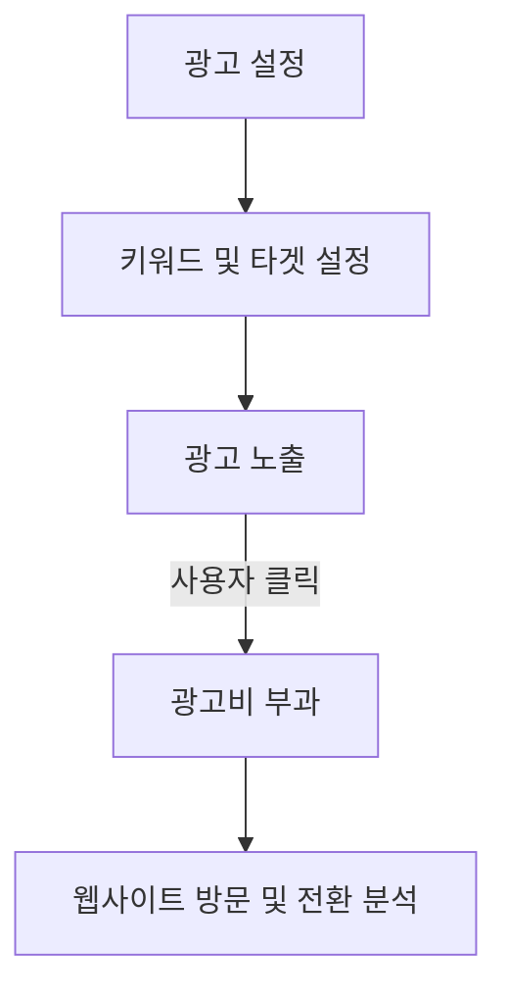

# CPC (Cost Per Click): 클릭당 비용 광고 모델의 핵심

<!-- mtoc-start -->

- [정의 및 개념](#정의-및-개념)
- [주요 특징](#주요-특징)
- [CPC 광고 프로세스](#cpc-광고-프로세스)
- [활용 사례](#활용-사례)
- [기대 효과 및 필요성](#기대-효과-및-필요성)
- [광고 과금 모델 비교](#광고-과금-모델-비교)
- [마무리](#마무리)
- [Keywords](#keywords)

<!-- mtoc-end -->

디지털 마케팅에서 광고주는 효과적인 광고 비용 집행을 위해 다양한 광고 모델을 활용한다. 그중 CPC(Cost Per Click, 클릭당 비용) 모델은 사용자가 광고를 클릭할 때마다 광고주가 일정 비용을 지불하는 방식으로, 검색 엔진 마케팅(SEM)과 디지털 광고에서 가장 널리 사용되는 방식 중 하나다. 이 모델을 활용하면 광고주는 실제 방문자 유입에 대해 비용을 지불하므로 예산을 효율적으로 사용할 수 있다.

## 정의 및 개념

CPC(Cost Per Click)는 광고주가 광고가 노출되는 것이 아니라 사용자가 광고를 클릭할 때마다 비용을 지불하는 디지털 광고 과금 모델.

- **특징**: 클릭 기반 과금, 광고 성과 측정 가능, 예산 효율성 극대화
- **목적**: 광고 예산의 효과적인 활용, 타겟 트래픽 유입 증가, 광고 ROI 최적화
- **필요성**: 광고비 지출 대비 실제 방문자 확보, 광고 성과 측정을 통한 최적화 전략 수립

## 주요 특징

1. **클릭 기반 과금 모델**: 광고가 노출되는 것이 아니라 사용자가 클릭할 때만 비용이 부과됨
2. **즉각적인 트래픽 증가**: 광고를 클릭한 사용자가 사이트로 직접 유입되므로 빠른 방문자 확보 가능
3. **예산 관리 용이**: 광고주는 클릭당 지불할 최대 금액을 설정하여 예산을 효과적으로 운영할 수 있음
4. **광고 성과 측정 가능**: CTR(Click-Through Rate), CPC, 전환율 등의 지표를 활용하여 광고 성과 분석 가능
5. **검색 및 디스플레이 광고 활용**: 검색 엔진 광고(Google Ads)와 디스플레이 광고(배너, 소셜 미디어 광고)에서 활용됨

## CPC 광고 프로세스

CPC 광고 모델은 광고주가 특정 키워드나 대상 고객을 설정하고, 광고가 노출된 후 사용자가 클릭할 때마다 비용이 부과되는 방식으로 운영된다.

## 활용 사례

6. **검색 엔진 광고(SEM)**: Google Ads, Bing Ads와 같은 검색 광고에서 CPC 모델 활용
7. **소셜 미디어 광고**: Facebook Ads, Instagram Ads, LinkedIn Ads 등에서 타겟팅 광고 운영
8. **디스플레이 광고**: 배너 광고 및 네이티브 광고에서 CPC 기반 과금 적용
9. **이커머스 및 리타겟팅 광고**: 특정 제품 페이지로 유도하여 구매를 촉진하는 광고 전략
10. **모바일 앱 마케팅**: 앱 다운로드를 유도하기 위해 CPC 모델 활용

## 기대 효과 및 필요성

- **광고 비용 최적화**: 클릭당 비용을 설정하여 예산을 효과적으로 운영 가능
- **정확한 타겟 마케팅**: 키워드 및 사용자 관심사 기반 타겟팅으로 광고 효율성 증대
- **즉각적인 결과 확보**: 광고 집행 즉시 트래픽 유입 및 성과 분석 가능
- **전환율 향상 가능성**: 방문자 유입 후 맞춤형 랜딩 페이지로 유도하여 전환율 상승 기대
- **광고 성과 데이터 분석**: 클릭률, 전환율, CPC 등을 기반으로 최적화 전략 수립 가능

## 광고 과금 모델 비교

| 과금모델                  | 과금기준      | 장점                                      | 단점                                   | 주요 적용 분야                  |
| ------------------------- | ------------- | ----------------------------------------- | -------------------------------------- | ------------------------------- |
| CPC (Cost Per Click)      | 광고 클릭당   | - 전환 가능성 높음 - ROI 측정 용이     | - 클릭 사기 위험 - 브랜딩에 부적합  | - 검색광고 - 쇼핑광고        |
| CPM (Cost Per Mile)       | 노출 1000회당 | - 대규모 노출 가능 - 단가 저렴         | - 전환율 낮음 - 효과 측정 어려움    | - 브랜드 광고 - 배너광고     |
| CPA (Cost Per Action)     | 전환 행동당   | - 정확한 성과측정 - 리스크 낮음        | - 단가 높음 - 전환까지 시간 소요    | - 이커머스 - 회원가입        |
| CPV (Cost Per View)       | 동영상 시청당 | - 브랜드 스토리텔링 - 참여도 측정 용이 | - 제작비용 높음 - 시청 완료율 변동  | - 유튜브 광고 - 브랜드 영상  |
| CPE (Cost Per Engagement) | 참여 행동당   | - 높은 사용자 참여 - 상호작용 측정     | - 참여 기준 모호 - 비용 예측 어려움 | - 소셜미디어 - 이벤트 캠페인 |

**주요 특징**:

11. CPC: 클릭 기반 과금으로 전환 가능성이 높은 검색광고에 적합
12. CPM: 대규모 노출이 필요한 브랜드 캠페인에 효과적
13. CPA: 실제 구매/가입 등 전환 행동 시에만 과금되어 ROI 관리가 용이
14. CPV: 동영상 광고에 특화된 모델로 브랜드 스토리텔링에 적합
15. CPE: 소셜미디어 활동 등 사용자 참여를 유도하는 캠페인에 효과적

## 마무리

CPC(Cost Per Click) 광고 모델은 클릭당 비용을 지불하는 방식으로, 광고 예산을 보다 효율적으로 관리할 수 있는 강력한 마케팅 도구다. 검색 광고, 디스플레이 광고, 소셜 미디어 광고 등 다양한 플랫폼에서 활용되며, 광고 성과를 직접 측정할 수 있어 데이터 기반 마케팅 전략을 수립하는 데 적합하다. CPC 모델을 효과적으로 운영하면 예산 낭비 없이 원하는 목표를 달성할 수 있다.

## Keywords

CPC, Cost Per Click, 클릭당 비용, 디지털 광고, 검색 엔진 마케팅, 소셜 미디어 광고, 광고 성과 분석, 클릭률, 전환율, 트래픽 유입